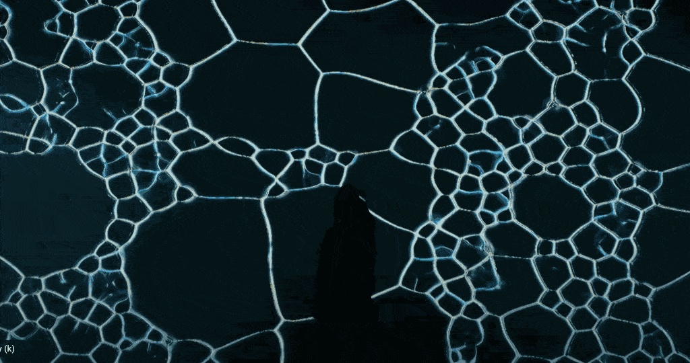

# Assignments 5.x: Audiovisual Environment

---

* 5.1. **Due Tuesday 4/15; 30-45 minutes:** Be Prepared for Class! 
* 5.2. **Due Tuesday 4/15; 30-45 minutes:** Looking Outwards
* 5.3. **Due Thursday 4/17: 60-90 minutes:** Introductory Tutorials
* 5.4. **Due Tuesday 4/22: 1.5-2.5 hours:** TouchDesigner Warmup
* 5.5. **Due Monday 5/5: 10-12 hours:** Audioreactive Environment

 *[The improvisation of water](The improvisation of water (2023) )* (2023) by Ahyun Cho

---

## 5.1. Be Prepared For Class on Tuesday 4/15

*Due Tuesday April 15; 30-45 minutes.*

On Tuesday April 9th, School of Art alum Emmanuel Lugo will give a tutorial/workshop in class, in order to introduce you to TouchDesigner. Beforehand, **please make sure** to:

* **Create** an account (using your Andrew email) at [Derivative software](https://derivative.ca/), the creators of TouchDesigner
* **Install** the free, non-commercial version of TouchDesigner on your laptop, and **register** the software using your account information. 
* **Ensure** you have a known computing solution: in the Discord channel `#5-1-preparation`, either **post** a *photograph* of your laptop running TouchDesigner, *OR* please **state** in writing that you plan to use the CMU computers in CFA-318.
* If you plan to use your own laptop, 
  * **Bring** your laptop to class
  * **Bring** your laptop’s power supply to class
  * **Bring** your 3-button mouse to class.

---

## 5.2. Looking Outwards: TouchDesigner

*Due Tuesday April 15; 30-45 minutes.*

https://www.youtube.com/watch?v=Y0xZzuYS2YI

Touchdesigner is an authoring tool for high-performance interactive graphics systems. In this Looking Outwards assignment, you are asked to spend a half-hour familiarizing yourself with how people use TouchDesigner, and journaling about a project you appreciated. To do this: 

* **Identify** a project that you find interesting, by **browsing** the following sources: 
  * [The official TouchDesigner showcase on Vimeo.com](https://vimeo.com/groups/touchdesigner/sort:plays/format:thumbnail). Please note that there are more than 2000 projects across 160 pages of results; please look beyond the first page!
  * [Projects tagged with Touchdesigner on CreativeApplications.net](https://www.creativeapplications.net/?s=touchdesigner). This is an important blog documenting thousands of interactive new media arts projects. To get past the paywall, use the login information in the [Discord `#key-information` channel](https://discord.com/channels/1325654518544728137/1325736563417808957/1328429634563608640). Please note that there are four pages of results there. 
* In the Discord channel `#5-2-looking-outwards`, **write** a sentence describing the project.
* **Write** a sentence explaining what you found interesting about it
* **Include** a URL link to the project's video or webpage
* **Include** an image or screenshot of the project.

---

## 5.3. Do These Introductory Tutorials

*Due Thursday April 17; 60-90 minutes.*

* **Set aside** 1-2 hours for this assignment. 
* **View** and (at your computer) **follow along with** the “101 Series: Navigating the Environment” [official TouchDesigner tutorials](https://learn.derivative.ca/courses/100-fundamentals/), listed below. 
* For each tutorial unit, **screenshot** the work on your computer. 
* *I want receipts.* In the Discord channel `#5-3-tutorial-screenshots`, **post** your screenshots. 
* In particular, **view** the following seven brief tutorials (each is about 5 minutes long):
  1. [The User Interface](https://learn.derivative.ca/courses/100-fundamentals/lessons/101-navigating-the-environment/topic/user-interface/)
  2. [Using the OP Create Dialog](https://learn.derivative.ca/courses/100-fundamentals/lessons/101-navigating-the-environment/topic/using-the-op-create-dialog/)
  3. [Reading Network Anatomy](https://learn.derivative.ca/courses/100-fundamentals/lessons/101-navigating-the-environment/topic/reading-network-anatomy/)
  4. [Reading Operator Anatomy](https://learn.derivative.ca/courses/100-fundamentals/lessons/101-navigating-the-environment/topic/reading-operator-anatomy/)
  5. [Operator Wires, References, and Links](https://learn.derivative.ca/courses/100-fundamentals/lessons/101-navigating-the-environment/topic/manipulating-operator-wires/)
  6. [Working with TOPs](https://learn.derivative.ca/courses/100-fundamentals/lessons/101-navigating-the-environment/topic/working-with-tops/)
  7. [Working with CHOPs](https://learn.derivative.ca/courses/100-fundamentals/lessons/101-navigating-the-environment/topic/working-with-chops/)

---

## 5.4. TouchDesigner Warmup

*Due Tuesday April 22; 1.5-2.5 hours. Exercise designed by Em Lugo.*

We are still learning the basics. For Tuesday, April 22, **do** the following:

* **Watch**: [Shapes and Colors](https://learn.derivative.ca/courses/100-fundamentals/lessons/102-tops-working-with-images/topic/shapes-colors/) (5 minutes)
* **Watch**: [Basic Compositing](https://learn.derivative.ca/courses/100-fundamentals/lessons/102-tops-working-with-images/topic/basic-compositing/) (5 minutes)
* Feel free to **watch** any of the other sections of the [100-series Working with Images lectures](https://learn.derivative.ca/courses/100-fundamentals/lessons/102-tops-working-with-images/). 
 
Then: **follow along** and **execute** these two TouchDesigner tutorial projects, shown below:

* **Do**: [Organic Color Tunnel](https://www.youtube.com/watch?v=gHPrDMqOmJ0) (30-60 minutes)
* **Do**: [Instancing Geometry with Mouse Interactivity](https://www.youtube.com/watch?v=SJZIMGg-thY) (60-90 minutes)

*Now,* in a Discord post in the `#5-4-warmup` channel, please do the following:

* **Embed** a brief moving image (screen-captured video, animated GIF, or unlisted YouTube link) for each of the two project tutorials. It doesn’t have to be a lengthy video; I just need to see receipts.
* **Write** a sentence or two about your experience. What do you appreciate about TouchDesigner? What concerns or confusions do you have? Did you tinker with the project, and if so, how?

 <small>[Tutorial: Organic Color Tunnel](https://www.youtube.com/watch?v=gHPrDMqOmJ0)</small>

 <small>[Tutorial: Instancing Geometry with Mouse Interactivity](https://www.youtube.com/watch?v=SJZIMGg-thY)</small>

---

## 5.5. Audioreactive Environment

*(10-12 hours, Due Monday, May 5. Exercise designed by Em Lugo.)*

For this project, you will develop an “audio-reactive” visual composition. Your project should use audio in at least two ways to either generate or modify a graphic. It will help to:

* **Identify** some suitable audio. Given the tools you have available, instrumental rhythmic music may work best, but that’s just a suggestion, not a requirement. Edit and/or trim your audio to produce a clip that’s about 1-3 minutes long.
* **Study** project examples to understand what sorts of signals you can obtain from audio (such as amplitude from certain frequency bands).
* **Identify** a set of visual parameters you want the audio signals to control (such as the color, position, displacement, etc. of a visual design).

As you develop your project, consider whether there are visual parameters that you’d like to perform manually (e.g. with a mouse, camera, or keyboard), to change how your visuals respond to the music over time.

*Now:*

* (3 minutes) **Browse** these brief video documentations of artworks by others: **[one](https://www.youtube.com/watch?v=_AuGX_TBDnI), [two](https://www.youtube.com/watch?v=e6tSht38gNs), [three](https://www.youtube.com/watch?v=b8RfdTC8UlY), [four](https://www.youtube.com/watch?v=uhZfnWsjr8Y)**
* (15 minutes) **Watch** the two tutorials below, to give you some additional ideas about what’s possible.
* **Create** a Discord post for your project, in the channel `#5-5-audiovisual` system.
* **Develop** an audio-reactive composition, as discussed above.
* **Record** a screen-captured video of your project. (Make sure it includes the sound!) **Make sure** your video is “full-screen” and does not show the TouchDesigner program network.
* **Embed** a link to the video of your project. An ideal format would be an unlisted Youtube video. If you decide to use a Box or Google drive link, make absolutely sure that the link is set to public.
* **Write** a few sentences about your project. How would you describe the mappings you established? What do you like best about the project?

#### Additional Tutorials

 <small>[How to make spectrum shape audiovisual using feedback in Touchdesigner](https://www.youtube.com/watch?v=jf718jbSoTU)</small>

 <small>[Audio Wheel – TouchDesigner Tutorial 1](https://www.youtube.com/watch?v=QPzYNAyxC70)</small>

---

EOF