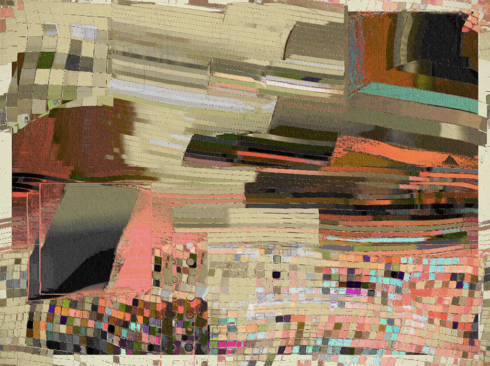
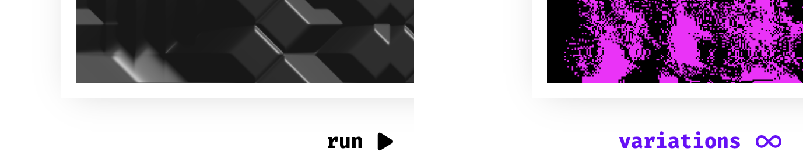
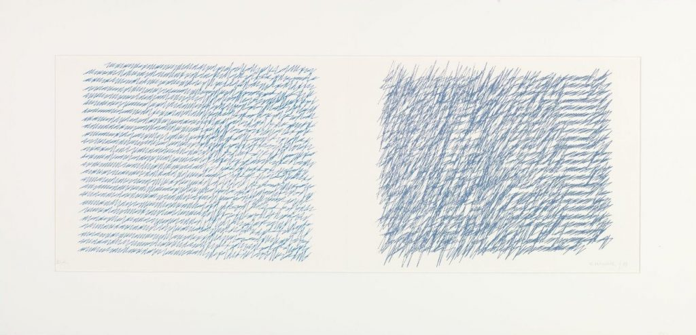
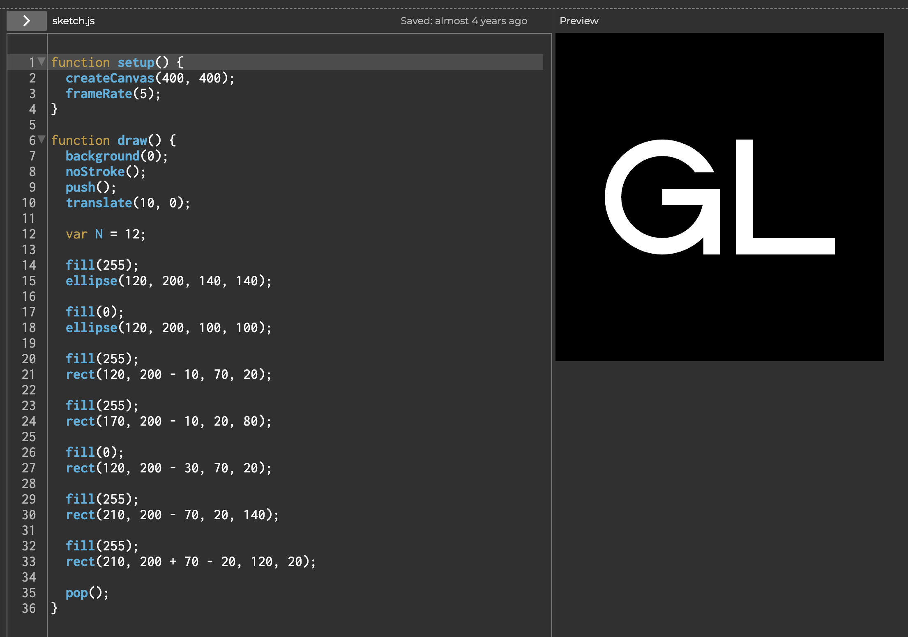
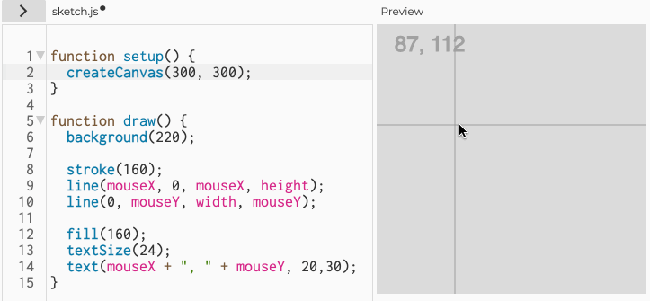
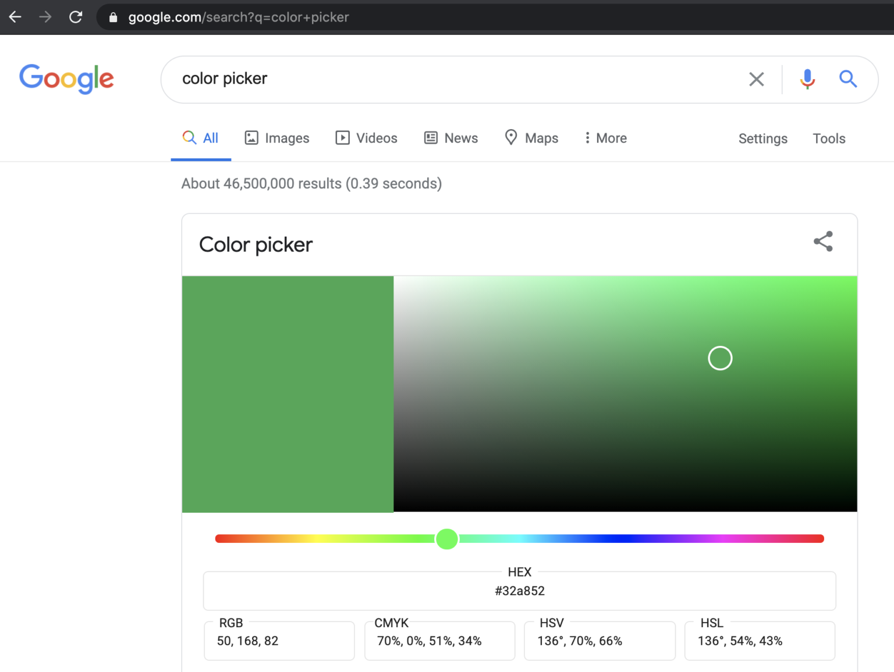
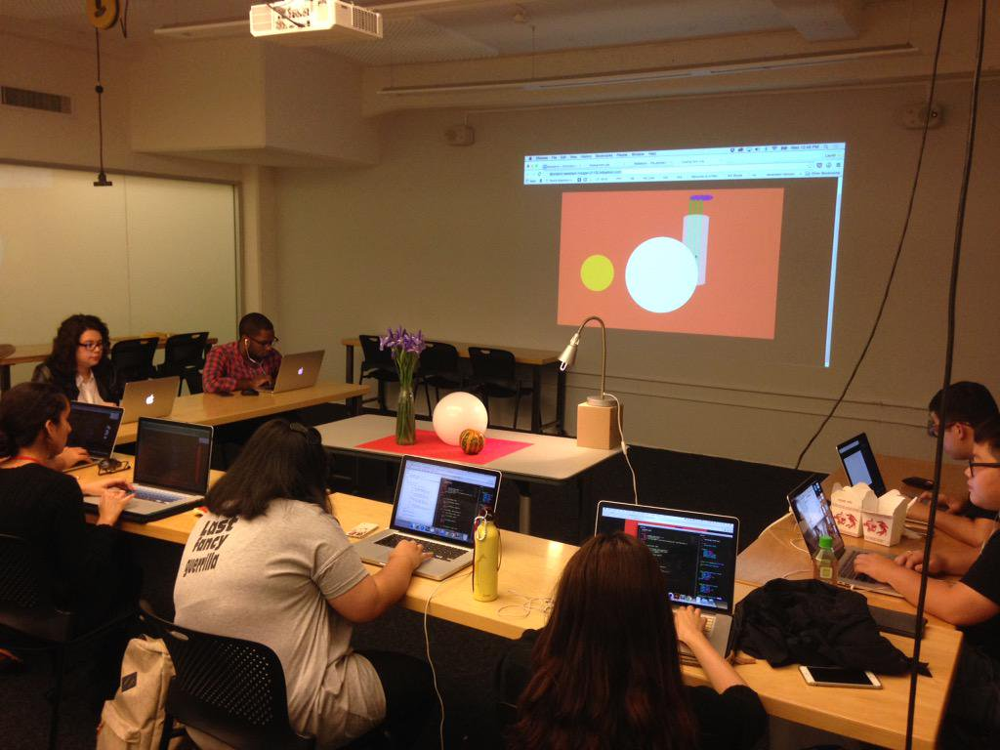
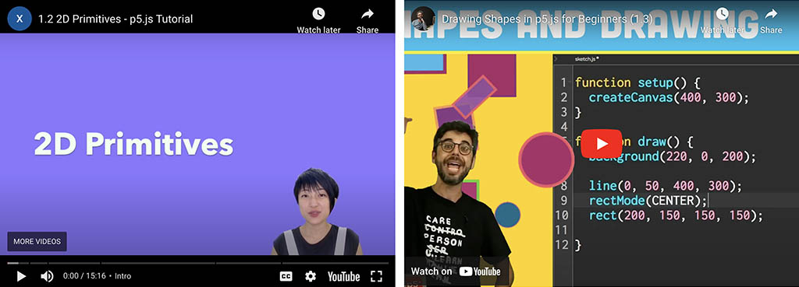

# Assignments 2.1-2.6: Creative Code

This assignment has the following components: 

*Approximately 3 hours of effort are assigned for the beginning of class on 2/04:*

* `01/30` 2.1: [Basic Administration](#21-basic-administration)
* `02/04` 2.2. [Ecosystem Familiarization](#22-ecosystem-familiarization)
* `02/04` 2.3: [Looking Outwards: Generative Art](#23-looking-outwards-generative-art)
* `02/04` 2.4: [Reading Response: Artist Narratives](#24-reading-response-artist-narratives)
* `02/04` 2.5: [Graphic Primitives I: Drawing Your Initials](#25-graphic-primitives-i-drawing-your-initials)
* `02/04` 2.6: [Graphic Primitives II: Drawing from Life](#26-graphic-primitives-ii-drawing-from-life)

*More details will be announced soon about Exercises 2.7-2.12:* 

* `02/XX` 2.7: Compton Reading: The Oatmeal Problem
* `02/XX` 2.8: Galanter Reading: Generative Art Theory
* `02/XX` 2.9: Generative Design: Face Generator
* `02/XX` 2.10: Generative Design: Schotter
* `02/XX` 2.11: Generative Design: Pattern Field
* `02/XX` 2.12: Interactive Monster

---

## 2.1. Basic Administration

For **Thursday 1/30**, please make sure to have done the following: 

* Create an account at [OpenProcessing.org](https://openprocessing.org) if you don’t already have one. It is recommended that you choose an anonymous public identifier.
* Join our OpenProcessing classroom. To do this, log into your OpenProcessing account. Then locate and use the provided private “OpenProcessing Invite” to join our OpenProcessing classroom, which you can find in the `#key-information` channel in our Discord.
* In your laptop’s web browser, bookmark our OpenProcessing classroom, whose URL is [https://openprocessing.org/class/95759#/](https://openprocessing.org/class/95759#/).

---

## 2.2. Ecosystem Familiarization 

### *(15 minutes; Due ASAP, but no later than 02/04.)*

**Spend 15 minutes familiarizing yourself** with the following online resources. The goal here is simply to make sure you are *aware* of these media, that you know *where* to find them, and that you know *how* they can help you. *There is no deliverable for this exercise.*

* Here's a [p5.js **Cheat Sheet**](https://bmoren.github.io/p5js-cheat-sheet/)
* This is the official [p5.js **Reference**](https://archive.p5js.org/reference/) (and its [newer version](https://p5js.org/reference/))
* Here are the [p5.js **Examples**](https://archive.p5js.org/examples/). I recommend you browse at least 5 of them.
* ["Getting Started with p5.js"](https://openlab.citytech.cuny.edu/mtec1101-hd88-sp2022/files/2019/03/Make_Getting-Started-with-p5dotjs.pdf) **book** by Lauren Lee McCarthy: [PDF](https://openlab.citytech.cuny.edu/mtec1101-hd88-sp2022/files/2019/03/Make_Getting-Started-with-p5dotjs.pdf), [PDF](https://intronewmedia150.wordpress.com/wp-content/uploads/2019/08/gettingstartedp5.pdf).
* [OpenProcessing](https://openprocessing.org/discover/#/trending) — a free community **sharing site** for p5.js experiments.
* [FxHash](https://www.fxhash.xyz/marketplace) — an uncurated **marketplace** for generative art NFTs made with p5js.
* Here are some helpful and important **YouTube tutorial channels**: 
  * The legendary [Coding Train](https://www.youtube.com/@TheCodingTrain/videos) by Dan Shiffman — featuring 1200+ videos, ranging from [this great p5.js introduction](https://www.youtube.com/watch?v=HerCR8bw_GE&list=PLRqwX-V7Uu6Zy51Q-x9tMWIv9cueOFTFA) to very advanced tutorials
  * [PattVira](https://www.youtube.com/@pattvira) – excellent tutorials (by a CMU alum!), including this great [introductory playlist](https://www.youtube.com/playlist?list=PL0beHPVMklwgMz4Z-mNp4_udo9mjBk7pn)
  * [Xin Xin](https://www.youtube.com/@xinxin1011) — some more excellent introductory videos
* Of possible interest:
  * [p5.j​​s 中文教程](https://www.youtube.com/watch?v=uEffNzLcn60&list=PLznBLb1-pQM_piONXfwND-0h3h493vO1k) by [QianQian Ye](https://qianqian-ye.com/)
  * [한국어로 된 p5.js 튜토리얼](https://www.youtube.com/watch?v=j2fbcQqzJzE&list=PLgAffhOqz2QE0o6TeDW345rcA_YBCDqnt)

## 2.3. Looking Outwards: Generative Art

 <small>*William Mapan*</small>

### *(45 minutes; Due Tuesday 2/04)*

In this exercise, you'll look at some artworks, and make a brief post about one that caught your eye. So: below are some online collections of generative artworks. In most cases, each page presents variations produced by a single piece of software-art. *Now:*

* **Browse** these pages and **select** a project you like (or which appeals to you more than the others). 
* **Create** a post in the Discord channel `#2-3-looking-outwards`. In your post,
* **state** the project's title and artist;
* **provide** a link to the project's URL;
* **write** a sentence or two about what you found interesting about it; and
* **include** an image or screenshot of the artwork.

Note: many of these artworks are dynamic and/or interactive, and some allow you to generate new results beyond the ones already generated. For projects on the [fxhash.xyz](https://www.fxhash.xyz/) website, look for the following buttons, which (if present) will allow you to experience some projects in real-time:

* [*Forecast*](https://www.fxhash.xyz/generative/25151) by [Amy Goodchild](https://www.amygoodchild.com/about)
* [*nth culture*](https://deca.art/collection/nth-culture-by-fingacode) by [Fingacode (Junior Ngoma)](https://www.youtube.com/watch?v=2Lero3In5uc)
* [*horizon(te)s*](https://www.fxhash.xyz/marketplace/generative/16217) by Iskra Velitchkova & Zach Lieberman
* [*Cone Gradients*](https://verse.works/series/color-gradient-study-by-zach-lieberman) by Zach Lieberman
* [*Yafa*](https://www.samiahalaby.com/computer-art.html) by Samia Halaby
* [*Garden, Monoliths*](https://www.fxhash.xyz/generative/2969) by Michaël Zancan
* [*Coronado*](https://www.fxhash.xyz/generative/slug/coronado) by jeres
* [*monogrid 1.1 CE*](https://www.fxhash.xyz/generative/13944) by Kim Asendorf
* [*Fictional Lullaby*](https://www.eyesofpanda.com/project/fictional_lullaby/) by Licia He
* [*Running Moon*](https://www.artblocks.io/curated/collections/running-moon-by-licia-he?tab=Artworks) by Licia He
* [*Smooth Steps*](https://www.fxhash.xyz/generative/25393) by Andreas Gysin (ertdfgcvb)
* [*Blokkendoos*](https://www.fxhash.xyz/generative/slug/blokkendoos) by Piter Pasma
* [*September*](https://www.fxhash.xyz/marketplace/generative/20000) by [Tea Boswell](https://www.fxhash.xyz/u/teaboswell)
* [*Take Wing*](https://www.fxhash.xyz/generative/slug/take-wing) by [Melissa Wiederrecht](https://melissawiederrecht.com/)
* [*Zbageti*](https://www.fxhash.xyz/generative/17737) by Melissa Wiederrecht • p5js
* [*Cosmic Rays*](https://verse.works/series/cosmic-rays-by-melissa-wiederrecht) by Melissa Wiederrecht
* [*Growth v02*](https://www.fxhash.xyz/generative/slug/growth-v02) by [Robert Hodgin](https://roberthodgin.com/) (flight404)
* [*Miniscapes*](https://www.fxhash.xyz/generative/slug/miniscapes-1) by Rich Poole & ThePaperCrane
* [*Genomes*](https://www.fxhash.xyz/generative/slug/genomes) by ciphrd & znah
* [*Barbarians*](https://verse.works/series/barbarians-by-jacek-markusiewicz) by Jacek Markusiewicz
* [*Mediterranean*](https://www.fxhash.xyz/generative/slug/mediterranean) by kira0 • p5js
* [*Turner Light*](https://www.fxhash.xyz/generative/slug/turner-light) by Aluan Wang (ileivoivm) • p5js
* [*Memories of Qilin*](https://www.artblocks.io/curated/collections/memories-of-qilin-by-emily-xie?tab=Artworks) by Emily Xie • p5js
* [*Equinox*](https://verse.works/series/equinox-by-aluan-wang) by Aluan Wang (ileivoivm) 
* [*Rough Cuts*](https://www.fxhash.xyz/generative/16152) by [VolatileMoods](https://www.fxhash.xyz/u/Volatile%20Moods)
* [*Gerhard*](https://www.fxhash.xyz/generative/slug/gerhard) by Richard Nadler & Leander Herzog
* [*De/FragV2*](https://www.fxhash.xyz/generative/slug/defragv2) by Karsten Schmidt (Toxi)
* [*Strands of Solitude*](https://verse.works/series/strands-of-solitude-by-william-mapan) by William Mapan
* [*Distance*](https://opensea.io/collection/distance-by-william-mapan-lacma) by William Mapan
* [*Anticyclone*](https://www.artblocks.io/curated/collections/anticyclone-by-william-mapan?tab=Artworks) by William Mapan
* [*I'm Feeling Lucky*](https://verse.works/series/im-feeling-lucky-by-maya-man-1) by Maya Man
* [*FAKE IT TILL YOU MAKE IT*](https://www.artblocks.io/curated/collections/fake-it-till-you-make-it-by-maya-man?tab=Artworks) by Maya Man
* [*Fidenza*](https://www.artblocks.io/curated/collections/fidenza-by-tyler-hobbs?tab=Artworks) by Tyler Hobbs
* [*Archetype*](https://verse.works/series/archetype-by-kjetil-golid) by Kjetil Golid
* [*Risk / Reward*](https://verse.works/series/risk--reward-by-kjetil-golid) by Kjetil Golid
* [*Petro National*](https://verse.works/series/petro-national-by-john-gerrard-2) by John Gerrard
* [*Paperwork*](https://verse.works/series/paperwork-by-ana-maria-caballero) by Ana María Caballero
* [*Subscapes*](https://verse.works/series/subscapes-by-matt-deslauriers) by Matt DesLauriers
* [*Fragments of an Infinite Field*](https://www.artblocks.io/curated/collections/fragments-of-an-infinite-field-by-monica-rizzolli?tab=Artworks) by Monica Rizzolli • p5js
* [*Vvttmmnn*](https://www.behance.net/gallery/79529337/vvttmmnn) by Manolo Gamboa Naon
* [*Cirrrll*](https://www.behance.net/gallery/95976629/cirrrll) by Manolo Gamboa Naon
* [*Naive*](https://www.artblocks.io/curated/collections/na%C3%AFve-by-olga-fradina?tab=Artworks) by Olga Fradina
* [*Linea*](https://verse.works/series/linea-by-stuart-batchelor) by Stuart Batchelor
* [*Geometry Runners*](https://www.artblocks.io/curated/collections/geometry-runners-by-rich-lord?tab=Artworks) by Rich Lord
* [*Trossets*](https://verse.works/series/trossets-by-anna-carreras) by Anna Carreras
* [*923 Empty Rooms*](https://www.artblocks.io/curated/collections/923-empty-rooms-by-casey-reas?tab=Artworks) by Casey Reas
* [*Gumbo*](https://www.artblocks.io/curated/collections/gumbo-by-mathias-isaksen?tab=Artworks) by Mathias Isaksen
* [*Memories of Digital Data*](https://www.artblocks.io/curated/collections/memories-of-digital-data-by-kazuhiro-tanimoto?tab=Artworks) by Kazuhiro Tanimoto
* [*Screens*](https://www.artblocks.io/curated/collections/screens-by-thomas-lin-pedersen?tab=Artworks) by Thomas Lin Pedersen
* [*Ceramics*](https://www.artblocks.io/curated/collections/ceramics-by-charlotte-dann?tab=Artworks) by Charlotte Dann
* [*Fontana*](https://www.artblocks.io/curated/collections/fontana-by-harvey-rayner-%7C-patterndotco?tab=Artworks) by Harvey Rayner
* [*Primitives*](https://www.artblocks.io/curated/collections/primitives-by-aranda-lasch?tab=Artworks) by Aranda\Lasch
* [*little boxes on the hillsides, child*](https://www.liaworks.com/theprojects/little-boxes-on-the-hillsides-child/) by Lia
* [*Alan Ki Aankhen*](https://www.artblocks.io/curated/collections/alan-ki-aankhen-by-fahad-karim?tab=Artworks) by Fahad Karim
* [*Loom*](https://verse.works/series/loom-by-anna-lucia) by Anna Lucia

---
## 2.4. Reading Response: Artist Narratives

 <small>*Vera Molnár*</small>

### *(45 minutes; Due Tuesday 2/04)*

**Skim** the following five articles, which were written by artists describing their process of developing specific generative artworks. **Select** just one of the narratives, and in the Discord channel `#2-4-narratives`, **write** a few sentences describing your observations and feelings about that artist’s process. Where possible, I recommend reading the **Web** versions as they may contain videos or interactives.

* Robert Hodgin, *Meander* (2020): [**Web**](https://roberthodgin.com/project/meander) / [PDF](pdf/hodgin_meander.pdf)
* Casey Reas, *Phototaxis* (2001-2021): [**Web**](https://medium.com/@REAS/notes-on-phototaxis-db7aa7641ad8) / [PDF](pdf/reas_phototaxis.pdf)
* Vera Molnár, *My Mother’s Letters* (1988-1995): [**PDF**](pdf/molnar-mothers-letters.pdf)
* Tyler Hobbs, *Fidenza* (2021): [**Web**](https://www.tylerxhobbs.com/words/fidenza) / [PDF](pdf/hobbs_fidenza.pdf)
* Aleksandra Jovanic, *Chromatlas* (2022): [**Web**](http://aleksandrajovanic.com/chromatlas/) / [PDF](pdf/jovanic_chromatlas.pdf)

---

## 2.5. Graphic Primitives I: Drawing Your Initials

 <small>*(Here are my initials, for example.)*</small>

### *(30 minutes; Due Tuesday 2/04)*

The purpose of this brief, low-stakes exercise is to familiarize yourself with the basic drawing primitives in p5.js. Some helpful techniques for **Locating Pixel Coordinates** and **Choosing Colors** are provided just below.

* Take 5 minutes to **explore** the [Reference](https://archive.p5js.org/reference/) materials for the p5.js basic graphics primitives — such as commands for: [line segment](https://archive.p5js.org/reference/#/p5/line), [rectangle](https://archive.p5js.org/reference/#/p5/rect), [rounded rect](https://archive.p5js.org/reference/#/p5/rect), [ellipse](https://archive.p5js.org/reference/#/p5/ellipse), [filled arc](https://archive.p5js.org/reference/#/p5/arc) (pac-man), [point](https://archive.p5js.org/reference/#/p5/point) (dot), [triangle](https://archive.p5js.org/reference/#/p5/triangle), [Bézier curve](https://archive.p5js.org/reference/#/p5/bezier), [spline curve](https://archive.p5js.org/reference/#/p5/curve), [polyline and polygon](https://archive.p5js.org/reference/#/p5/beginShape).
* **Start** a new project at OpenProcessing. In it, **create** a p5.js sketch with a canvas whose dimensions are no larger than 800×600 pixels. 
* **Use** the p5.js graphics primitives to **draw** your initials. You can use whichever colors and shapes you need. (You're not being asked to make your initials look like mine!)
* **Experiment** with your shapes’ options and parameters, such as fill and stroke colors, line weight, transparency, etc.
* **Add** your sketch to the appropriate assignment slot ("Graphic Primitives I") [in our OpenProcessing classroom](https://openprocessing.org/class/95759/#/c/96604). 
* **Make** a thumbnail icon for your project: in OpenProcessing, **click** on ⓘ, "Edit", and then the thumbnail square to capture an image of your project.
* In the Discord channel `#2-5-initials`, **post** a screenshot of your OpenProcessing project.
* If you get stuck anywhere, **give a shout** in the `#haaaalp` channel in our Discord!

### Help Locating Pixel Coordinates

It can sometimes be challenging to locate the pixel coordinates you want. You may find it helpful to plan your design using [graph paper](https://print-graph-paper.com/), or by displaying your cursor's coordinates using something like the following (find the code [here](https://editor.p5js.org/golan/sketches/vvEg7XbQ4)):

### Help Choosing Colors

In can also be challenging to get the values that describe the color you want. You may find it helpful to refer to this [table of common Web colors](https://en.wikipedia.org/wiki/Web_colors#Extended_colors) (which can help you refer to colors by name) as well as the [Digital Color Meter app](https://medium.com/mac-os-x/digital-color-meter-in-mac-machine-e961bedca040) that comes with MacOS. Additionally, you can easily access a color picker by [searching for one on Google](https://www.google.com/search?q=color+picker):

---

## 2.6. Graphic Primitives II: Drawing from Life

 <small>*[Coding from Life](https://veryinteractive.net/pages/coding-from-life.html) by Laurel Schwulst*</small>

### *(45 minutes; Due Tuesday 2/04)*

**Observe** a real location (such as your room or your desk) for 3-5 minutes. You will be using these observations to make a still life, interior, or landscape with code. You are encouraged to take ‘notes’ in the form of a drawing on paper. 

*Now:*

* **Create** a new p5.js sketch on OpenProcessing, with canvas dimensions that are no larger than 800×800 pixels.
* **Create** a drawing of your scene using p5.js code and graphics primitives.
* **Add** your sketch to the appropriate assignment ("Graphic Primitives II") [in our OpenProcessing classroom](https://openprocessing.org/class/95759/#/c/96605).
* Remember to **make** a thumbnail icon for your OpenProcessing project!
* **Create** a post in the Discord channel, `#2-6-life-drawing`.
* **Embed** a screenshot of your p5.js project in your Discord post.
* **Write** a sentence about any details you’d like to bring to our attention.

*Notes:*

1. **Note**: The world has an infinite amount of detail; you can't capture it all. *Please limit yourself to 45 minutes to execute this small project!*
2. **Note**: Advanced students, feel free to tinker by linking some properties of this composition to time, randomness, or to the mouse coordinates. That said: *this is optional* and for the time being, no instruction will be given on this. 
3. **Note**: Optionally, below is a list of some **relevant YouTube videos** that you may find helpful!!
  * [1.2 2D Primitives](https://www.youtube.com/watch?v=hISICBkFa4Q) (Xin Xin)
  * [1.3 RGB Color & Blendmode](https://www.youtube.com/watch?v=fTEvHLLwSBE) (Xin Xin)
  * [1.3 Shapes & Drawing](https://www.youtube.com/watch?v=c3TeLi6Ns1E&t=23s) (Coding Train)
  * [1.4 Color](https://www.youtube.com/watch?v=riiJTF5-N7c&t=6s) (Coding Train)
  * [Basics of using OpenProcessing site](https://www.youtube.com/watch?v=Oj3DGSCMAOQ) (Dane Webster)

---

## More TBA on Exercises 2.7-2.12!

***Watch this space!***

