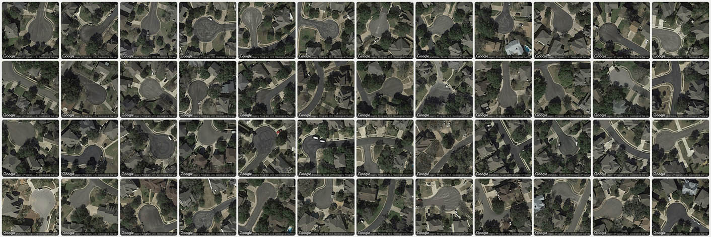

# Assignments 4.x: Digital Curation

--- 

* *This 'speed project' is due on Thursday, April 10. (6-8 hours)*
* **Reminder:** Get a 3-button mouse!

---

### Digital Curation / Internet Readymade

For this one-week "speed project", you're asked to indulge in your inclination to surf the web, to go down a rabbit hole, to immerse yourself in internet platforms, to distill a collection of objects that seem extraordinary only to you, and to rescue these data from obscurity. To understand what I mean, see our [**lecture notes**](https://github.com/golanlevin/60-120/tree/main/2025/lectures/digital_curation).

For this project, we're not particularly interested in your ability to *imagine* or *create*; we're interested in your capacity to *discover*, *document*, and *collect*. Now, for **Thursday April 10th**:

* **Research** a type of artifact, media, subculture or practice you find on the internet.
* **Create** a coherent collection of digital “media-objects” that you consider valuable but under-appreciated from an aesthetic, political, historical, or anthropological standpoint. Ideally, your collection should reveal your distinctive taste as an observer and collector.
* **Curate** these objects into an exhibition. Make a discovery, curate a collection, allow the things you find to speak for themselves. **Present** this collection in an online page using either [**Hotglue.me**](https://hotglue.me/) or [**mmm.page**](https://mmm.page/). Note that you may need to make a free account.
* In a Discord post in the `#4-digital-curation` channel, **provide** a URL link to your Hotglue/mmm page.
* In your post, **write** a few sentences about what your collection is, why it interests you, and any special remarks about how you collected it.
* In your post, **include** some small images of examples of the things you collected. 
* In your post, **include** a screenshot of your Hotglue/mmm page.

---