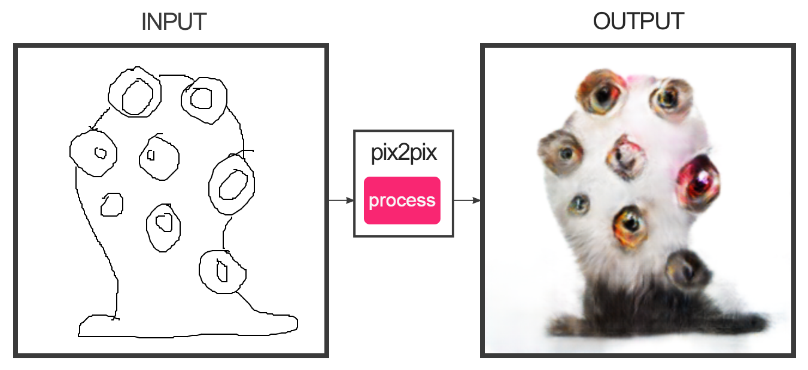
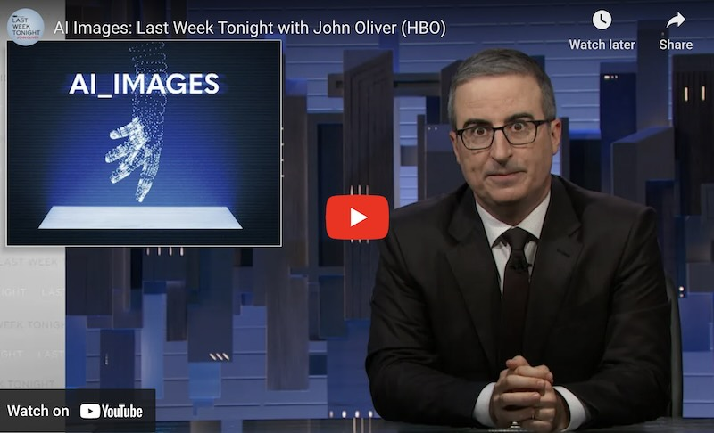
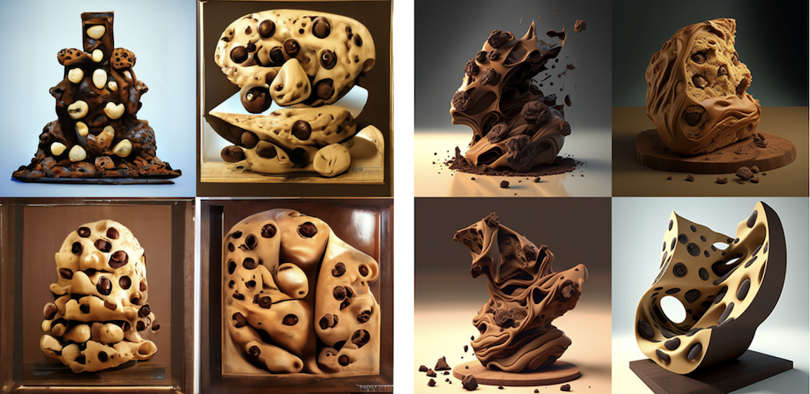
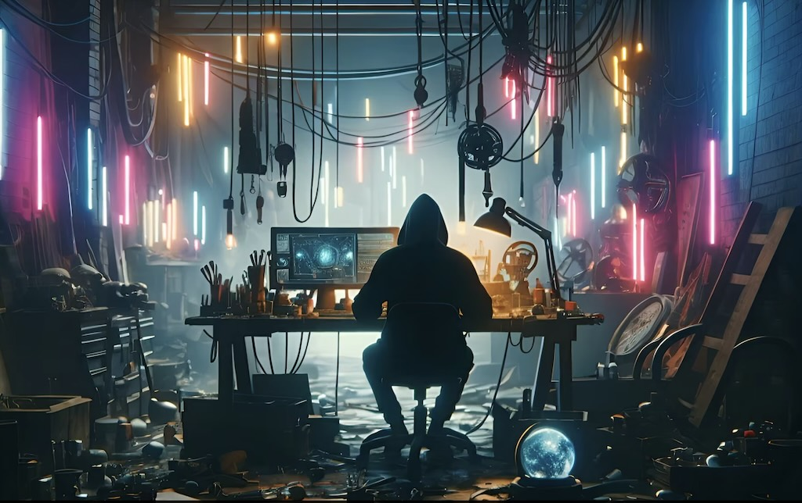
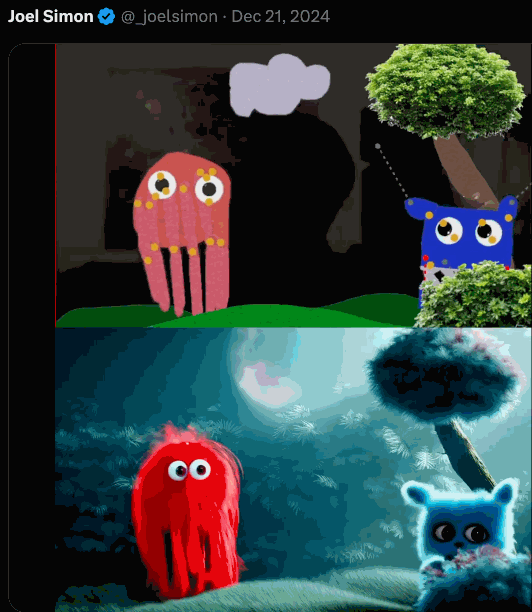
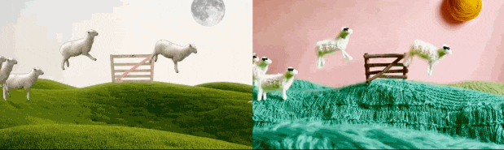

# Assignments 1.x: Generative AI

This assignment has the following parts: 

* 1.0. Administrative Tasks — *(15 minutes, due Thursday 1/16)*. 
* 1.1. Looking Outwards Report — *(45 minutes, due Thursday 1/16)*. 
* 1.2. Image-to-Image Exercise with Pix2Pix — *(10 minutes, due Thursday 1/16)*. 
* 1.3. Text-to-Image Synthesis with MidJourney — *(60 minutes, due Tuesday, 1/21)*.
* 1.4. Exercise: Image Outpainting with Runway.ML — *(30 minutes, due Tuesday, 1/21)*.
* 1.5. Viewing-Response —  *(30 minutes, due Tuesday 1/21)*.
* 1.6. Puppet Conditioning — *(5 hours, Due Tuesday 1/28)*. 

---

## 1.0. Administrative Tasks

For Thursday, 1/16, please complete the following. This should take less than 15 minutes. 

* Please carefully read the [Syllabus](https://github.com/golanlevin/60-120/blob/main/2025/syllabus/readme.md) (10 minutes)
* Complete this [Welcome Questionnaire](https://forms.gle/5HW4Eeg3aQsN9nJN9).
* Join our course Discord using the (latest) invite provided by email. 
* Create an [OpenProcessing](https://openprocessing.org) account; join our site with [this invite](https://openprocessing.org/join/F883B9).

Additionally, 

* If you have accommodations, please get them to me ASAP.
* Non-Art students in this class should receive access to Adobe CC; check on this?
* Make sure you have an external hard drive, such as one of [these](https://www.amazon.com/gp/product/B08GTYFC37/?th=1).
* This is a reminder that [you will need a 3-button mouse](https://github.com/golanlevin/60-120/blob/main/2025/syllabus/readme.md#required-course-materials) after spring break.

---

## 1.1. *Looking Outwards* Report: AI and the Arts

(*45 minutes, due Thursday 1/16*). 

A “[Looking Outwards](https://github.com/golanlevin/60-120/blob/main/2025/syllabus/looking-outwards.md)” report is a brief post that reports on a project that interests you. Your job is to browse blogs and other sources, such as those linked below, and then report on an artwork or other project that you haven’t seen before. The point of the assignment is to deepen your familiarity with the field of AI in new media art — and to develop your own personal research practice.

The following websites showcase more than a thousand artworks that make use of machine learning and/or ‘AI’ techniques. Please browse these websites for about 30 minutes. After viewing at least five projects, select one to feature in a Looking Outwards report.

* [**MLArt.co Gallery**](https://mlart.co/) (a collection of approximately 500 experiments curated by Emil Wallner).
* [**AI Art Gallery**](http://www.aiartonline.com/) (annual exhibitions of the NeurIPS Workshop on Machine Learning for Creativity  and Design: [2020](https://www.aiartonline.com/category/highlights-2020/), [2019](https://www.aiartonline.com/category/highlights/), [2018](https://www.aiartonline.com/category/art/), [2017](https://www.aiartonline.com/category/art-2017/))
* [**Chrome Experiments**](https://experiments.withgoogle.com/experiments) (a showcase of 1600+ experiments, commissioned by Google, that explore machine learning through pictures, drawings, language, and music).
* [**CreativeApplications.net: #AI**](https://www.creativeapplications.net/?s=AI) (projects tagged with `#AI` on a leading blog about media arts and design. To get past the paywall, use the login information provided in the `#key-information` channel of our Discord.)
HuggingFace (a large repository of laboratory-grade experimental AI tools, not yet commercialized)
* [**AIArtists.org**](https://aiartists.org/ai-artist-founding-members) A directory of artists who are known to use AI in their work (plus an [expanded list](https://aiartists.org/ai-artist-directory))

*Now:*

* Create a post in the Discord channel, `#1-1-looking-outwards`
* Include an image of the project you selected.
* Include a URL link to information about the project.
* Write a sentence describing the project. (What *is* it?)
* Write another sentence about why you found the project interesting.
* Write a question, concern, or critical observation that you have about the project.
* *Note*: For today's exercise, if two students choose to write about the exact same project, neither student will get credit. This constraint is made to encourage you to look beyond the first page of results.

---

## 1.2. Image-to-Image Exercise with Pix2Pix

*(10 minutes, due Thursday 1/16)* In this brief exercise, you are asked to spend a few minutes with the *edges2cats* demo in the [**Image-to-Image**](https://affinelayer.com/pixsrv/) (Pix2Pix) online app by Christopher Hesse. Note that this app is from *2017* — ancient history in AI terms — and is comparatively rudimentary. You are asked to:

* **Create** a post in the Discord channel, `#1-2-pix2pix`
* **Create** 2 or 3 different designs. **Screenshot** your work so as to show both your input and the system’s output.
* **Embed** your favorite results into the Discord post.
* **Write** a reflective sentence about your experience using this tool.

---

## 1.3. Exercise: Text-to-Image Synthesis with MidJourney

*(60 minutes, due Tuesday, 1/21)* In this exercise, you will use a machine learning system to generate some images that intrigue you. This system has (controversially) been trained on billions of images scraped from the Internet. This [very entertaining 10-minute *Last Week Tonight*](https://www.youtube.com/watch?v=3YNku5FKWjw) video gives some good perspective; I encourage you to watch it.

You have been provided with access to paid accounts for MidJourney, an image synthesis service. These are accessed through the account login details provided in the `key-information` channel of our Discord. Login details for these accounts are available in our course Discord. *NOTE:* These accounts are a communally shared resource for the 16 students in our class, and sharing it with you is an act of trust.

Now,

* **Read** the [Midjourney Quick Start Guide](https://docs.midjourney.com/docs/quick-start) — most especially, the documentation on “[Imagine Parameters](https://docs.midjourney.com/docs/parameter-list)“.
* **Tinker**! Try experimenting with techniques like: “inspiring” an image with a seed image, using different model versions, making non-square images, etcetera.
* **Generate** about 3-5 images, and **present** them in the Discord post. What you make is up to you, but I challenge you to make something that doesn’t just look like a character design plucked from DeviantArt (that’s too easy). The weirder the better. **Try** to work a prompt through at least five iterations of revision.
* **Create** a Discord post in the channel `#1-3-image-synthesis`
* **Embed** your images in the post.
* For each image, **include** the text of the prompt that you used to create it.
* **Write** a few sentences of reflective commentary. Were you able to ‘guide’ the system? What discoveries did you make?

### Tips: 

**Tip 1:** Note that MidJourney provides some powerful commands to guide the AI. These are discussed in the documentation on “[Imagine Parameters](https://docs.midjourney.com/docs/parameter-list)“, and include things like controlling the image aspect ratio, resolution, visual quality, inspiration source image, and (importantly) choice of AI model. MidJourney has evolved a lot: The latest model version (v6) produces extremely high-fidelity results, but the earlier versions can make weirder (less photorealistic) stuff! Below are v1 and v4 responses to the same prompt, “chocolate chip sculpture”: 

**Tip 2:** The following list additional guides may be helpful. In particular, you may find it helpful to use what Kate Compton has called “seasonings” — extra phrases and tags (like “trending on ArtStation” that hint and inflect the image synthesis in interesting ways.

* [Midjourney’s official “Tips for Prompts“](https://docs.midjourney.com/docs/prompts)
* [Crafting Exceptional Prompts for MidJourney](https://harpa.ai/blog/ultimate-midjourney-prompts-guide)
* [Prompt-Engineering Tips](https://twitter.com/davidad/status/1551143240065228800)
* [Kate Compton on “Seasonings”](https://twitter.com/GalaxyKate/status/1460266560820584451)
* [Into prompt engineering for A.I.](https://reticular.hypotheses.org/2261)

In using our communal MidJourney/Discord accounts, please adhere to the following:

* Do not share the login details of this account with anyone.
* Do not modify any of the account settings (password, etc.)!
* Do not use this account to connect to any other Discord servers.
* Do not use this account to communicate with other people on Discord, harass them, etc. You must adhere to our course Code of Conduct.
* You must adhere to the MidJourney terms of service. If you get booted off for doing bad things (like generating offensive content), it affects our whole class.
* I’ll probably need to help you log in the first time by affirming that your login is legit.

## 1.4. Exercise: Image Outpainting with Runway.ML

*(30 minutes, due Tuesday, 1/21)*. You have been provided with account details (in the Discord `key-information` channel) to access [Runway.ML](https://runwayml.com/), a powerful suite of machine-learning-based artist tools. In this exercise, you are asked to use the Runway.ML “infinite image” and/or “expand image” tool to provocatively extend an image of your choice. Some possible images you could expand are:

* One or more of your own artworks
* One of the images you generated with MidJourney
* A famous photograph or painting (*please be thoughtful*)
* (This list is representative and not exhaustive.)
(Note that it’s also possible to create a composition that connects multiple images.)

***Now,***

* **Watch** [this 2-minute video](https://www.youtube.com/watch?v=N424al-2lxA), which helpfully explains how to use the tool.
* **Make** a large, high-resolution extended image. Consider making a [*tableau vivant*](https://www.tate.org.uk/art/art-terms/t/tableau). **Compare** the results of Runway’s “infinite image” tool (which asks for a text prompt) versus Runway’s “expand image” tool.
* **Create** a Discord post in the channel `#1-4-outpainting`, and **embed** your image.
Also **embed** the “original” (seed) image that you extended, so we can better understand what you did.
* **Write** a few sentences of process description. What was the initial “kernel” image or images that you started from? Why did you choose this? Did you make any discoveries in your process?
* **Write** a few sentences of reflective commentary. What do you appreciate about the result, and what would you change?

---

## 1.5. Viewing - Response 

*(30 minutes • 10% • Due Tuesday 1/21).*

* [Alan Warburton](https://alanwarburton.co.uk/) is a British media theorist and expert CGI animator. **Watch** [*The Wizard of AI*](https://vimeo.com/884929644), his 20-minute video essay about generative AI. (In this essay, Warburton uses tools like Runway and MidJourney to discuss and critique the legal, aesthetic and ethical problems these tools engender.) 
* In the Discord channel `1-5-viewing`, **write** a couple of sentences about something that stuck with you from Warburton's video essay.

---

## 1.6. Puppet Conditioning

*(5 hours • Due Tuesday 1/28)* 

In [this tweet](https://x.com/_joelsimon/status/1834756270798389524), CMU BCSA alum [Joel Simon](https://www.joelsimon.net/) — creator of AI tools like [Puppets.App](https://puppets.app/), [ArtBreeder](https://www.artbreeder.com/), and [LatentScape](https://latentscape.com/) — demonstrates a workflow in which a springy puppet, controlled in realtime by a camera-based handtracker, is used to create an animation that conditions the "vid2vid" generative AI process in RunwayML. That — *more or less* — is the workflow we will use for this project. 

Now: 

* **Create** a brief (10-15 second) animation or puppet-video, *from scratch*, using any non-AI means you prefer. For example, you could use things like
  * drawings controlled with Joel's [Puppets.App](https://puppets.app/), or 
  * a sock-puppet or other puppet you've made out of craft materials, or
  * a free stop-frame animation tool such as [Cloudstopmotion.com](https://cloudstopmotion.com/en-US), or
  * Blender/Maya/p5 (if that's your thing), etc.
* Your input video could be a loop, or a tiny story, or just a 'live' scene — up to you. (Feel free to make multiple shots.) **NOTE**: In your input video, whether animated or puppeteered, you may not include any camera-based recordings of actual people. The reason for this constraint is simply that I want you to *make* something from scratch! 
* **Export** your animation as a video file; 1280x720 is a recommended resolution. 
* If you made a stop-frame animation, consider using the "[Super Slow Motion](https://www.youtube.com/watch?v=tMjpv2aaAKw)" tool to create interpolated frames. (This can significantly reduce the number of frames you need to record!)
* **Upload** your animation to one of the provided RunwayML accounts. **Make** a folder with your name in Runway's `Assets/Private/` directory and **move** your video there. 
* **Use** the "Video-to-Video (Gen-1)" (ai-tools/gen-1) or "[Video to Video with Gen-3 Alpha](https://www.youtube.com/watch?v=B_RfJ1B5wME)" tool to transform it. (Technically, you are *conditioning* a generative AI process with your input video.)
* **Export** your output video from RunwayML. 
* **Adding sound** is *very strongly recommended*, though not strictly required. You should be able to do this with your preferred tool, such as Quicktime, GarageBand, iMovie, Premiere, AfterEffects, DaVinci Resolve, or [Kapwing.com](https://www.kapwing.com/).
* **Upload** both your input and output videos to YouTube, and **set** the visibility of these videos to *Unlisted*. 
* **Create** a Discord post in the channel `1-6-puppets`, and **include** links to your two YouTube videos in the post. 
* In your Discord post, **write** a few sentences about your process. 
* Also in your Discord post, **embed** a pair of static images (input/output) showing your work. 


---

*EOF.*

