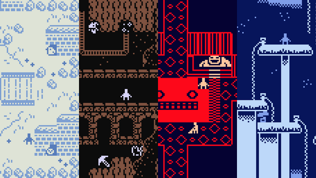
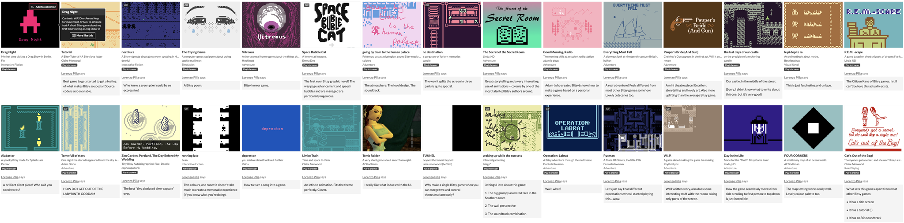
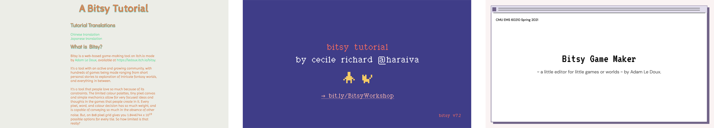
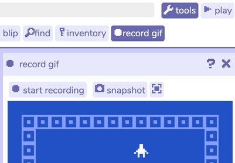
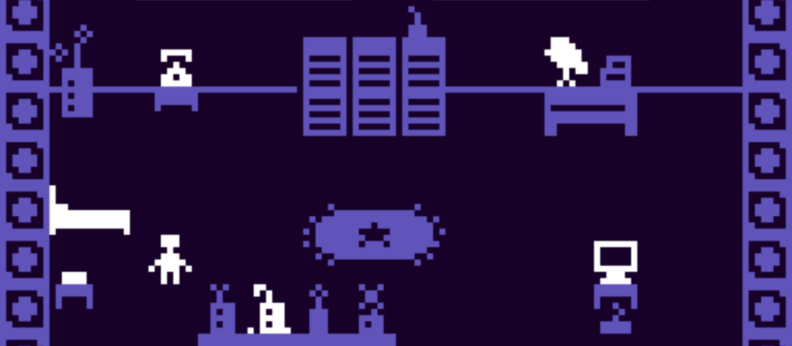

# Assignments 3.x: Interactive Narrative

---

*In this unit, we will create interactive narratives. You can think of these as (e.g.) short games, playable stories, branching narratives, time-based illustrations, responsive graphic novels....*

This unit extends through Tuesday April 1st, and has five deliverables:

* [**3.1. Looking Outwards: Bitsy Games**](#31-looking-outwards) *(due Thursday, March 13; ~1.5 hours)*
* [**3.2. Bitsy Tutorial**](#32-bitsy-tutorial) *(due Tuesday, March 18; ~2 hours)*
* [**3.3. Research Phase**](#33-research-phase) *(due Thursday, March 20; ~1 hour)*
* [**3.4. Draft of Interactive Narrative/Game**](#34-draft-of-interactive-narrativegame) *(due Thursday, March 27; ~6 hours)*
* [**3.5. Interactive Narrative/Game**](#35-interactive-narrative-game) *(Main project; due Tuesday, April 1; ~10 hours)*

### Learning Objectives

*Bitsy is not a "professional" game making tool and it’s extremely limited, so what’s the point of this assignment?* Ideally you will:

* Tell a story non-linearly, through narrative bits presented in a coherent environment (think of it as a world-building assignment)
* Convey a *theme*, express something *personal*, create a *mood* without resorting to clichés
* Learn to use and reuse graphic assets economically (tiles and modular assets are common in game design)
* Learn to communicate the affordances of a space, such as: where are the exits, what are the walls, what are you supposed to *do*, where are you supposed to *go* (this huge part of game design, level design, and art direction in interactive media)
* Learn to overcome the limitation of a tool by using hacks, unconventional solutions, or out-of-the-box thinking.

---

# 3.1. Looking Outwards

*(This Looking-Outwards report is due Thursday, March 13. Estimated time is ~1.5 hours.)*

**Browse** the following websites/lists:

* [Lorenzo Pilia’s Bitsy Faves pt.1](https://itch.io/c/201121/bitsy-faves-pt1-20172018) (2017–2018)
* [Lorenzo Pilia’s Bitsy Faves pt.2](https://itch.io/c/232207/bitsy-faves-pt2-20192024) (2019–2024)
* [Top games tagged Bitsy](https://itch.io/games/tag-bitsy) on Itch.io *(5544 results as of March 2025!)*
* [More Bitsy games, tricks, and software](https://itch.io/search?q=bitsy) on Itch.io
* [Claire Morwood’s "Cool examples of cool games"](https://www.shimmerwitch.space/bitsyTutorial.html) (see bottom of that page)
* [Some games recommended by previous 60-120 students](https://github.com/golanlevin/60-120/blob/main/2025/lectures/interactive_narrative/some_bitsy_games.md#student-recommendations)

*Now:*

* **Play through** a variety of games linked from the sites above.
* **Select** three (3) games that you find intriguing or compelling.
* **Create** a post in the Discord channel `#3-1-looking-outwards`. In the post, 
* **State** the title and URL of each of your chosen games. 
* **Write** one or two sentences for each game, explaining what you appreciate about them and why they are worth playing. **Highlight** some idea, solution or trick you could potentially apply to your story.
* **Include** a screenshot of each of your chosen games.

---

# 3.2. Bitsy Tutorial

#### **NOTE!** This tutorial exercise is **purely technical**. Feel free to amuse yourself, but a creatively-imagined game is not requested here.

*(This is due before class on Tuesday March 18. Estimated time: ~2 hours.)* 

* Here is the official [Bitsy documentation](https://make.bitsy.org/docs/); **Behold** the fact that it exists, using your eyes.
* Here is an [extremely thorough playlist of recent Bitsy video tutorials](https://www.youtube.com/playlist?list=PLlXuD3kyVEr6bprFqUBCOEWT47xqYmVQ4); Briefly **observe** its existence, and **make** a mental note of it. 
* Here are three simple, introductory Bitsy tutorials (they are all similar); **Select** one, and **follow** it: 
  * Claire Morwood’s [Bitsy Tutorial](https://www.shimmerwitch.space/bitsyTutorial.html) (Web)
  * Cecile Richards’ [Bitsy Workshop Tutorial](pdf/bitsy_workshop_by_cecile_richards.pdf) (PDF)
  * Connie Ye’s [Bitsy Tutorial](pdf/bitsy_tutorial_by_connie_ye.pdf) (PDF)
* **Create** a SIMPLE "non-game" game project — i.e. *zero art, zero story* — in which you demonstrate that you can achieve each of the following technical requirements: 
  * a non-default **title** for your project
  * a non-default animated **avatar**
  * a non-default animated **sprite** that presents some dialog with a “text effect”
  * a non-default **item** (i.e. a collectible object) that produces a **sound** ("blip") of your choice when the user collects it
  * a **room** which has at least two different background tiles; some impassable walls or obstacles; and an exit that connects to a differently-colored second room. 
  * a room with a non-default background **tune**
  * a non-default color for your **project HTML page** (from the Settings menu)
  * an **ending**, which displays a message when the user reaches the end of the "game".
  * an **HTML file version** of your game, saved to your own computer! 

*Now:*

* **Create** a post In the Discord channel `#3-2-tutorial`.
* **Record** a brief animated GIF of your tutorial game by using the Bitsy “record GIF” tool in “Play” mode. *(A screenshot showing where to find this tool is below.)* It's fine if your GIF is just a few seconds long. **Embed** this GIF in your Discord post to show your work. *(If you encounter a problem recording the GIF, try using [LICEcap](https://www.cockos.com/licecap/) instead.)*
* **Write** a sentence or two about your experience learning the Bitsy tool.

---

# 3.3. Research Phase

*(This research phase is due Thursday, March 20. Estimated time: 1 hour.)*

### Overview of the Process

For the remainder of this Unit, you will develop an experience using Bitsy, such as a game or interactive narrative. It is strongly recommended that your final version include sound.

#### Requirements: 

1. Your project must be playable in **5 minutes or less** – think quality not quantity.
2. Your project must have some degree of **non-linearity** – don’t make me advance through a slideshow.
3. Your project must be **published** to the Itch.io website.
4. Your project must be **documented** in a video playthrough.

#### Your work will be divided in three phases: 

* 3.3. A brief description of your ideas, as informed by brainstorming and other research, due **3/20**.
* 3.4. A rough draft of your game, due **3/25**. You will present your draft to a small group of peers in the class for playtesting and feedback.
* 3.5. A published game to be shown in critique, due **4/1**. You will present the final version of your project to the entire class, presenting it from its page on Itch.io.

### Brainstorming

To arrive at the idea for your project, consider how you might retell the story (or recreate the world) of something like the following:

* A memory from your childhood
* A dream you remember
* A fairy tale or myth you relate to
* A joke or shaggy-dog story you like to tell
* A situation you found yourself in recently
* A family story
* A house you used to live in
* *This is not an exhaustive list!*

**Alternatively** — Prof. Pedercini encourages the students in his section to combine a *narrative prompt* (content) with a *theme modifier* (form): 

| **Narrative prompts** | **Theme modifiers** |
|-----------------------|--------------------------------|
| Everything in one room | Non-linear space (the rooms do not describe a continuous space) |
| Memory                | Non-linear time (the game has flashforwards or flashbacks) |
| Abstract              | Loop: the game ends where it began |
| Poem                  | Multiple endings |
| Aging                 | Multiple beginnings |
| Utopia                | Multiple or changing avatars |
| Inequality            | Non-fiction / Documentary |
| Obsession             | Autobiographical |
| Educational           | No movement in space |
| Alphabet              | Abstract avatar (what if it’s not a person walking around) |
| Adapt old fiction     | Abstract space (inhabit a painting)|
| Hostile architecture  | Non human/non anthropomorphized avatar |
| Before and after      |                                |
| Colonization          |                                |
| Bureaucracy           |                                |
| Four Seasons          |                                |
| An upsetting dream    |                                |
| Glitch                |                                |
| My first time         |                                |
| Reverse time          |                                |
| Smell                 |                                |
| Sport                 |                                |
| Paranoia              |                                |
| Riot                  |                                |
| Death                 |                                |
| Factory               |                                |
| Memorabilia           |                                |

**Give consideration to:**

* What are the places, locations, situations that immediately come to your mind?
* What are some less obvious ones?
* Who is the player and what are they doing there?
* Who else lives or exists in that place?
* What happened in that place an hour ago? A year ago? What is going to happen tomorrow?
* How can you tell the story of the place through objects and characters disseminated in this space?
* How do you intrigue the player and keep their attention? What questions are you asking narratively?
* How can you surprise the player? What is a twist, a discovery, a revelation you can deliver towards the end?

### Research Work

*Now*, for Thursday, March 20, **please do the following**: 

* (10 minutes) **Read** this brief article on [*Standard Patterns in Choice-Based Games*](https://heterogenoustasks.wordpress.com/2015/01/26/standard-patterns-in-choice-based-games/) (10 minute read)
* (2 minutes) Briefly (re)-**Scan** [this collection of tutorials](https://www.youtube.com/playlist?list=PLlXuD3kyVEr6bprFqUBCOEWT47xqYmVQ4), which shows you how to achieve some advanced tricks that are well-supported within Bitsy (such as conditional dialogue)
* (2 minutes) Briefly **Scan** [this collection of Bitsy hacks](https://github.com/seleb/bitsy-hacks/blob/main/README.md), which shows some of the ways in which the open-source community have extended the functionality of Bitsy. *Be aware that it can be a little tricky to get some of these hacks to work properly.*
* (5 minutes) Briefly **Scan** some of the [games made by previous students in this course](https://github.com/golanlevin/60-120/blob/main/2025/lectures/interactive_narrative/some_bitsy_games.md#cmu-student-bitsy-projects), to get a feel for what it's possible for an CMU art student to achieve in a couple of weeks.
* **Conceive** two different ideas for a short Bitsy game elaborating on your theme. 
* **Make** a single room in Bitsy that is representative of the style, the dialogue and the vibe of your possible game(s). Don’t get too attached to this room: This is strictly for you to get acquainted with the tool, to do a vibe check, and to understand how long it takes to make things.
* **Create** a post in the Discord channel, `#3-3-research`
* In your post, **Describe** your two different project ideas. 
* **Mention** concepts and/or techniques you'd like to explore.
* **Include** an image of the room you made. 

---

# 3.4. *Draft* of Interactive Narrative/Game

*(This is due Thursday, March 27. Estimated time: 6 hours.)*

On Thursday March 27, you will present your draft to a small group of peers in the class for playtesting and feedback.

* To get started, **Plan** out your project using a storyboard and graph paper. Keep your drawings/notes. Plan all of your rooms on paper, including sprites, NPC dialogue, etc.
* You are **strongly advised** to export and save intermediate copies of your work *frequently*.
* You should anticipate that you may need to do some additional research, specific to your project, about how to use advanced features of the Bitsy environment (e.g. variables) that may not have been covered in the previous Tutorial.
* **NOTE**: Adding recorded audio/music beyond Bitsy's chiptunes can be tricky, and involves integrating “hacks” that are described [here](https://candle.itch.io/bitsy-audio), [here](https://kool.tools/bitsy/tools/bitsymuse-ui/), and in documentation [here](https://github.com/seleb/bitsy-hacks/blob/main/dist/bitsymuse.js). I strongly advise you to learn how to add sound to a test/scratchpad project before March 25. To make this easier, some students have recommended switching to [Bitsy Savior](https://aloelazoe.itch.io/bitsy-savior), a standalone Bitsy editing tool, instead of developing your project in the web browser.

Now: 

* **Export** your Bitsy project to an HTML file or zip archive, and make sure you are able to share it from your Google drive. 
* **Create** a Discord post in the channel `#3-4-draft`.
* **Paste** a link to your file in the Discord post, so that your peers can test it on their computers. (Ensure the link is set to public!)
* **Embed** an animated GIF of your project.
* **Write** a sentence or two to describe your project: What is your game about? 
* **Write** a sentence or two explaining: How is your game played? What do your players need to know to navigate your draft? 
* **Write** an answer to the following: In our in-class playtest session, *what would be helpful for you to get feedback on? What decisions did you make that you’re not sure about?*

---

## 3.5. Interactive Narrative Game

*(For Tuesday April 1, you are expected to revise, publish, and document your interactive Bitsy experience. Estimated time: 10 hours.)*

* **Refine** and **revise** your project, incorporating your peers’ feedback.
* **Do not under any circumstances use the default Bitsy music**. Turn it off. The default music tells players that you don’t know what you're doing and that they should not play your thing.
* **Record** a brief video in which you narrate a play-through of your game. **Upload** this video to your Google drive or (even better) to an unlisted YouTube location.
* **Publish** the final version of your project online at [itch.io](https://itch.io/). Your project *must* be presented from itch.io, so make sure to leave time to get this working! **Pay attention** to the complete itch.io settings — for example, there is a control that makes it possible to enable/disable **full-screen** presentations of your game.
* **Ensure** your project has an **intriguing title**, a well-edited **short description** (with clear instructions), and an **attractive thumbnail image** on Itch.io.
* **Create** a Discord post in the channel with your name. For example, a student named "Chris" would document their project in the Discord channel, `#3-chris`. We will use these channels to provide written feedback for your projects during our critique.
* In your Discord post, **link** to your game at Itch.io. **Ensure** the link works and that your game is publicly visible! (**Test** your link from a different computer or from a different browser that you're not logged into!)
* **Write** a paragraph which describes your experience in simple terms. *What is the story? How is it played?*
* You must **include** some images of your work. For example, you could **embed** an animated GIF of your game, and/or **embed** some screenshots, images of your sketches, or some scans of your storyboard notes.
* **Provide** a link to your playthrough video in your Discord post. If you store the video in your Google drive, **ensure** the link is publicly accessible.
* **Write** a paragraph evaluating your project, and discussing your experience making it.

---

EOF

<!--

* [Bitsy Basic Dialog tutorial](https://www.youtube.com/watch?v=G8ysQSwYQ18)
* [Bitsy Advanced Dialog tutorial](https://www.youtube.com/watch?v=jbvtS1d2Zq0)
* [Bitsy conditional dialog](https://www.youtube.com/watch?v=GnPge60wGWI)
* [Bitsy conditional dialog tutorial with variables](https://www.youtube.com/watch?v=Mrt0tk6HSvI)
* [More colors in Bitsy](https://www.youtube.com/watch?v=ZlmWoR8zvxs)
* https://ayolland.itch.io/trevor/devlog/29520/bitsy-variables-a-tutorial

BITSY HACKS

For EXTRA CREDIT: You are gently encouraged to explore and implement one of the many other available “hacks” that extend the functionality of your project, some examples of which are listed below. However, you should be aware that:

Some older hacks may not be compatible with the latest version of Bitsy;
Some hacks are not compatible with each other;
Special care and attention to detail must be taken when implementing some hacks, so as not to corrupt your project file;
There are hundreds of different hacks for Bitsy, created by random enthusiasts. Getting one working is up to you. It is possible that you might spend effort on something that doesn’t end up working.
If you decide to add one or more hacks to your project, you are strongly advised to get it working in a scratchpad game first, and to do so as soon as possible. For some resources about advanced Bitsy use and Bitsy hacks, browse through sites like the following:

Cecile Richards’ collection of bitsy tools, including:
Pixsy (turn images into rooms)
Add audio to Bitsy
Great list of Bitsy Hacks
Another big list of Bitsy hacks
Fontsy (making your own fonts)
Bitsy Wiki
How do I use variables (coding with dialog)?
How do I do Boolean operations in Bitsy?
How do I have a locked door that opens once the player finds the key?
How do I have more than three colors in the palette?
How do I add extra frames of animation?
How do I change the background color of the text box?
How do I read out items and variables (and drawings) as part of the dialogue?

</li>
<li aria-level="1"><a href="https://web.archive.org/web/20231128131447/https://github.com/seleb/bitsy-hacks">Great list of Bitsy Hacks</a></li>
<li aria-level="1">Another big list of <a href="https://web.archive.org/web/20231128131447/https://bitsy.fandom.com/wiki/Bitsy_hacks_collection_on_GitHub">Bitsy hacks</a></li>
<li style="font-weight: 400;" aria-level="1"><a href="https://web.archive.org/web/20231128131447/https://seansleblanc.itch.io/fontsy">Fontsy</a> (making your own fonts)</li>
<li aria-level="1"><a href="https://web.archive.org/web/20231128131447/https://bitsy.fandom.com/wiki/Bitsy_Wiki">Bitsy Wiki</a></li>
<li aria-level="1"><a href="https://web.archive.org/web/20231128131447/https://ayolland.itch.io/trevor/devlog/29520/bitsy-variables-a-tutorial">How do I use variables (coding with dialog)?</a></li>
<li aria-level="1"><a href="https://web.archive.org/web/20231128131447/https://louisemclennan.wordpress.com/2018/06/07/boolean-operations-in-bitsy/">How do I do Boolean operations in Bitsy?</a></li>
<li aria-level="1"><a href="https://web.archive.org/web/20231128131447/https://docs.google.com/document/d/16x1S_FjkcXuuB5R-XRBA50CAXLSIPLTWonvKq3A5SAY/edit#heading=h.gxnecyhhzwd1">How do I have a locked door that opens once the player finds the key?</a></li>
<li aria-level="1"><a href="https://web.archive.org/web/20231128131447/https://docs.google.com/document/d/16x1S_FjkcXuuB5R-XRBA50CAXLSIPLTWonvKq3A5SAY/edit#heading=h.f5n7g14acgne">How do I have more than three colors in the palette?</a></li>
<li aria-level="1"><a href="https://web.archive.org/web/20231128131447/https://docs.google.com/document/d/16x1S_FjkcXuuB5R-XRBA50CAXLSIPLTWonvKq3A5SAY/edit#heading=h.zf5xu0y5xp9j">How do I add extra frames of animation?</a></li>
<li aria-level="1"><a href="https://web.archive.org/web/20231128131447/https://docs.google.com/document/d/16x1S_FjkcXuuB5R-XRBA50CAXLSIPLTWonvKq3A5SAY/edit#heading=h.nm09cxlmmyic">How do I change the background color of the text box?</a></li>
<li aria-level="1"><a href="https://web.archive.org/web/20231128131447/https://docs.google.com/document/d/16x1S_FjkcXuuB5R-XRBA50CAXLSIPLTWonvKq3A5SAY/edit#heading=h.tecf31prkcsq">How do I read out items and variables (and drawings) as part of the dialogue?</a></li>
</ul>

https://golancourses.net/60120/daily-notes/unit-3-interactive-narrative/design-strategies/
https://ruin.itch.io/pixsy
https://ayolland.itch.io/trevor/devlog/29520/bitsy-variables-a-tutorial

-->
