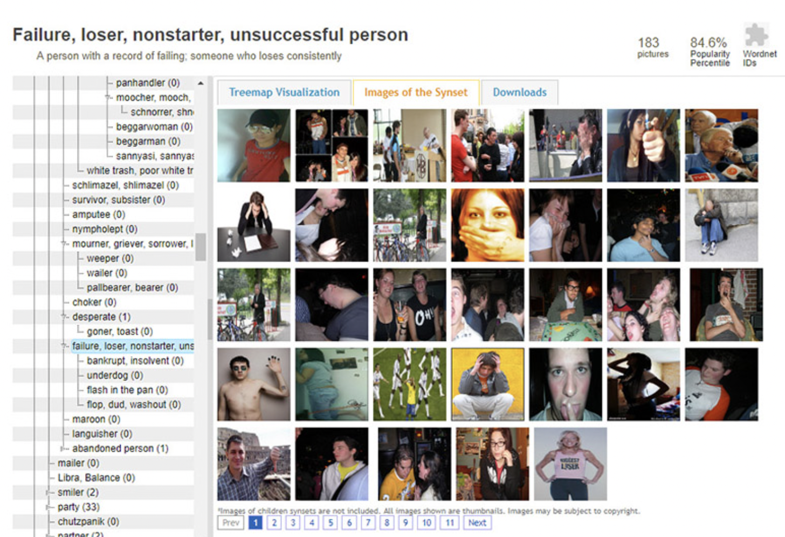

# Thursday, January 16

### Agenda

* [Effet Kazoo](https://www.youtube.com/watch?v=y9FKxMiiI6Y)
* Warmup Exercise 1: [Which Faces Were Made by A.I.?](https://www.nytimes.com/interactive/2024/01/19/technology/artificial-intelligence-image-generators-faces-quiz.html)
* Warmup Exercise 2: [Which Parts of These Images Are A.I.-Generated?](https://www.nytimes.com/interactive/2024/12/27/technology/artificial-intelligence-generative-fill-photoshop-openai.html?unlocked_article_code=1.pk4.GhtX.zVgU6EqAMzxQ&smid=url-share)

### Some Tangents

#### The commercially expected

* Soon, generative AI will be used to render realtime games, as in [this prototype](https://x.com/LinusEkenstam/status/1841821657515581948)

#### The weird and interesting

* [Kevin Slavin (2022) used MidJourney](https://twitter.com/golan/status/1544329926198939648) to visualize "real things that existed, or real events that happened, that have no visual record" — such as (architect) Antoni Gaudí's (burned/ransacked) cardboard maquettes for the [Sagrada Familia](https://livingchurch.org/covenant/the-christmas-story-in-stone-the-nativity-facade-of-the-sagrada-familia/) cathedral.
* [Sawdust Store](https://www.instagram.com/ainterestingaf/p/CrtBRWSowIJ/?img_index=1)
* [Aunties in bizarre settings and the Singapore AI artist behind it @niceaunties](https://www.youtube.com/watch?v=aNldH5IIn3g)
* [Work by Jess MacCormack](https://x.com/JessMacAI/status/1703127734644584769), [Fleshy](https://x.com/ClownVamp/status/1873416162350092616), [+](https://x.com/iki_jima/status/1873987062170608053)
* [Animals Eating Noodles](https://x.com/_akhaliq/status/1812573686152450397)
* [Hotdog Eating Chinese Food](https://x.com/_akhaliq/status/1811864979710107843)

#### The bad 

* [Generative AI systems infringe by default](https://x.com/Rahll/status/1835752715537826134), thread by Reid Southen.
* [Works created entirely with AI can't be copyrighted in the USA](https://www.cooley.com/news/insight/2024/2024-01-29-copyright-ownership-of-generative-ai-outputs-varies-around-the-world#:~:text=copyright%20will%20only%20protect%20the%20human%2Dauthored%20aspects%20of%20the%20work)
* [Generative AI is being used for misinformation](https://x.com/reshetz/status/1815648517081190457) ("ignore all prevous instructions"), a new Turing test.
* [Meta's RayBans train AI on anything you look at](https://www.instagram.com/ainterestingaf/p/CrtBRWSowIJ/?img_index=1)
* Digital cryptids: like [Crungus](https://futurism.com/ai-nightmare-crungus) and [Loab](https://en.wikipedia.org/wiki/Loab), as [discussed by James Bridle](https://x.com/jamesbridle/status/1567794871716532225), embed frightening biases.
* Even seemingly innocuous operations like outpainting can have unintended consequences ([profile pic story](https://www.linkedin.com/posts/elizabethlaraki_im-talking-at-a-conference-next-month-on-activity-7252374626972938240-KVQr/))

---

## How Generative AI Works for Image Synthesis

*Information here is distilled from [Writing Images: Exploring the data behind popular text to image generation models](https://aarati.online/writing_images_workshop/), by Aarati Akkapeddi.*

* Images have "alt" text (or alternative text): a written description of an image posted online. Let's all inspect some alt text. 
* Since 2008, [CommonCrawl.org](commoncrawl.org) has maintained a free, open repository of web crawl data that can be used by anyone. It is downloadable in [big files](https://commoncrawl.org/get-started).
* "CLIP is a neural network trained on image-text pairs. In the context of Stable Diffusion and LAION-5B, CLIP is used to evaluate image descriptions and automatically filter out image-text pairs that don't have a strong relationship from the Common Crawl data. If image-text pairs were rated a score lower than a certain threshold, they were discarded. This allowed the creators of LAION to work with such a large database of images without individually evaluating each pair by hand. To understand how CLIP works and its biases, we should look at the data this model was trained on. CLIP is trained on Imagenet, a dataset of more than 14 million images (smaller than LAION-5B) scraped from the Internet, labelled by Amazon Mechanical Turk crowdworkers and organised through 21,000 categories. The categories of ImageNet were created making use of WordNet, a lexical dataset of English nouns, verbs, adjectives and adverbs grouped into sets expressing distinct concepts."
  * [View Wordnet](https://en-word.net/lemma/cat)
  * [View ImageNet](https://navigu.net/#imagenet#n04074963/n04074963_2858.jpg)
* [Excavating AI](https://excavating.ai/) by Kate Crawford and Trevor Paglen is a project about the bias of Imagenet & Wordnet. 
* [LAION-5B](https://laion.ai/blog/laion-5b/) is an open source dataset of over 5 billion CLIP-filtered image-text pairs. The artist Aarati Akkapeddi downloaded [this tiny subset of LAION-5B](https://aarati.online/writing_images_workshop/unsafe.html) (1454 images, which is only about 0.00002908% of the full dataset), and has sorted them (using another tool) by their NSFW/unsafe score.
* You can see whether your images have been incorporated into LAION-5B using tools like [https://haveibeentrained.com/](https://haveibeentrained.com/). 
* LAION-5B is used to train *Stable Diffusion*, the open-source version of the text-to-image generator that underlies tools like MidJourney. Ollin Boer Bohan has made a [nice visual explanation](https://madebyoll.in/posts/dino_diffusion/) of how Stable Diffusion works, and an [interactive demo](https://madebyoll.in/posts/dino_diffusion/demo/)
* At the end of all this is *bias*. See for yourself in the [DiffusionBiasExplorer](https://huggingface.co/spaces/society-ethics/DiffusionBiasExplorer) to explore how the text-to-image models represent different professions and adjectives.

---

### Lecture(s) on Generative AI

* [More Like This, Please: Programming with Examples](https://golancourses.net/60120/daily-notes/unit-1/machine-learning-art/)
* [Seeing Like a Computer](https://golancourses.net/60120/daily-notes/unit-1/machine-learning-art-ii/)
* [The Dark Side of AI and the Arts](https://golancourses.net/60120/daily-notes/unit-1/the-dark-side-of-ai-and-the-arts/)

---

### Time Permitting 

* Ekphrasis, in ancient Greece, was the term for the skill of describing a thing with vivid detail. ... Some special MidJourney commands
* [Prompt Engineering for Cosmo Cover](https://x.com/karenxcheng/status/1541438655327133697) by Karen X. Cheng
