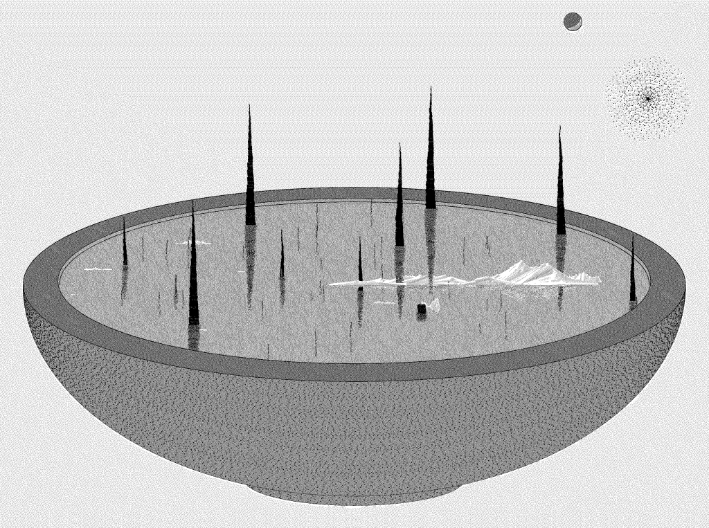

# Thursday, January 30

### Agenda

* [Effet Kazoo](https://www.youtube.com/watch?v=y9FKxMiiI6Y)
* Attendance
* [Introduction to Creative Coding](https://github.com/golanlevin/lectures/blob/master/lecture_introduction/readme.md) (Pep Talk)
* Due on Tuesday February 4th: [**2.2**](https://github.com/golanlevin/60-120/tree/main/2025/assignments/creative_code#22-ecosystem-familiarization), [**2.3**](https://github.com/golanlevin/60-120/tree/main/2025/assignments/creative_code#23-looking-outwards-generative-art), [**2.4**](https://github.com/golanlevin/60-120/tree/main/2025/assignments/creative_code#24-reading-response-artist-narratives), [**2.5**](https://github.com/golanlevin/60-120/tree/main/2025/assignments/creative_code#25-graphic-primitives-i-drawing-your-initials), [**2.6**](https://github.com/golanlevin/60-120/tree/main/2025/assignments/creative_code#26-graphic-primitives-ii-drawing-from-life)
* Time permitting: *Generative Art*

---

## Unit 2: Algorithmic Form, Creative Code

In this unit, we consider the topics of generativity and interactivity by developing skills in creative coding.

* [Introduction to Creative Coding / Pep Talk](https://github.com/golanlevin/lectures/blob/master/lecture_introduction/readme.md)

---

## Generative Art

Here is a very small selection of some generative artworks. (From [*Generative Artworks: A Tasting*](https://golancourses.net/60120/daily-notes/unit-2-creative-code/generative-artworks-tasting/))

* Michael Chang, [G*enerative Machines*](https://web.archive.org/web/20180214093650/https://machines.chromeexperiments.com/) (2012)
* Ilana Katz, [sketches for generative leaves](https://x.com/Lanzerel/status/1356357430351826949) (2021)
* Matthias Dörfelt, [*Munching*](https://www.mokafolio.de/works/Munching), 2014
* CMU Algorat Collective (Connie Ye, Char Stiles, Tatyana Mustakos, Caroline Hermans), [*Ratmaker*](https://algorat.club/ratmaker/index.html) (2018)
* Kate Compton, [*Puppets*](http://www.galaxykate.com/apps/unpublic/puppet/index.html), 2017
* Everest Pipkin, [*Mirror Lake*](https://everest-pipkin.com/#games/mirrorlake.html) (2015), and [*Moth Generator*](https://twitter.com/mothgenerator), 2015
* Robert Hodgin, [Growth v02](https://www.fxhash.xyz/generative/slug/growth-v02), 2022
* Memo Akten + James Paterson, [A Strange Loop](https://www.fxhash.xyz/generative/slug/a-strange-loop) (2022)
* Lingdong Huang, [*Shan Shui*](http://shan-shui-inf.lingdong.works/) (2018) and [photos](https://www.flickr.com/photos/creativeinquiry/albums/72157673905317117); and [*Fishdraw*](https://fishdraw.glitch.me/) (2021)
* Licia He, generative plotter/watercolor works (2020-)
* Michaël Zancan, [*Garden Monoliths*](https://www.fxhash.xyz/generative/2969) (2021)
* Jennifer Steinkamp, Daisy Bell (2008), wall projection
* Christine Sugrue, [*Delicate Boundaries*](http://csugrue.com/delicateboundaries/), 2007
* Theo Watson & Emily Gobeille, [*Weather Worlds*](http://design-io.com/projects/WeatherWorlds/), 2013
* Michael Chang, [*Generative Machines*](https://web.archive.org/web/20200513075153/http://machines.chromeexperiments.com/), 2011
* Leah Buechley, [Lasercut Curtain](https://x.com/leahbuechley/status/936669240605552640?lang=en), 2017
* Jessica Rosenkrantz & Jesse Louis-Rosenberg (Nervous System): Growing a Hyphae Lamp [process](https://vimeo.com/25604611) and [results](https://vimeo.com/25325299); [generative jigsaw puzzles](https://n-e-r-v-o-u-s.com/projects/albums/generative-jigsaw-puzzles/)
* [Books with computationally-generated covers](https://github.com/golanlevin/generative_covers)
* Marius Watz, [generated 3D printed sculptures](https://www.flickr.com/photos/watz/albums/72157688146756901)

