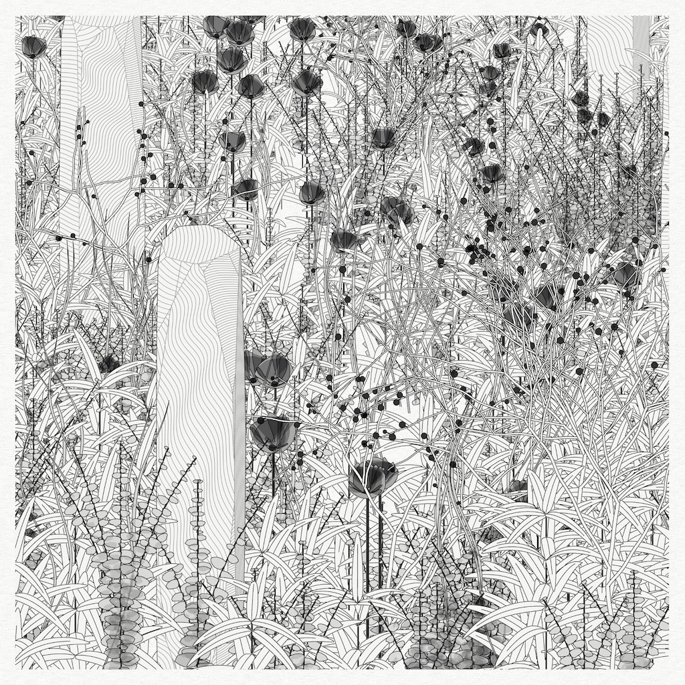

# Tuesday, February 04

### Agenda

* [Effet Kazoo](https://www.youtube.com/watch?v=y9FKxMiiI6Y)
* Attendance

---

# Technical Lecture

## 1. Recap from last session

* [setup()](https://archive.p5js.org/reference/#/p5/setup) and [draw()](https://archive.p5js.org/reference/#/p5/draw)
* [print()](); [width](https://archive.p5js.org/reference/#/p5/width), [height](https://archive.p5js.org/reference/#/p5/height)
* coordinates, arguments
* [circle()](https://archive.p5js.org/reference/#/p5/circle), [rect()](https://archive.p5js.org/reference/#/p5/rect); [shapes in reference](https://archive.p5js.org/reference/#group-Shape)
* [line()](https://archive.p5js.org/reference/#/p5/line), [strokeweight()](https://archive.p5js.org/reference/#/p5/strokeWeight)
* [fill()](https://archive.p5js.org/reference/#/p5/fill), [stroke()](https://archive.p5js.org/reference/#/p5/stroke); [noFill()](https://archive.p5js.org/reference/#/p5/noFill), [noStroke()](https://archive.p5js.org/reference/#/p5/noStroke)
* [color](https://archive.p5js.org/reference/#/p5/color), transparency; [web color names](https://en.wikipedia.org/wiki/Web_colors)
* shape layering
* drawing states: valid until changed

## 2. New material

* **VARIABLES!**
* [mouseX](https://archive.p5js.org/reference/#/p5/mouseX), [mouseY](https://archive.p5js.org/reference/#/p5/mouseY), and [mouseIsPressed](https://archive.p5js.org/reference/#/p5/mouseIsPressed)
* [random()](https://archive.p5js.org/reference/#/p5/random)
* [if()](https://archive.p5js.org/reference/#/p5/if)
* [map()](https://archive.p5js.org/reference/#/p5/map)
* [rectMode()](https://archive.p5js.org/reference/#/p5/rectMode) (& [Golan video](https://www.youtube.com/watch?v=F7iRdN50jf8))
* Graphics Transforms: [translate()](https://archive.p5js.org/reference/#/p5/translate), [rotate()](https://archive.p5js.org/reference/#/p5/rotate), [scale()](https://archive.p5js.org/reference/#/p5/scale), [push()](https://archive.p5js.org/reference/#/p5/push), [pop()](https://archive.p5js.org/reference/#/p5/pop)
* [for()] (https://archive.p5js.org/reference/#/p5/for) *(time permitting)*

NOW:

* [**Golan's Tutorial on variables and iteration**](https://openprocessing.org/sketch/2531328)
* *Exercise*: simple drawing program
* *Exercise*: Random-walker 

## HELPFUL VIDEOS

*If you're struggling with any of the above concepts, please check out the tutorial videos I've selected below. Dan Shiffman, Xin Xin, and Patt Vira are highly regarded educators who have made patient instructional videos for you.* 

#### 2D Graphics Primitives

* [1.2 2D Primitives](https://www.youtube.com/watch?v=hISICBkFa4Q) (Xin Xin)
* [1.3 RGB Color & Blendmode](https://www.youtube.com/watch?v=fTEvHLLwSBE) (Xin Xin)
* [Color - Creative Coding with p5.js](https://www.youtube.com/watch?v=HNNxQKF8yXA&list=PLcP0K4vxUDTkm3YO1_T1Q5JW8TSux2YdG&index=4) (Patt Vira)
* [1.3 Shapes & Drawing](https://www.youtube.com/watch?v=c3TeLi6Ns1E&t=23s) (Coding Train)
* [1.4 Color](https://www.youtube.com/watch?v=riiJTF5-N7c&t=6s) (Coding Train)

#### Variables

* [Variable - Creative Coding with p5.js](https://www.youtube.com/watch?v=xhdIJo8lxWA&list=PL0beHPVMklwgMz4Z-mNp4_udo9mjBk7pn&index=5) (Patt Vira)
* [2.1: Variables in p5.js (mouseX, mouseY)](https://www.youtube.com/watch?v=RnS0YNuLfQQ&list=PLglp04UYZK_PrN6xWo_nJ-8kzyXDyFUwi) (Coding Train)
* [2.2: Variables in p5.js (Make your own)](https://www.youtube.com/watch?v=Bn_B3T_Vbxs&list=PLglp04UYZK_PrN6xWo_nJ-8kzyXDyFUwi) (Coding Train)

#### Generating Randomness (`random()`)

* [2.4: random() Function - p5.js Tutorial](https://www.youtube.com/watch?v=POn4cZ0jL-o&t=14s) (Coding Train)
* [2.5: The random() Function](https://www.youtube.com/watch?v=nfmV2kuQKwA&list=PLglp04UYZK_PrN6xWo_nJ-8kzyXDyFUwi) (Coding Train)

#### Mapping: `map()` function

* [map() and constrain() in p5.js](https://www.youtube.com/watch?v=xMZX7uJtF5Q) (Golan)
* [3.5 map() - p5.js Tutorial](https://www.youtube.com/watch?v=K1yMakbnWOs&list=PLT233rQkMw761t_nQ_6GkejNT1g3Ew4PU&index=10) (Xin Xin)
* [2.5: The map() Function](https://www.youtube.com/watch?list=PLglp04UYZK_PrN6xWo_nJ-8kzyXDyFUwi&v=nicMAoW6u1g) (Coding Train)

#### Conditional Testing (`if`, `else`)

* [3.1 If, Else, Else If - p5.js Tutorial](https://www.youtube.com/watch?v=nFQwVikjee8&list=PLT233rQkMw761t_nQ_6GkejNT1g3Ew4PU&index=5) (Xin Xin)
* [3.1.1 IF / ELSE Example - Make a Drawing Machine](https://www.youtube.com/watch?v=ucrlrVoe9Ns&list=PLT233rQkMw761t_nQ_6GkejNT1g3Ew4PU&index=6) (Xin Xin)
* [Conditionals (Boolean Expression)](https://www.youtube.com/watch?v=V8aJnrXlGhY&list=PL0beHPVMklwgMz4Z-mNp4_udo9mjBk7pn&index=6) (Patt Vira)
* [Conditionals (If, Else If, Else)](https://www.youtube.com/watch?v=btVdEgjooGE&list=PL0beHPVMklwgMz4Z-mNp4_udo9mjBk7pn&index=7) (Patt Vira)

#### Graphics Transforms (`translate`, `rotate`, `push`, `pop`)

* [How to Rotate Shapes in p5.js (translate, rotate, push, pop)](https://www.youtube.com/watch?v=o9sgjuh-CBM) (Coding Train)
* [How to use scale() in p5.js](https://www.youtube.com/watch?v=pkHZTWOoTLM) (Coding Train)
* [1.4 translate(), rotate(), push(), pop() - p5.js Tutorial](https://www.youtube.com/watch?v=maTfm84mLbo) (Xin Xin)

#### *Time permitting:* Iteration (`for` Loop)

* [4.1: while and for Loops](https://www.youtube.com/watch?v=cnRD9o6odjk&t=1s) (Coding Train)
* [For Loop - Creative Coding with p5.js](https://www.youtube.com/watch?v=SFAQ9cn5ImE&list=PL0beHPVMklwgMz4Z-mNp4_udo9mjBk7pn&index=9) (Patt Vira)
* [5.1 for Loop - p5.js Tutorial](https://www.youtube.com/watch?v=QdGeb0H5idM&list=PLT233rQkMw761t_nQ_6GkejNT1g3Ew4PU&index=12) (Xin Xin)

<!-- for next time: lerp()
* [Creative Coding Math: Linear Interpolation (Lerp Function)](https://www.youtube.com/watch?v=IwOZV19CH2Y) (Patt Vira)
-->

---

# Generative Art: A Tasting

#### [Generative Art with Creative Code](../lectures/creative_code/readme.md) (Lecture)

 <small>Michaël Zancan, *Garden Monoliths*, 2021</small>

