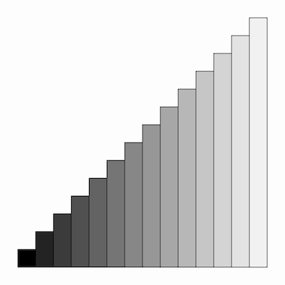

# Thursday, February 06

### Agenda

* [Effet Kazoo](https://www.youtube.com/watch?v=y9FKxMiiI6Y)
* Attendance


### Reminder about Upcoming Assignments: 

*All Assignment 2 assignment descriptions are available [here](https://github.com/golanlevin/60-120/tree/main/2025/assignments/creative_code).*

* `Thu 02/06` 2.7. [Reading: The Oatmeal Problem](https://github.com/golanlevin/60-120/tree/main/2025/assignments/creative_code#27-reading-the-oatmeal-problem)
* `Thu 02/13` 2.8. [Face Generator](https://github.com/golanlevin/60-120/tree/main/2025/assignments/creative_code#28-face-generator)
* `Tue 02/18` 2.9. [Order-to-Disorder: Recoding *Schotter* (1968)](https://github.com/golanlevin/60-120/tree/main/2025/assignments/creative_code#29-order-to-disorder-recoding-schotter-1968)
* `Tue 02/18` 2.10. [Nested Iteration With Functions: *Pattern*](https://github.com/golanlevin/60-120/tree/main/2025/assignments/creative_code#210-nested-iteration-with-functions-pattern)
* `Thu 02/27` 2.11. [Interactive Creature (Mask, Costume, or Puppet)](https://github.com/golanlevin/60-120/tree/main/2025/assignments/creative_code#211-interactive-creature-mask-costume-or-puppet)


---

# Technical Lecture

* [quad()](https://archive.p5js.org/reference/#/p5/quad); [curve()](https://archive.p5js.org/reference/#/p5/curve)
* [beginShape()](https://archive.p5js.org/reference/#/p5/beginShape), [vertex()](https://archive.p5js.org/reference/#/p5/vertex), [curveVertex()](https://archive.p5js.org/reference/#/p5/curveVertex), [endShape()](https://archive.p5js.org/reference/#/p5/endShape)
* [random()](https://archive.p5js.org/reference/#/p5/random)
* [map()](https://archive.p5js.org/reference/#/p5/map)
* [noise()](https://archive.p5js.org/reference/#/p5/noise) *(time permitting)*
* [lerp()](https://archive.p5js.org/reference/#/p5/lerp) *(time permitting)*

---

# In-Class Exercises

*We are all always learners. Let's learn the basics of drawing with this tool.*


Here are 11 exercises to (hopefully) complete in class. Please store each one in your OpenProcessing account. Remember, a bunch of helpful instructional videos are listed [here](https://github.com/golanlevin/60-120/blob/main/2025/daily_notes/0204.md#helpful-videos), and my tutorial on variables/iteration is [here](https://openprocessing.org/sketch/2531328). 

1. Elements: Quadrilateral Zoo
2. Elements: Little of Everything
3. Iteration: Seven Circles
4. Iteration: Lines to the Cursor
5. Iteration: Transitioning Rectangles
6. Iteration: String Art Challenge
7. Color Observation
8. Conditional Testing: Left or Right
9. Unpredictability: Coin Toss
10. Random Walker (Brownian Motion Drunk Walk)
11. Randomized Paint Program


---

### 1. Elements: Quadrilateral Zoo

Write commands to plot the vertices of a family of quadrilaterals: square, rectangle, parallelogram, rhombus, trapezoid, dart, and kite.


---

### 2. Elements: Little of Everything

Explore your graphics toolset by drawing one of each type of primitive it provides. For example, you might draw a rectangle, ellipse, arc, line segment, Bézier curve, polyline, and polygon. Experiment with their options and parameters, such as fill color, stroke weight, etc.


---

### 3. Iteration: Seven Circles

Use iteration to copy this figure, in which seven circles are positioned across the canvas. The position of each circle should be computed using your loop’s counting variable. Make sure the first circle is inset by a margin; it should not lie on the edge of the canvas.


---

### 4. Iteration: Lines to the Cursor

Use iteration to create an interactive display featuring a series of ten lines. Each line should connect the cursor to one of a series of points distributed evenly across the canvas.


---

### 5. Iteration: Transitioning Rectangles

Recall that *any* visual property can be linked to a loop variable, not just position. Use iteration to generate a series of rectangles. Your code should simultaneously control several of the rectangles’ visual properties, including their position, height, and fill color.


---

### 6. Iteration: String Art Challenge

This one can be surprisingly tricky. Use iteration to recreate the figure below. Your code should draw exactly eight straight line segments.


---

### 7. Color Observation

Carefully observe: the color of your shirt; the table; the wall of the room; and the palm of your hand. Without using a camera or scanning device, reproduce these colors to the best of your ability.


---

### 8. Conditional Testing: Left or Right

Create a sketch in which a text display indicates whether the cursor is on the left side or the right side of the canvas.


---

### 9. Unpredictability: Coin Toss

Create a sketch for a coin that is “tossed” every time the mouse button is clicked. Your coin should be evenly weighted so that heads and tails have the same likelihood of appearing. Test your program over ten tosses. What were the observed frequencies of heads and tails?


This project is structurally similar to your *Face Generator* exercise due next Tuesday 2/11. Here's a basic code structure to get you started: 

```
function setup() {
  createCanvas(600, 600);
}

function draw() {
  background('white'); 
  // generate a face/coin/etc HERE...
  noLoop();
}

function mousePressed(){
  loop();
}
```

---

### 10. Random Walker (Brownian Motion Drunk Walk)

Create a sketch in which a small 2D element travels erratically from one moment to the next, leaving a trail across the canvas as it moves. At every timestep, it should update its current position with a small random displacement in both X and Y.


---

### 11. Randomized Paint Program

Create an "experimental paint program" in which the user's cursor leaves a trail of graphics whose shapes and colors are somehow influenced by randomness. The program should only add graphics when the mouse button is pressed. You should clear the screen once (during setup) and whenever the user presses a key. 


---

EOF