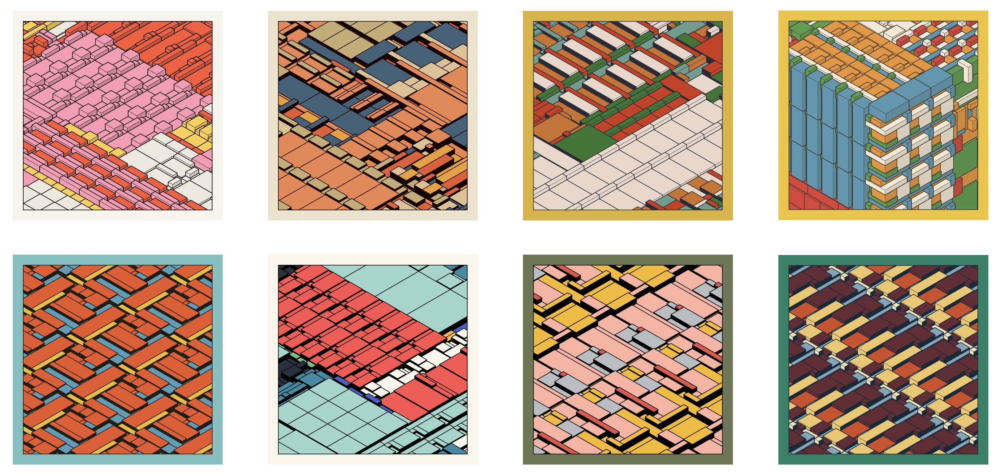

# Thursday, February 13

## Agenda

* [Effet Kazoo](https://www.youtube.com/watch?v=y9FKxMiiI6Y)
* Attendance
* [Face Generator](https://openprocessing.org/class/95759/#/c/96710) presentations

---

## Upcoming Assignments: 

*All Assignment 2 assignment descriptions are available [here](https://github.com/golanlevin/60-120/tree/main/2025/assignments/creative_code).*

* [Schotter](https://github.com/golanlevin/60-120/tree/main/2025/assignments/creative_code#29-order-to-disorder-recoding-schotter-1968), due Tuesday 2/18
* [Pattern](https://github.com/golanlevin/60-120/tree/main/2025/assignments/creative_code#210-nested-iteration-with-functions-pattern), due Tuesday 2/18

---

## Art Presentation

* [**PATTERN**!](https://github.com/golanlevin/lectures/tree/master/lecture_pattern)

---

## Technical Presentations

* [double-for loop tutorial](https://openprocessing.org/sketch/2542778) (nested iteration)
* [custom function tutorial](https://openprocessing.org/sketch/2542795) (functional abstraction)
* push/rotate/pop within a `for` loop - [rotated hearts](https://openprocessing.org/sketch/1835700)

