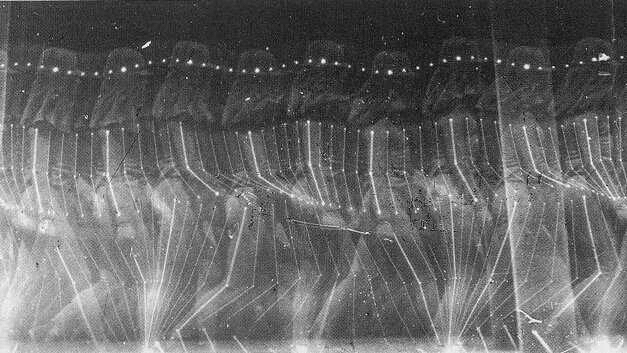

# Thursday, February 20

## Agenda

* [Effet Kazoo](https://www.youtube.com/watch?v=y9FKxMiiI6Y)
* Attendance
* [Bertram-Montfort Lecture](img/bertram_montfort.jpg), 5:30pm Monday 2/25, CFA-111
* *Reminder*: [**Interactive Creature** (Mask, Costume, or Puppet)](https://github.com/golanlevin/60-120/tree/main/2025/assignments/creative_code#211-interactive-creature-mask-costume-or-puppet),  Due Thursday, 2/27
* Past work:
  * [Schotter: Order-to-Disorder](https://openprocessing.org/class/95759/#/c/96711) solution discussion
  * [Pattern Field](https://openprocessing.org/class/95759/#/c/96712) project review *(time permitting)*

---

## Technical Presentation(s)

* [**Simple Array Tutorial**](https://openprocessing.org/sketch/2550122): dealing with an array of points
* [**Gestural Interaction**](../lectures/tracking/readme.md): Face & Body tracking sample code
* [**Chronophotography**](https://github.com/golanlevin/lectures/tree/master/lecture_expanded_body#precursors-chronophotography): Brief history of motion capture

---

## Art Presentation(s)

* [**Bodies, Faces, Hands**](../lectures/bodies-faces-hands/readme.md)
* [Augmenting the Human Form](https://github.com/golanlevin/lectures/tree/master/lecture_expanded_body#augmentation-of-the-human-form-in-visual-modernism-cubism-futurism-bauhaus-and-beyond), *(time permitting)*

