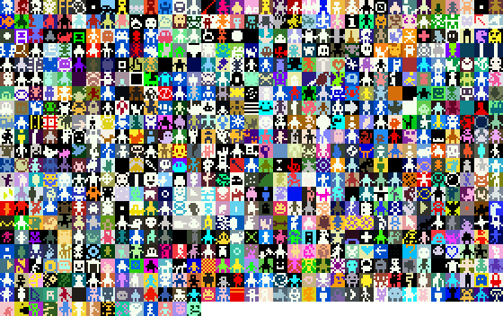

# Thursday, February 27

*Agenda:*

* **NEW INFO**: Final presentations, **Monday May 5th, 9:30-11:30am**
* Creative Coding Project Review
* Pre-Introduction to Bitsy: *Small Games Manifesto*
* Lookahead to Assignment 3, [*Interactive Narrative*](../assignments/interactive_narrative/readme.md)

---

## Creative Coding Project Review

* Review of [*Pattern Field*](https://openprocessing.org/class/95759/#/c/96712) Projects
* Review of [*Puppet/Mask/Costume*](https://openprocessing.org/class/95759/#/c/96713) Projects

---

## Pre-Introduction to Bitsy

> Make short and intense games: 
> think haiku, not epic. 
> Think poetry, not prose. 
> — Auriea Harvey & Michaël Samyn: *Realtime Art Manifesto*

Let’s read the [*Small Games Manifesto*](https://ebeth.itch.io/small-games-manifesto) by Ebeth:

### 1.

* Most people don’t have time to make or play long games - The solution to this is *Small Games*.
* Small Games should be 10 minutes or less and it’s best if they’re playable in a web browser.
* Scope it down.

### 2.

* There’s no requirements for being a Small Games dev.
* Don’t worry about “quality”.
* Be sincere and personal in your work.
* Games should let you experience something you can’t in real life.
* Make games you want everyone to play.
* Make games you want only one person to play.
* Make mini masterpieces.
* Make absolute garbage.

### 3.

* Make your games and tools accessible.
* Support your fellow game makers & tool creators.
* Bring new people into the development scene.
* Lift up other voices.
* Be respectful- There’s no room for bigots in the Small Games Movement.
* Have fun.

> Lookahead to Assignment 3, [*Interactive Narrative*](../assignments/interactive_narrative/readme.md)