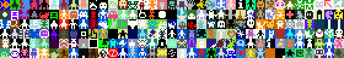

# Tuesday, March 11

---

### Welcome Back!

* A fresh start, a new direction
* Mid-semester feedback is underway/forthcoming

### Upcoming Artist Talks at the STUDIO (CFA-111)

* `Thu 3/13:` Ken Goldberg artist talk: [*Art, AI, and Robots*](https://studioforcreativeinquiry.org/events/kengoldberg), 5:30pm 3/13
* `Fri 3/14:` Benjamin Gaulon artist talk: [*Recyclism*](https://studioforcreativeinquiry.org/events/gaulon-lecture), 5:30pm 3/14, & [Saturday workshop](https://studioforcreativeinquiry.org/events/refunct)
* `Thu 3/27:` Ingrid Mayrhofer-Hufnagl artist talk: [*Machines and Intelligent Artifacts*](https://studioforcreativeinquiry.org/events/ingrid-mayrhofer-hufnagl-lecture-ai-%e2%8a%82-ia-machines-and-intelligent-artifacts), 5:30pm 3/27
* `Tue 4/01:` Kyle McDonald artist talk: [*Art + AI: After the Slop*](https://studioforcreativeinquiry.org/events/kylemcdonald), 5:30pm Tuesday 4/1

### Upcoming Student-Directed Arts Events

* [**B★A** Signup is due **today** (3/10)](https://studioforcreativeinquiry.org/events/ba-2025-sign-up-by-march-10th-day-of-is-april-8) for the **student artist talks** on 4/8!
* [**Haute Glue**: Student-Directed Wearable and Performance Art Works](https://studioforcreativeinquiry.org/events/haute-glue-student-directed-live-event-for-wearable-and-performance-art-works), 5:30pm 3/28 at the STUDIO

### 60-120 Reminders & Important Deadlines

* Final presentations will be **Monday May 5th, 9:30-11:30am**
* (We'll look at some past-due projects from Unit 2 on Thursday.)
* Quick overview of upcoming assignments & units:
  * `Due Thu 3/13:` [**3.1. Looking Outwards: Bitsy Games**](../assignments/interactive_narrative/readme.md#31-looking-outwards) *(~1.5 hours)*
  * `Due Tue 3/18:` [**3.2. Bitsy Tutorial**](../assignments/interactive_narrative/readme.md#32-bitsy-tutorial) *(~2 hours, including in-class time)*
  * `Due Thu 3/20:` [**3.3. Research Phase**](../assignments/interactive_narrative/readme.md#33-research-phase) *(due Thursday 3/20; ~1 hour)*
  * `Due Tue 3/25:` [**3.4. Draft of Interactive Narrative/Game**](../assignments/interactive_narrative/readme.md#34-draft-of-interactive-narrativegame) *(~6 hours)*
  * `Due Tue 4/01:` [**3.5. Interactive Narrative/Game**](../assignments/interactive_narrative/readme.md#35-interactive-narrative-game) *(~10 hours)*
  * `Due Thu 04/10:` **4.2. Internet Curation Speed Project** (TBA)
  * `Due Mon 05/05:` **5.3. Audiovisual System** (TBA)

---

# BITSY!

1. **Overview of Bitsy**. Let's [watch some video presentations introducing Bitsy](../lectures/interactive_narrative/bitsy_overview.md) (15m). 
2. **Playtime!** Let's review [Prof. Pedercini's list of recommended Bitsy games](../lectures/interactive_narrative/some_bitsy_games.md). 
3. **Introduction to the Bitsy Editor** (below)

---

## The Bitsy Editor

* Let's go to the [**Bitsy Editor**](https://make.bitsy.org/)
* How to **play** the game
* Edit the avatar (add a nose)
* Animate the avatar
* Add an item (choose key)
* Add a tile-type, modify the room
* Add a palette, change the room's palette
* Encourage good naming of rooms, tiles, items, etc.
* Bitsy games are saved in the browser memory so **download** them often as a backup!
* Show data & HTML

