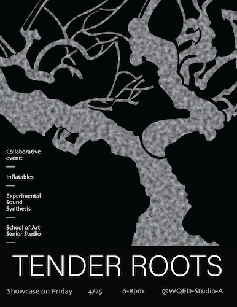
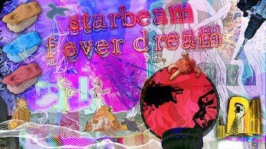

# Tuesday, April 22

---

### Reminders

* It is expected that you have completed **Assignment 5.4, [TouchDesigner Warmup](https://github.com/golanlevin/60-120/tree/main/2025/assignments/audiovisual_environment#54-touchdesigner-warmup)** for today. This exercise introduces key concepts including *visual feedback* and *object instancing*. 
* A reminder that your final project, **Assignment 5.5 ([Audioreactive Environment](https://github.com/golanlevin/60-120/tree/main/2025/assignments/audiovisual_environment#55-audioreactive-environment))** is due to be presented on the morning of Monday, May 5th, from 9-11:30am. Location TBA. 

### Special Event: *Tender Roots* (4/25)

This **Friday, April 25th**, 6-8pm, there will be a special event at WQED (4802 5th Ave, Studio A, at the edge of campus): **Tender Roots** is an evening of sound, inflatables, and animation. Sonic compositions, giant inflatable sculptures, and animation come together to create an immersive landscape. Audience members can explore the dynamic creations made by students of *Experimental Sound Synthesis* (taught by Annie Hui-Hsin Hsieh), *Inflatables* (taught by Olivia Robinson), and School of Art *Senior Studio* (advised by Johannes DeYoung). 

### Special Event: *STARBEAM FEVER DREAM* (4/29)

A live visual performance, video and animation event, [**STARBEAM FEVER DREAM**](https://art.cmu.edu/event/starbeam-fever-dream/?utm_source=newsletter) features (numerous!) students from Carnegie Mellon University’s School of Art *and* the University of Pittsburgh Studio Arts programs. This lusciously luminous, light-drenched, sensory overload will be presented at HAVEN, 401 Atwood Street on April 29th from 7-9PM — an entirely student-run performance art space here in Oakland. 

---

## Some Audiovisual Performances

*... Involving artist-made custom software*

Davide Quayola 

* [Transient](https://quayola.com/ars-electronica-linz-2/) (2021)
* [Transient #B_022-03](https://www.youtube.com/watch?v=WzfBkArrN28) (2022)
* [Quayola & Sinigaglia](https://www.youtube.com/watch?v=EMUQqRM_xHQ) (2013)

Joanie Lemercier

* [constellations](https://joanielemercier.com/constellations/) (2018)
* [Omicron](https://www.youtube.com/watch?v=NvtKhJM87rU) (2012)

Myriam Bleau

* [Soft Revolvers](https://www.youtube.com/watch?v=eeXebgHkd5g) (2015)

Daito Manabe 

* [electric stimulus to face -test3](https://www.youtube.com/watch?v=YxdlYFCp5Ic) (2008)
* [copy my facial expression into my friends' -test 0](https://www.youtube.com/watch?v=VtRVvBSbonk) (2008)
* [electric stimulus to face - test 7 ( 4K )](https://www.youtube.com/watch?v=CvmE4TZfeuo) (2008)

Rhizomatiks × Elevenplay

* [discrete figures](https://www.youtube.com/watch?v=s_S3fomiXO0) (2019)
* [multiplex](https://www.youtube.com/watch?v=a1hG__i4ems&t=160s) (2024)
* [YASKAWA × Rhizomatiks × ELEVENPLAY](https://www.youtube.com/watch?v=H_eAkJ_o-pk) (2016)

Ryoji Ikeda: 

* [Data.Matrix](https://www.youtube.com/watch?v=k3J4d4RbeWc) (2010)
* [The TRANSFINITE](https://www.youtube.com/watch?v=omDK2Cm2mwo) (2012)
* [Test Pattern](https://www.youtube.com/watch?v=XwjlYpJCBgk) (2014)

Ryoichi Kurokawa

* [rheo: 5 horizons](https://vimeo.com/31319154) (2010)
* [RHEO](https://www.youtube.com/watch?v=tVGmU3saB4M) (2009)

Ei Wada

* [Barcoder](https://www.youtube.com/watch?v=2CvnajExX-A) (2018)
* [The Barcoders](https://eiwada.com/projects#/barcoder/) (2018)

Kanta Horio

* [Particle](https://www.youtube.com/watch?v=OMIW1cIgeEE) (2008)

Sue Slagle (SUE-C)

* [Documentary](https://vimeo.com/655825033)

