# Bodies, Faces Hands

*Some interactive artworks using Body, Face, and Hand Tracking*

---

## Body

[*Videoplace*](https://www.youtube.com/watch?v=WAA9uYxgSbg) (1974-1989, Myron Krueger)
 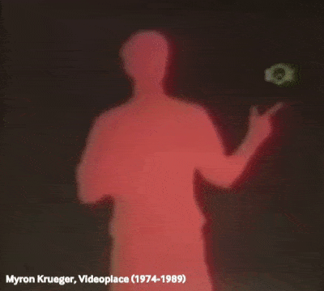

[*Text Rain*](https://www.youtube.com/watch?v=f_u3sSffS78) (1999, Camille Utterback & Romy Achituv)
 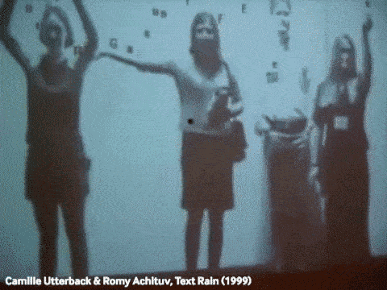

[*Shadow Monsters*](https://www.youtube.com/watch?v=ShHQHAlZ7fA) (2005, Phil Worthington)
 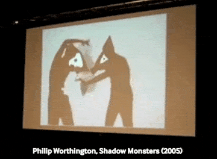

[*Ego*](https://www.youtube.com/watch?v=KzDifurF9wQ) (2014, Klaus Obermeier)
 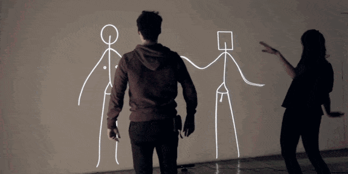

[*Mortal Engine*](https://www.youtube.com/watch?v=CHKLr_pvj2I&t=46s) (2008, Chunky Move)
 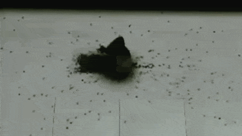

[*The Treachery of Sanctuary*](http://www.youtube.com/watch?v=_2kZdl8hs_s) (2012, Chris Milk)
 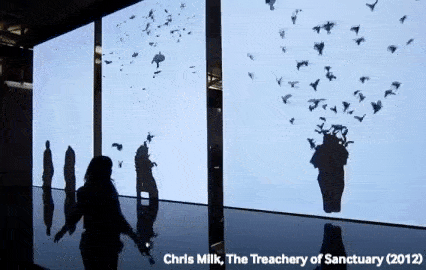

[*Body, Movement, Language*](https://experiments.withgoogle.com/billtjonesai) (2019, Bill T. Jones with Maya Man & Google Creative Lab)
 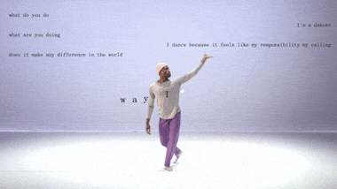

[*A Visual Journey Through Addiction*](https://www.nytimes.com/interactive/2018/us/addiction-heroin-opioids.html) (2018, Shreeya Sinha, Zach Lieberman, Leslye Davis; [+writeup](https://www.nytimes.com/2018/12/20/reader-center/opioid-addiction-graphic-video.html))
 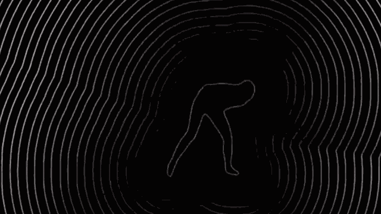

[*Surface Tension*](https://www.youtube.com/watch?v=JXLoLPkzdto&t=12s) (1992, Rafael Lozano-Hemmer)
 

[*Boundary Functions*](https://www.snibbe.com/art/boundaryfunctions) (1998, Scott Snibbe)
 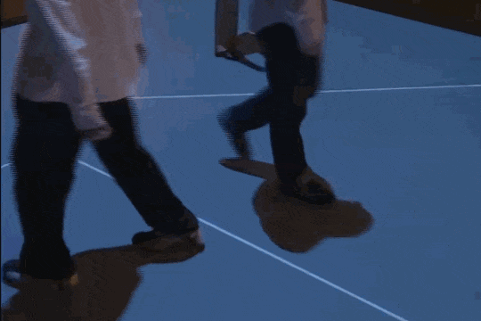

[*Weather Worlds*](https://www.design-io.com/projects/weatherworlds) (2013, Emily Gobeille & Theo Watson)
 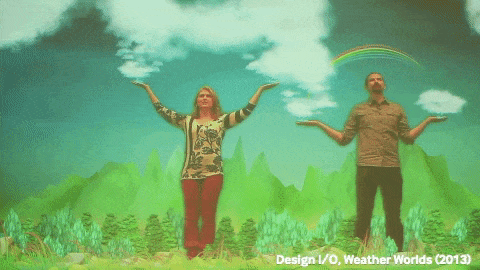

[*Interstitial Fragment Processor*](https://www.youtube.com/watch?v=9B0y3TrFyyE) (2004-2007, Golan Levin)
 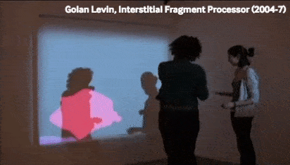

[*Sniff*](https://vimeo.com/13791894) (2010, Karolina Sobecka & James George)
 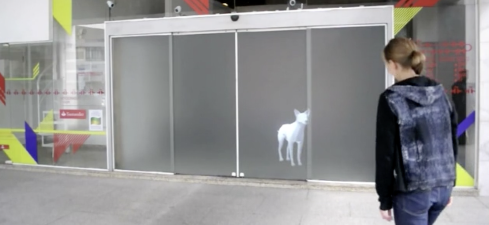

[*The Web I Want*](https://www.youtube.com/watch?v=9eJKUzeIvLE) (2015, Jeremy Bailey)
 
[*The Future of Creativity*](https://www.youtube.com/watch?v=Q1gbQXwBKxU) (2012, Jeremy Bailey)
 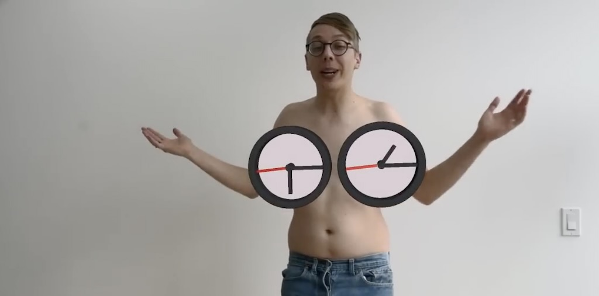

---

## Face

[*All the Universe is Full of the Lives of Perfect Creatures*](https://karolinasobecka.com/filter/archive/All-The-Universe-is-Full-of-The-Lives-of-Perfect-Creatures) (2012, Karolina Soebecka)
 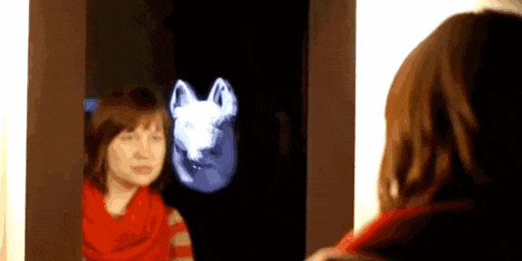

[*Typeface2*](https://vimeo.com/9587564) (2010, Mary Huang)
 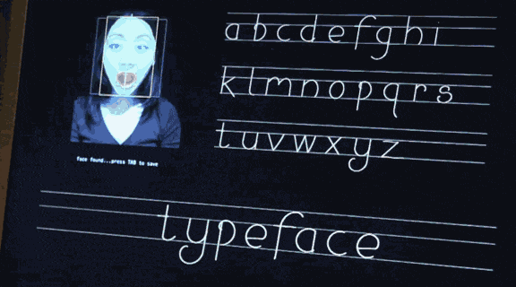

[*Mas Que la Cara*](https://www.youtube.com/watch?v=P-eNPoXGg1E) (2015, Zach Lieberman; [+writeup](https://zachlieberman.medium.com/m%C3%A1s-que-la-cara-overview-48331a0202c0)
 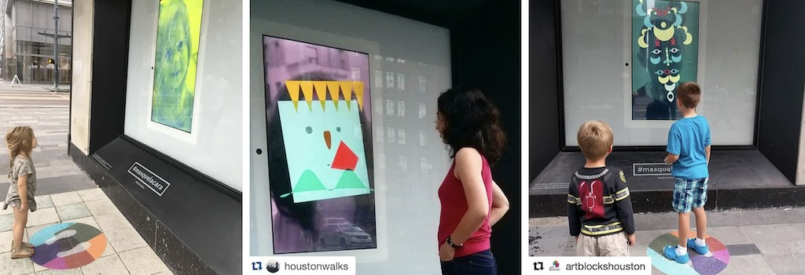

[*Autosmiley*]() (2010,  Theo Watson)

[*Cheese*](https://www.youtube.com/watch?v=B61CEiPWzGk) (2003, Christian Moeller)
 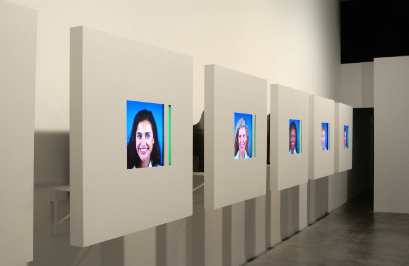

---

## Hands

[*Delicate Boundaries*](http://vimeo.com/1007230) (2008, Christine Sugrue)
 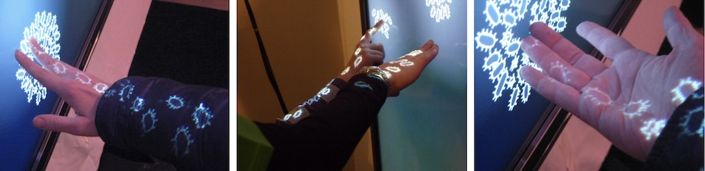

[*Puppet Parade*](https://www.design-io.com/projects/puppetparade) (2011, Emily Gobeille & Theo Watson; +prototype)
 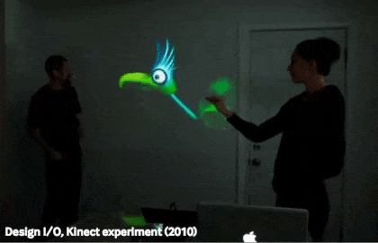
 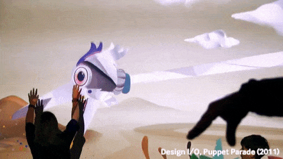

[*Nail Art Museum*](https://www.youtube.com/watch?v=40pSU5ZM784&t=153s) (2014, Jeremy Bailey)
 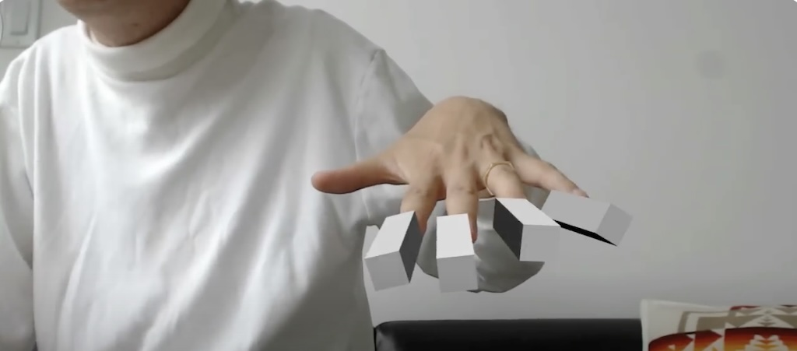

---

# Some Student Projects

[Darcy Cao](https://ems.andrew.cmu.edu/2016-60212/darca/10/15/darca-faceosc/index.html)  

[*Intergalactic Robot*](https://ems.andrew.cmu.edu/2016-60212/kadoin/10/15/kadoin-faceosc/index.html), Kate Chaudoin, 2016
 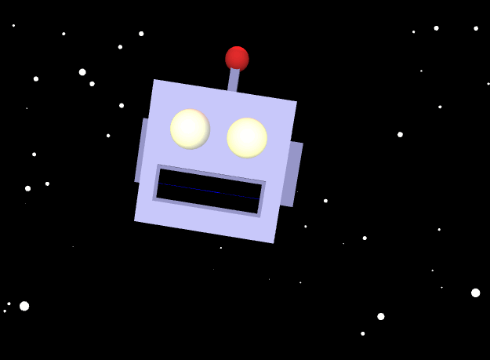

[Body Copy & Paste](https://ems.andrew.cmu.edu/2016-60212/krawleb/11/15/krawleb-mocap/), Caleb Crawford & Kate Chaudoin, 2016
 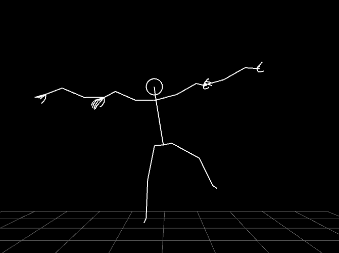
 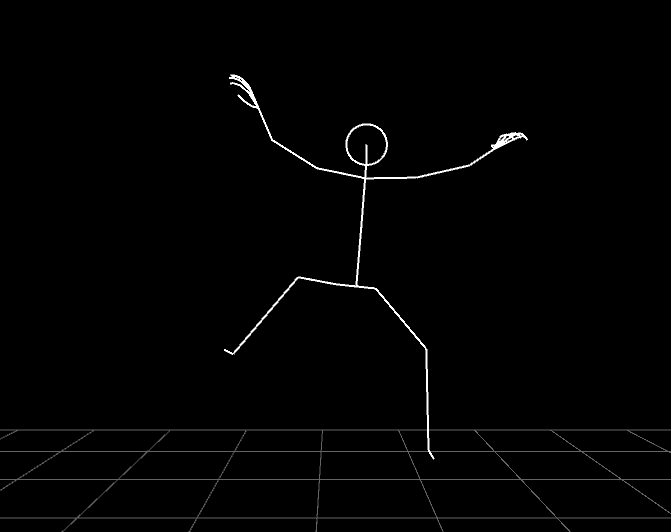

[*Face Powered Shooter*](https://ems.andrew.cmu.edu/2016-60212/ngdon/10/13/ngdon-faceosc/index.html), Lingdong Huang, 2016
 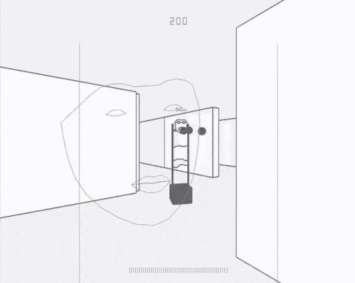

---

#### Sources: 

* [Lecture_Expanded_Body](https://github.com/golanlevin/lectures/tree/master/lecture_expanded_body)
* [Lecture_Face](https://github.com/golanlevin/lectures/tree/master/lecture_face)
* [Lecture_Shadow](https://github.com/golanlevin/lectures/tree/master/lecture_shadow)
* [2022 60-212 Body](https://courses.ideate.cmu.edu/60-212/s2022/index.html%3Fp=1688.html)
* [2015 IACD Body](https://ems.andrew.cmu.edu/2015/lectures/interactivity/full-body-interactive-art/index.html)
* [2013 IACD Body](https://ems.andrew.cmu.edu/2013/lectures/lecture-02-25/index.html)