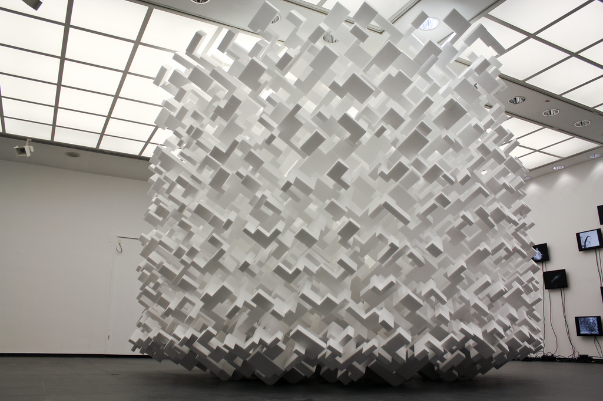

# Generative Art

Here is a very small selection of some generative artworks. 

 <small>Everest Pipkin, [*Mirror Lake*](https://everest-pipkin.com/#games/mirrorlake.html) (2015)</small>

 <small>Marius Watz, [generated 3D printed sculptures](https://www.flickr.com/photos/watz/albums/72157688146756901)</small>

  <small>Michael Chang, [*Generative Machines*](https://web.archive.org/web/20180214093650/https://machines.chromeexperiments.com/) (2012)</small>

---

 <small>Manfred Mohr, [P-021/A + B](http://www.emohr.com/mohr_algo_021b.html) (1969)</small>

> *About the algorithm: The elements are horizontal, vertical, 45 degree lines, square waves, zig-zags, and have probabilities for line widths and lengths. The algorithm places elements in a horizontal direction and has a high probability to move from left to right and a limited probability to backtrack. The original idea of this algorithm was to create a visual musical score which defies the progression in time by occasionally turning back on itself. Thus at the same time an abstract text is created.*

Computer Art is the bastard child of CS and fine art—rejected by both parents. Manfred Mohr (born 1938) is another of the first dozen or so people to make art with a computer; Here’s a [brief excerpt from an interview](https://www.thewhitereview.org/feature/interview-with-manfred-mohr/) with him. 

* Frieder Nake, [*Hommage à Paul Klee*](https://collections.vam.ac.uk/item/O211685/hommage-a-paul-klee-13965-print-nake-frieder/hommage-%C3%A0-paul-klee-13965-print-nake-frieder/) (1965)
* Georg Nees, [*Schotter*](https://collections.vam.ac.uk/item/O221321/schotter-print-nees-georg/#:~:text=Summary,in%20Stuttgart%20in%20February%201965.) (1968)
* Vera Molnár, [*Interruptions*](https://dam.org/museum/artists_ui/artists/molnar-vera/interruptions/#:~:text=Interruptions%20(1968%2D1969),chaos%20on%20a%20regular%20structure.) (1968)
* Colette Bangert and Charles Bangert, [*Large Landscape: Ochre & Black*](https://www.atariarchives.org/artist/sec5.php) (1970) [img](img/bangert.jpg)
* Ruth Leavitt, [*Diamond Transformations*](https://www.atariarchives.org/artist/sec28.php) (1974)

Below is [*Pixillation*](http://lillian.com/films/) (1970) by [Lillian F. Schwartz](https://en.wikipedia.org/wiki/Lillian_Schwartz) (1927-2024). Lillian F. Schwartz is one of the first people to create computer animation. At the time, the idea of using computers to make animation was considered radically wasteful. As a long-term resident artist at Bell Laboratories during the 70s and 80s, Schwartz developed a catalogue of visionary techniques for the use of computational form.

---

## More Recent Generative Art

* Everest Pipkin, [*Mirror Lake*](https://everest-pipkin.com/#games/mirrorlake.html) (2015), and [*Moth Generator*](https://twitter.com/mothgenerator) (above), 2015
* Michael Chang, [*Generative Machines*](https://web.archive.org/web/20180214093650/https://machines.chromeexperiments.com/) (2012)
* Ilana Katz, [sketches for generative leaves](https://x.com/Lanzerel/status/1356357430351826949) (2021)
* Matthias Dörfelt, [*Munching*](https://www.mokafolio.de/works/Munching), 2014
* CMU Algorat Collective (Connie Ye, Char Stiles, Tatyana Mustakos, Caroline Hermans), [*Ratmaker*](https://algorat.club/ratmaker/index.html) (2018)
* Kate Compton, [*Puppets*](http://www.galaxykate.com/apps/unpublic/puppet/index.html), 2017
* Robert Hodgin, [Growth v02](https://www.fxhash.xyz/generative/slug/growth-v02), 2022
* Memo Akten + James Paterson, [A Strange Loop](https://www.fxhash.xyz/generative/slug/a-strange-loop) (2022)
* Lingdong Huang, [*Shan Shui*](http://shan-shui-inf.lingdong.works/) (2018) and [photos](https://www.flickr.com/photos/creativeinquiry/albums/72157673905317117); and [*Fishdraw*](https://fishdraw.glitch.me/) (2021)
* Licia He, generative plotter/watercolor works (2020-)
* Michaël Zancan, [*Garden Monoliths*](https://www.fxhash.xyz/generative/2969) (2021)
* Jennifer Steinkamp, Daisy Bell (2008), wall projection
* Christine Sugrue, [*Delicate Boundaries*](http://csugrue.com/delicateboundaries/), 2007
* Theo Watson & Emily Gobeille, [*Weather Worlds*](http://design-io.com/projects/WeatherWorlds/), 2013
* Jessica Rosenkrantz & Jesse Louis-Rosenberg: Growing a Hyphae Lamp [process](https://vimeo.com/25604611) and [results](https://vimeo.com/25325299); [generative jigsaw puzzles](https://n-e-r-v-o-u-s.com/projects/albums/generative-jigsaw-puzzles/)
* [Books with computationally-generated covers](https://github.com/golanlevin/generative_covers)

Still Life ([*Morandi’s Infinite Shelf*](https://vimeo.com/190109253)), Jason Salavon, 2009; (…also see his [*Form Study #1*](https://www.youtube.com/watch?v=81r3DcNpvbU), 2004)

Leah Buechley, [*Lasercut Curtain*](https://x.com/leahbuechley/status/936669240605552640?lang=en), 2017:

Mononymous generative artist, Lia’s [mechanical plotter drawings](https://www.liaworks.com/theprojects/mechanical-plotter-drawings-waves/) (2018), (made using an [AxiDraw plotter](https://shop.evilmadscientist.com/productsmenu/846)):


---

### Non-Computational Generative Art

It's worth pointing out that there is a wide range of process-based generative art and rule-based generative art that does *not* use code. SCUMAK by sculptor Roxy Paine, a machine that creates blobby plastic forms, is an excellent example. Each of the forms “generated” by the machine represents a negotiation between “parameters” represented by device settings and natural random forces in the physical world.

Another interesting case is *NODE10 3931* by the artist John Powers. This is a “rule based” piece of handmade generative art, assembled quasi-improvisationally by Powers from blocks of styrofoam.

---

(Revised from [*Generative Artworks: A Tasting*](https://golancourses.net/60120/daily-notes/unit-2-creative-code/generative-artworks-tasting/))