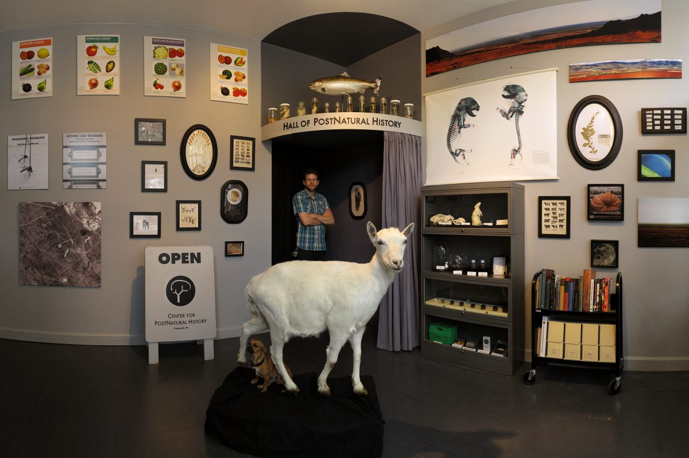
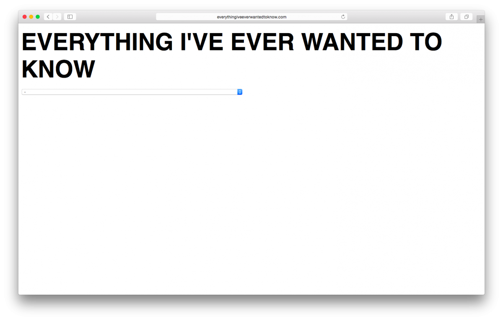
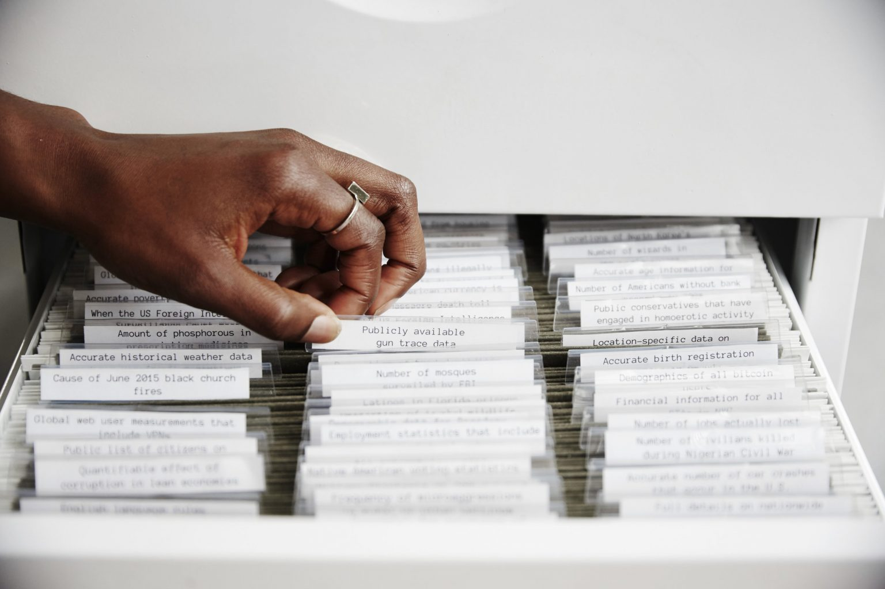
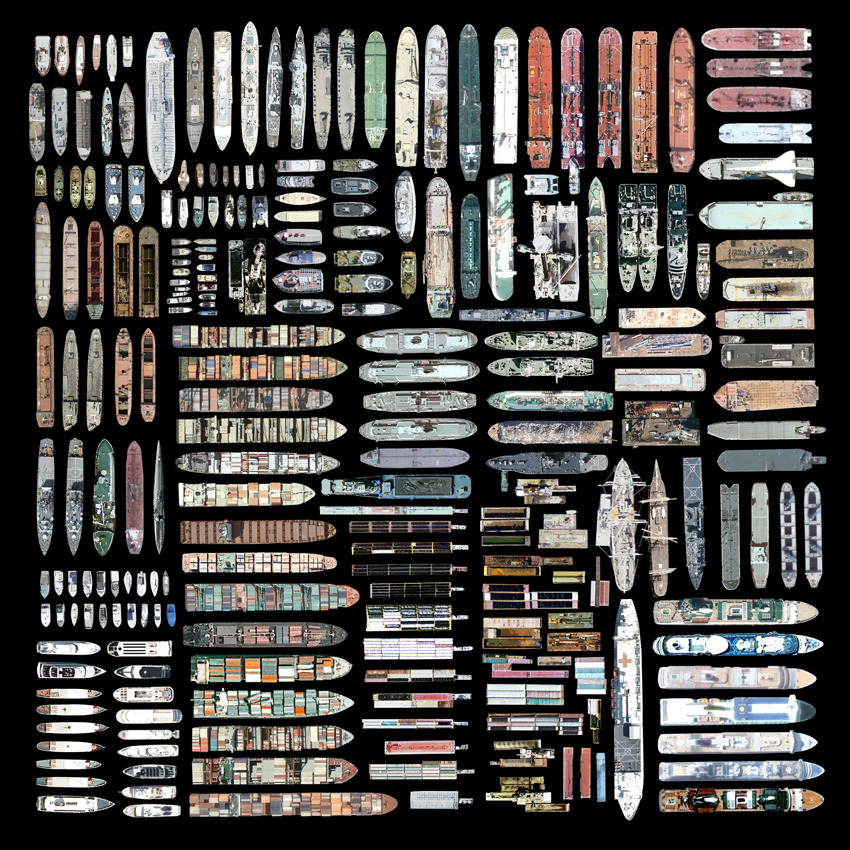

# Digital Curation / Internet Readymades

*(Notes cribbed from Prof. Paolo Pedercini.)*

---

<!--
https://ems.andrew.cmu.edu/2022f/daily-notes/unit-4-internet-readymades/index.html
-->

Have you ever gone into an Internet rabbit-hole? *Tell us about it.* 

In this brief unit, we will conduct deep research into a subculture, sub-genre, practice, or typology of artifact you found on the Internet. You will be asked to: 

* **collect** a series of digital “objects” that you consider valuable but under-appreciated from an aesthetic, political, historical, or anthropological standpoint; and then
* **curate** these materials into an exhibition, in the form of an online collage, presentation, or website.

---

 [*Walter Lewin, MIT Chalk Dotted Line Lecturer*](https://www.youtube.com/watch?v=B0LgaWUSzMI)

 [People selling mirrors on Craigslist](https://www.instagram.com/p/DG5zDfSRuc3)

---

### *What is an “objet trouvé” or “found object”? How does it operate?*

We consider a type of Dadaist artwork known as the *found object* (from the French *objet trouvé*), found art, or ready-made (a term coined by Marcel Duchamp). The primary principles of the Dada readymade philosophy were to:

1. **choose** an object — a creative act in itself; 
2. **cancel** that object’s familiar purpose by presenting it not in its usual functionary role but *defamiliarized*, as a work of “art”; and 
3. **title** the artwork, in such a way as to potentially provoke a new thought or meaning. 

Under the readymade light, an artist became a “chooser” rather than “maker.”

 <small>Pablo Picasso, *Bull's Head*, 1942</small>

<!--  <small>Meret Oppenheim, [*Object*](https://www.moma.org/collection/works/80997), 1936</small> -->

---

### *What is a "curator"? What do they do?*

The idea of artist as curator / curator as artist / artist as archivist – are common trends in contemporary art. From the article [*Curator as Artist as Curator*](https://curatingthecontemporary.org/2015/04/30/curator-as-artist-as-curator/):

> *The term “curator” has moved beyond any singular definition and now occupies a much broader sphere of activities, practices and professions. The curator, as a caretaker-like figure, once functioned solely within the museum, and as such, would often have been entrusted with the overseeing of a particular collection or display. In a move far beyond the museum, curatorial practice now not only exists in relation to art, but also encompasses a panoply of occupational contexts. […] The curator does not merely display objects within a space, but “brings different cultural spheres into contact”, and as such acts as mediator between artworks, objects and ideas.*

 The [Center for PostNatural History](https://www.postnatural.org/) here in Pittsburgh, a project of School of Art professor Rich Pell, is a museum of genetically modified organisms.

**The word “curation” has endured a semantic shift** — to signify the more mundane filtering and classification of culture, especially in a social and digital environment (e.g. “content curation”)

> [Everyone’s a Curator Now](https://www.nytimes.com/2020/03/03/style/curate-buzzword.html) – When everything is “curated,” what does the word even mean? (NYT)

For this assignment, let’s embrace this collapse of roles and contexts, and see how artists have reacted to the proliferation of vernacular content on the internet.

 [*Working On My Novel*](https://coryarcangel.com/things-i-made/2012-037-work-on-my-novel-book.html) by Cory Arcangel (2014), a novel featuring the best tweets which include the phase “working on my novel”. Also see Arcangel's [*Sorry I Haven’t Posted*](https://coryarcangel.com/things-i-made/2010-020-sorry-i-havent-posted) (2010), a blog which re-posts the best blog posts of people apologizing for not posting to their blogs.

 [*EVERYTHINGIVEEVERWANTEDTOKNOW.COM*](https://anthology.rhizome.org/everythingiveeverwantedtoknow-com) by Martine Syms (2007), is a conceptual work of net art. Visiting the site presents the viewer with a drop-down menu that features all of the artist’s Google searches from a three year period, from 2004 to 2007.

 [*I’m Google*](https://imgoogle.dinakelberman.com/) by Dina Kelberman (2011-) is an ongoing tumblr blog in which batches of images and videos that Kelberman culls from the internet are compiled into a long stream-of-consciousness.

 [*Iraq War Wikihistoriography*](https://jamesbridle.com/works/iraq-war-wikihistoriography) by James Bridle (2010), also known as “The Iraq War: A History of Wikipedia Changelogs”, is a twelve-volume set of all changes to the Wikipedia article on the Iraq War. The twelve volumes cover a five year period from December 2004 to November 2009, a total of 12,000 changes and almost 7,000 pages. His essay points out that although an article on Wikipedia may tell a “single” specific story, the edits show a process that involves the opinions and conflicting biases of each writer. In this respect Wikipedia offers two stories: one that is front-facing to the reader and one that reveals the behind-the-scenes editing, writing and creative process.

 [*How to get rid of homeless*](https://concrete-press.com/how-to-get-rid-of-homeless) by Matteo Bittanti (2015). Matteo Bittanti collected, selected, and transcribed thousands of messages exchanged by the forum members who first experienced and then tried to “eradicate” the phenomenon of homelessness that “plagued” SimCity. From surprise to despair, from shock to resignation, these posts highlight the pitfalls of simulation, the not-so-subtle effects of ideology on game design, and the interplay between play and society, politics and entertainment.

 [*9 Eyes of Google Streetview*](https://9-eyes.com/) by Jon Rafman (2008-) is a post-photography project comprised of remarkable, jarring, and poignant images that the artist has found through exhaustive “travels” on Google Streetview.

 [*barelyLegal*](https://www.onchanneltwo.com/CH2-barelyLegal) by CH2 (2015) is a series of desktop documentary “drives” tracing routes to obtain safe legal abortions in the United States. As of 2015, currently, an adult person who needs an abortion living in Odessa TX needs to travel to LasCruces NM for medical care. This is a four hour and forty-eight minute drive. Their total round trip drive time: eight hours and thirty-six minutes.

 [*Postcards from Google Earth*](http://clementvalla.com/work/postcards-from-google-earth/) by Clement Valla (2011-2013), a collection of screenshots from Google Earth. Valla writes:

> *I discovered strange moments where the illusion of a seamless representation of the Earth’s surface seems to break down. At first, I thought they were glitches, or errors in the algorithm, but looking closer I realized the situation was actually more interesting — these images are not glitches. They are the absolute logical result of the system. They are an edge condition—an anomaly within the system, a nonstandard, an outlier, even, but not an error. These jarring moments expose how Google Earth works, focusing our attention on the software. They reveal a new model of representation: not through indexical photographs but through automated data collection from a myriad of different sources constantly updated and endlessly combined to create a seamless illusion; Google Earth is a database disguised as a photographic representation. These uncanny images focus our attention on that process itself, and the network of algorithms, computers, storage systems, automated cameras, maps, pilots, engineers, photographers, surveyors and map-makers that generate them.*

 [*Shanzhai Lyric*](https://www.instagram.com/shanzhai_lyric/) by Ming Lin and Alexandra Tatarsky (2015-, [shanzhailyric.info/](https://shanzhailyric.info/), [Talk](https://theinfluencers.org/en/shanzhai-lyric))

> *“Shanzhai [~Bootleg] Lyric is the name of both the project and the phenomenon we are trying to identify—an anonymously and collectively authored ongoing poem emerging out of the detritus of consumerism. […] an attempt at expressing solidarity with the aesthetic philosophy and politics of this hybrid English while not claiming ownership over the found phrases that we are gathering as our subject. We are less interested in producing our own bootlegs than in identifying shanzhai strategies and sharing them across various platforms […] Our aim is to place shanzhai lyrics in dialogue with other poetic and artistic lineages that also experiment with mimicry, wordplay, poetic plagiarism, and nonsense as subversive methods.”*

 [*default filename tv*](https://default-filename-tv.neocities.org/) by Everest Pipkin (2019) finds and plays youtube videos that were uploaded from the camera without any edits to the title of the video.

Some approaches to meme curation and archiving:

 [*Great Wall of Memes*](http://www.greatwallofmemes.com/) by Valentina Tanni (2012) is a research project in the form of a visual archive.

 [*Online culture wars*](http://disnovation.org/ocw.php) by Disnovation (2018-19) is a visualization “of hundreds of politicized memes, along with influential political figures and symbols. It is designed as a discussion starter, intended to visualize and contextualize the ongoing online culture wars, and some of the main political references, actors, and influencers.”

 [*The Library of Missing Data Sets*](https://mimionuoha.com/the-library-of-missing-datasets) by Mimi Onuoha (2016) is a physical repository of those things that have been excluded in a society where so much is collected. [Example: “Trans people killed or injured in instances of hate crime”; more [here](https://github.com/MimiOnuoha/missing-datasets).]

> *“Missing data sets” are the blank spots that exist in spaces that are otherwise data-saturated. Wherever large amounts of data are collected, there are often empty spaces where no data live. The word “missing” is inherently normative. It implies both a lack and an ought: something does not exist, but it should. That which should be somewhere is not in its expected place; an established system is disrupted by distinct absence. That which we ignore reveals more than what we give our attention to. It’s in these things that we find cultural and colloquial hints of what is deemed important. Spots that we’ve left blank reveal our hidden social biases and indifferences.*

 [There’s no such thing as a free watch](https://www.jennyodell.com/museumofcapitalism_freewatch.pdf) by Jenny Odell (2017) – An example of falling into a rabbit hole, an attempt to find the history of a single object from its online traces.

 [*The Zooms*](https://www.youtube.com/watch?v=Xf9V-RNjXlg) by Sam Lavigne (2022): “I extracted all the zoom-in shots from 600 hours of leaked police helicopter surveillance footage. The copaganda fantasies we see in tv/movies get enacted in real life. Constant and pointless surveillance actions are partially a consequence of those fantasies.”

*More about formats: Images as video:*

 [*787 Cliparts by Oliver Laric*](https://www.youtube.com/watch?v=LK90lJCHlV4) (2008)

 [*Search by Image, Recursively*](https://sebastianschmieg.com/searchbyimage/), by Sebastian Schmieg (2011) ([vimeo](https://vimeo.com/34949864)).

---

### Digital-to-physical media:

 [*Internet Cache Self Portrait*](https://www.evan-roth.com/~/works/internet-cache-self-portrait-series/#hemisphere=east&strand=139) – Evan Roth

 [*Satellite Collections*](https://www.jennyodell.com/satellite.html) by Jenny Odell (2009-2011)

 [*Dronestragram*](https://www.instagram.com/dronestagram/) by James Bridle (2012-2015): posting satellite images of the locations of drone strikes to Instagram, as they occur.

 [*Google Faces*](https://www.itsnicethat.com/articles/onformative) by Onformative (2013) used face-recognition software to find satellite images containing what appeared to be faces.

---

### Some projects by CMU Art Students

 [*Sephora*](https://connieye.com/sephora) (2019) by CMU art student Connie Ye. “A popular metric for a successful waterproof product is whether or not it can withstand tears and emotional turmoil. I remembered seeing a review giving an eyeliner 5 stars for surviving through a teary breakup, and I wanted to see if there would be more. Thus, for this project, I scraped Sephora’s website for reviews, and filtered through them for reviews mentioning crying.”

 [*@the.circles.of.life*](https://www.instagram.com/the.circles.of.life/) (2017) by CMU art student Caroline Hermans. Hermans created a collection of Instagram pregnancy portraits, which she annotated with custom p5.js software in order to “find the center and radius of pregnancy.” Described [here](https://ems.andrew.cmu.edu/excap17/author/caro/) and documented on Instagram [here](https://www.instagram.com/the.circles.of.life/).

 [*Breaking the [glass] Screen*](https://anishabaid.com/breaking-the-glass-screen) (2021) by art MFA student Anisha Baid is “a video presentation articulating gendered frustrations with the computer interface using a collection of found clipart and stock images. The video is made using appropriated corporated aesthetic strategies usually used in presentations about workplace ethics, sexual harassment and work-life balance.” [[more](https://empowering-women.net/about-breaking-the-screen-2020/)]

 [*Chiropractic Neck Cracking Supercut*](https://www.youtube.com/watch?v=mc_J4wbwKxY) by Reiley Nymeyer, CMU, created for *Foundations of Digital Media*, 2021.
