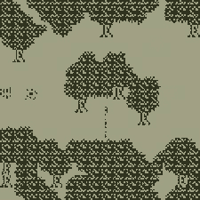
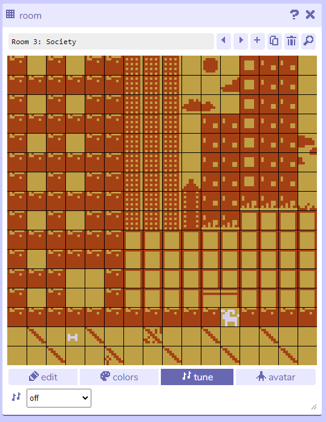

# Bitsy: Some Design Strategies

*Adapted/cribbed from lecture notes by Paolo Pedercini. This is his work!* 

---

## Tiles & Layouts

It’s OK to leave areas untiled. You can use negative space and the background color to communicate what areas are walkable. 


Especially for natural environments, make slight variations of tiles in order to break up repetition and make it look less grid-like. 


If your avatar and sprites walk on tiles of two colors, make your avatar have transparency by adding the following code:

```
BGC *
```
...right under the corresponding game data. Doing so requires a sprite color that stands out against the other two:


Avoid square tiles and straight edges when making non-architectural spaces.




Making tilesets is pretty much about rounding corners and creating patterns that break the grid. 


Modular tiles are powerful, but consider patterns that cover multiple tiles to add some variation. Like this:


versus this:


## Dithering

You only have two colors, but you can use techniques like **dithering** to add depth and gradients. 


[*Dithering*](https://en.wikipedia.org/wiki/Dither) is the problem of rendering a continuous-tone (or high bit-depth) raster image with fewer bits. There are many, many different techniques.


## Navigation

Try to convey exits and walkable areas without using arrows and explicit signage. You can have multiple exits that take you to the same room for more open-ended levels.


The classic exit-reentry problem: a door is approached by moving left; the avatar spawns in the second room to the right of the entrance; the player keeps pressing left and goes back to the first room. *Annoying and confusing*. Either maintain cinematic and spatial continuity, or spawn the player away from an exit that could cause that problem.


---

## Spatial Geometries

**Pure 2D** (Typography, 2D abstraction)


**Plan View** (Top Down: Maps, Mazes)


**Section View** (Platformers, ladders, etc)


**Landscape** (Perspective) View


Bitsy games don’t have to be top down or side view, but consider that other layouts may make the 4-direction movement and the wall collisions more awkward.


---

### But I *wanted* it to be inscrutable!

Paolo writes: *"You may be tempted to create some challenge by making the player’s progression less intuitive e.g. with hidden passages and non-obvious interactions. *Obfuscation is not puzzle design:* good puzzles are always readable. You know what you can do and what you have to do, the challenge is figuring out how."*


### On Defaults

Paolo writes: *"Do not under any circumstances use the default Bitsy music. Turn it off. The default music just tells the players that you don’t know what you are doing and that they should not play your thing."* Here's how to do it:



### The End

Unless it makes sense conceptually, you don’t want the player to wander around trapped in your game forever. Give your game a proper ending.


---

<!--
Recovered from: 
* [here](http://mycours.es/gamedesign2021/bitsy-2/)
* [here](https://web.archive.org/web/20230923021529/https://golancourses.net/60120/daily-notes/unit-3-interactive-narrative/design-strategies/)
* [here](https://web.archive.org/web/20230929093115/http://mycours.es/digitalmedia/bitsy/)
* [here](http://mycours.es/gamedesign2021/brainstorm-bitsy-world/)
* [here](https://ems.andrew.cmu.edu/2022f/daily-notes/unit-3-interactive-narrative/design-strategies/index.html)
-->