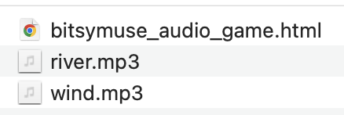
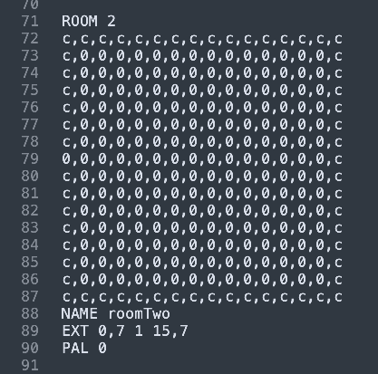

# Per-Room Audio in Bitsy

*We will enable per-room audio in Bitsy using the bitsymuse hack. Known to work for Bitsy 8.13.*

---

## WARNING

Once you add audio to your game with this hack, you can't upload the game back into the online editor -- you'll lose all of your sound-work. You should either: 

* Add sound as the last thing you do, once your game is finished, OR
* Edit your game thereafter using an offline Bitsy editor such as [Borksy](https://ayolland.itch.io/borksy) or [Bitsy Savior](https://aloelazoe.itch.io/bitsy-savior). *Your mileage may vary!!!*

---

## Installation Steps

* **Prepare** a game with multiple rooms. 
* **Download** the HTML file of your game.
* **Open** your game HTML in a text editor. 
* **Scroll** to the bottom of the game HTML. You'll see a `</script>` and `</head>` tag.
* Just after the `</script>` tag, and right before the  `</head>` tag, **add** the following HTML tags, which indicate that we are adding another script: 

```

<script>

</script>


```

* **Go** to the [bitsymuse hack repository](https://github.com/seleb/bitsy-hacks/blob/main/dist/bitsymuse.js)
* **Copy** the code in the bitsymuse.js file. The code is approximately 515 lines long. 
* **Paste** the bitsymuse code in-between the `<script>` and `</script>` tags that you just added. 


### Configure Bitsymuse to Load Your Audio

* **Prepare** some MP3 audio files, using an audio editor such as Audacity. You can have audio that loops, or not. I strongly recommend keeping your audio files well under 1MB.
* **Place** your MP3 files in the same directory as your game HTML. For example, my files look like this: 

 

* Now it is time to **modify** the `hackOptions` data structure in the bitsymuse code that you just pasted into the HTML. **Search** for `hackOptions`, and **read** through its comments carefully. 
* We have to **create two sets of mappings**: 
  * mappings from *MP3 filenames* to *sound-nicknames*, in the `audio` field,
  * assignments of *sound-nicknames* to *room-ID-numbers*, in the `musicByRoom` field
* I have demonstrated this in the snippet below. **Observe** how: 
  * the MP3 file `river.mp3` gets the sound-nickname `river` (and is also set to loop, and given 80% volume)
  * the sound nicknamed `river ` has been assigned to room #`2`


```
var hackOptions = {
	// Put entries in this list for each audio file you want to use
	// the key will be the id needed to play it in dialog tags and the musicByRoom options below,
	// and the value will be the properties of the corresponding <audio> tag (e.g. src, loop, volume)
	// `src` can be either a string, or an array of strings (to support fallbacks in different formats)
	// Note: you can add <audio> tags to the html manually if you prefer
	audio: {
		// Note: the entries below are examples that should be 
		// removed and replaced with your own audio files
		'wind': { src: './wind.mp3', loop: true },
		'river': { src: './river.mp3', loop: true, volume: 0.8 },
	},
	// Put entries in this list for every room ID or name that will change the music
	// If the player moves between rooms with the same audio ID, the music keeps playing seamlessly.
	// Undefined rooms will keep playing whatever music they were last playing
	musicByRoom: {
		// Note: the entries below are examples that should be 
		// removed and replaced with your own room -> audio id mappings
		0: 'S',
		1: 'wind', 
		2: 'river'
	},
	silenceId: 'S', // Use this song ID to make a room fall silent.
	resume: false, // If true, songs will pause/resume on change;
	// otherwise, they'll stop/play (doesn't affect sound effects)
};
```

* **Note** that you need to assign sounds to room *ID numbers*, and *not* the room names. You can find out a room's ID number by reading through the code near the top of your game's HTML file. Here you can see that my room named `roomTwo` has the ID number `2` (in line 71):



* Save your HTML and it should work! If it doesn't work, here are some things to check: 
  * Make sure your audio files are in the right location, and that you've copied their filenames correctly. 
  * Make sure you're using MP3 audio files. Other audio formats may not work. 
  * Make sure you pasted the bitsymuse code into your HTML file in the correct location, inside a script tag, as described above. 


---

## Example

* You can study a working example in [this minimal game](bitsymuse_audio_game.html). 
* This game is silent in room 0, plays wind sounds in room 1, and river sounds in room 2. 
* [**Live version**](https://raw.githack.com/golanlevin/60-120/main/2025/lectures/interactive_narrative/bitsy_hacks/bitsy_audio/bitsymuse_audio_game.html)


