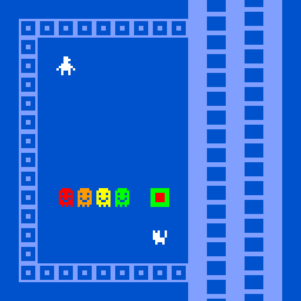

# Extra Colors and Animation Frames

---



Here you can see a game with seven colors. The avatar's nose has four frames of animation, the cat's tail has three frames of animation, and the latter tiles have 8 frames of animation. (*How do you think I achieved the special flashing square?*)

Adding extra frames to animations, and extra colors to palettes, is achieved by **hand-editing the game data**. There are **some important usage notes**:

* The Bitsy *user interface* does not accommodate extra frames of animation, even though it's possible to display them on the canvas. For example, the animation *editor* for tiles/sprites/items will only show the first two frames of animation, even if the object has more. In order to edit animations with more frames....you'll need to invent your own techniques.
* You may need to save your game and/or refresh the browser, in order for these changes to take effect. If you add a new color or additional frame and don't see it, try that.

---

## Working Example

* [Live version](https://raw.githack.com/golanlevin/60-120/main/2025/lectures/interactive_narrative/bitsy_hacks/extra_colors_and_frames/animation_and_colors.html)
* [Full game HTML](animation_and_colors.html)
* [Bitsy data](animation_and_colors.bitsy)


---

## Extra Colors

Here we add **additional colors** to the palette. Subsequently, we will refer to these new colors by their indexes in this list (counting from 0): 

```
PAL 0
0,82,204
128,159,255
255,255,255
255,0,0
255,153,0
255,255,0
0,255,0
NAME blueprint
```

We can now make tiles that use these (higher indexed) palette colors. Here is a tile; its name is `yellowTile`, its index is the letter `f`, and it uses palette color #5 (counting from zero), whose components are `255,255,0`:

```
TIL f
00111100
01111110
01011010
01111110
01011010
01100110
01111110
00101010
NAME yellowTile
COL 5

```

You can make the background color of a sprite or item **transparent** using the `BGC *` code, as shown here. This can make your avatar look better when it walks across complex backgrounds:

```
SPR A
00011000
00111000
00011000
00111100
01111110
10111101
00100100
00100100
POS 0 3,3
BGC *
```


The data for tiles, sprites, and items will always consist of zeros and ones. Put another way: **Note** that tiles, sprites, and items can still only ever have two colors — and one of them will always be the background color (or transparent).  

---

## Extra Frames of Animation 

You can ...just add... additional frames of animation to a tile, sprite, or item. However, they won't show up in the animation editor UI, and you may need to save your work and/or refresh the browser in order for the changes to take effect on the game canvas. 

Here's the code for the cat above, whose tail uses three frames of animation: 

```
SPR a
00000000
00000000
01010010
01110010
01110010
01111100
00111100
00100100
>
00000000
00000000
01010001
01110010
01110010
01111100
00111100
00100100
>
00000000
00000000
01010001
01110001
01110010
01111100
00111100
00100100
NAME cat
DLG 0
POS 0 8,12
BLIP 1
```

---

