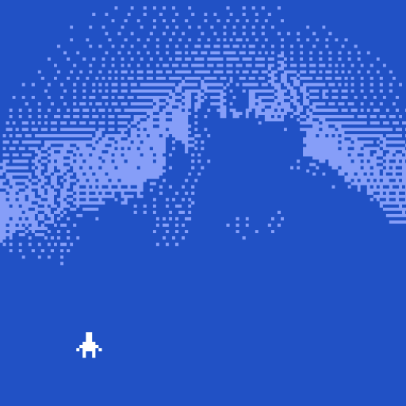

# Convert Images to Bitsy Rooms


*We will convert images to Bitsy rooms using Photoshop, [Dithermark](https://app.dithermark.com/), and the (v.5) [Image-to-Bitsy tool](https://tinybird.info/image-to-bitsy/old/). Instructions work as of 3/2025.*

### Overview:

*(If you're in a hurry, you can skip steps 1 and 2, since the Image-to-Bitsy tool can also scale/crop and dither; it just offers limited options for doing so.)* 

1. Using Photoshop (or another image editor), **crop** your source image to square and **resize** it to 128x128 pixels.
2. Using [Dithermark](https://app.dithermark.com/) (or another halftoning tool), **dither** your 128x128 color image into a black-and-white version.
3. Using the [Image-to-Bitsy tool](https://tinybird.info/image-to-bitsy/old/), **convert** your dithered 128x128 image into a Bitsy room and tiles, and **paste** these into your game data. 

### Warnings:

* Very attentive care is required in adding the resulting tiles to your game data. Small errors can cause corruption of your game data, and/or Bitsy game engine crashes. Follow instructions carefully, and be sure to have a backup of your game data. 
* Adding images with complex dithering can add a lot of tiles. This may significantly slow down Bitsy room transitions. It can also make subsequent hand-editing of your rooms more unwieldy, since there may now be hundreds more tiles to scroll through in the user interface.


---

## 1. Crop and Resize to 128x128

Using Photoshop or another image editor, **crop** a square region from your original image, and **resize** it to 128x128 pixels. In Photoshop, the steps are: 

1. **Open** your original image in Photoshop. 
2. Using the *Rectangular Marquee Tool*, **hold** *Shift* to manually **select** your preferred square sub-region. 
3. In the Photoshop menus, execute **Image → Crop**
4. In the menus, **Image → Image Size...**; specify width and height of `128` pixels. You probably want to enable ✅ `Resample` with one of the `bicubic` options.
5. **Save a copy** of your new 128x128 pixel image as a **PNG**.

For example, here's my original image:<br /> 


And here's my 128x128 crop PNG:<br />


---

## 2. Dither to Black-and-White

1. There are a variety of online image dithering services, each offering slightly different sets of dithering algorithms and UI features. I recommend [Dithermark](https://app.dithermark.com/), [Dither-Me-This](https://doodad.dev/dither-me-this/), and/or [DitherIt](https://ditherit.com/). 
2. **Go** to [Dithermark](https://app.dithermark.com/), and in the *Open* tab, **click** on  *Image file* to upload your 128x128 image. 
3. In the *Zoom* slider at the bottom of the window, **set** the magnification ratio to `400`%. This will display your image at the same size (4x) as a Bitsy game.
4. **Click** on *BW Dither* to select black-and-white dithering. *(Don't worry, you can change the colors later using Bitsy's palettes; selecting black & white now gives you maximum dynamic range for two-tone dithering.)*
5. **Experiment** with some of the dozens of choices from the *Algorithm* pull-down menu, such as Floyd-Steinberg, Atkinson, Sierra, etc. **Fiddle** with the *Threshold* slider, which will adjust how the brightness levels are interpreted.
6. In the *Export* tab, **save** your black-&-white, 128x128 dithered image as a PNG file with a new filename. 

Here's my 128-pixel image crop, dithered using various algorithms:


---

## 3. Convert to Bitsy Tiles and Inject New Game Data

The expectation here is that you probably want to add a new image-room to a game that you're already working on. The challenge of doing so involves injecting new tile and room information into your game without overwriting pre-existing data. *Take great care* in following the instructions below!

### Instructions

1. **WARNING!** *Make sure* you **backup** your game before doing this procedure! The risk of corrupting your game data is high.
2. From within the `save` tab of Bitsy editor's `game` Tool, **click** `⤓save data`. This will save a `.bitsy` file, such as `my_game.bitsy`. **Note** that this is not the full HTML file and contains no scripts.
3. **Go** to the v.5 [Image-to-Bitsy tool](https://tinybird.info/image-to-bitsy/old/) online.
4. **Click** the *Choose File* button in the leftmost ("game data") section, and **upload** your `my_game.bitsy` game data file.
5. **Click** the *Choose File* button in the second ("image") section, and **upload** your dithered, black-and-white, 128x128 pixel image. 
6. **Ignore** the "brightness" and "create new tiles" sliders. *(Technically, you could have done the scaling, cropping, and dithering entirely with this tool, but the workflow described above gives you better control and more creative options. If you want to use this tool for cropping and dithering, then these sliders would be helpful.)*
7. **Click** the *write to game data* button. This will inject a new room, and potentially hundreds of new tiles, into your game data. 
8. **WARNING:** — ***IF*** the highest-numbered room in your initial game data had a `TUNE` field set, *then* a small correction must now be made to your game data in order to avoid a corruption. Under these circumstances, **follow** these special instructions: 
  * Suppose that the highest-numbered room — say, `ROOM 1` in your *initial* game data (i.e. *before* you injected the new dithered room and tiles) had previously specified `TUNE 3` as its soundtrack. Unfortunately, the Image-to-Bitsy tool has *moved* the `TUNE 3` code *after* the new dithered room (e.g. `ROOM 2`). Additionally, the tool has also introduced an extra newline character which corrupts the file. To fix this, 
  * **Find** and **cut** the `TUNE 3` command which has been relocated after the new room
  * **Restore** the `TUNE 3` command to its original location after `ROOM 1`, taking care to place it immediately after the `ROOM 1` data, with no extra gap line. It should look like this: <br />
  
```
...
0,b,0,0,0,0,0,0,0,0,0,0,0,0,b,0
0,b,0,0,0,0,0,0,0,0,0,0,0,0,b,0
0,b,0,0,0,0,0,0,0,0,0,0,0,0,b,0
0,b,b,b,b,b,b,b,b,b,b,b,b,b,b,0
0,0,0,0,0,0,0,0,0,0,0,0,0,0,0,0
EXT 0,7 0 15,7
PAL 0
TUNE 3


ROOM 2
0,0,0,2f,2g,2h,2i,2j,2k,2l,2m,2n,0,0,0,0
0,0,2o,2p,2q,2r,2s,2t,2u,2v,2w,2x,2y,2z,0,0
0,30,31,32,33,34,35,36,37,38,39,3a,3b,3c
...
```

* **Copy** the modified game data from the tool, and **paste/save** it into a *new* Bitsy file, such as `my_game_v2.bitsy`. 
* *Before* uploading the new game data to the the Bitsy editor, I recommend **starting** the Editor from a New Game, and **refreshing** the browser.
* In the Game tool of the editor, **click** *load data* and **upload** your new game data, `my_game_v2.bitsy`. 

---

## Example

You can study a working example here: [**Live version**](https://raw.githack.com/golanlevin/60-120/main/2025/lectures/interactive_narrative/bitsy_hacks/image_to_bitsy/image_to_bitsy_test.html).



[*pre-mod game file*](pre_hacked_game.bitsy)

### Additional Notes

Unfortunately, the available tools for converting images to bitsy rooms/tiles are currently (March 2025) in poor working condition. These include:

* [**Pixsy**](https://ruin.itch.io/pixsy) - Five years old; now crashing with WASM errors
* The older-still v.5 [**Image-to-Bitsy tool**](https://tinybird.info/image-to-bitsy/old/) - requires close attention to detail when performing text surgery, to avoid corrupting your game.
* diane1f0cd's [**bitsy-image-converter**](https://raw.githack.com/diane1f0cd/bitsy-image-converter/master/index.html) - can only add one room, requires text surgery.


