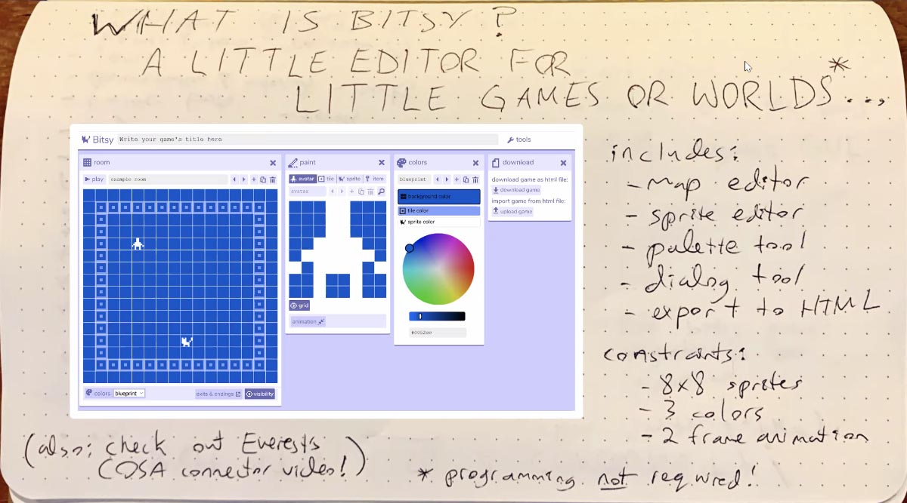
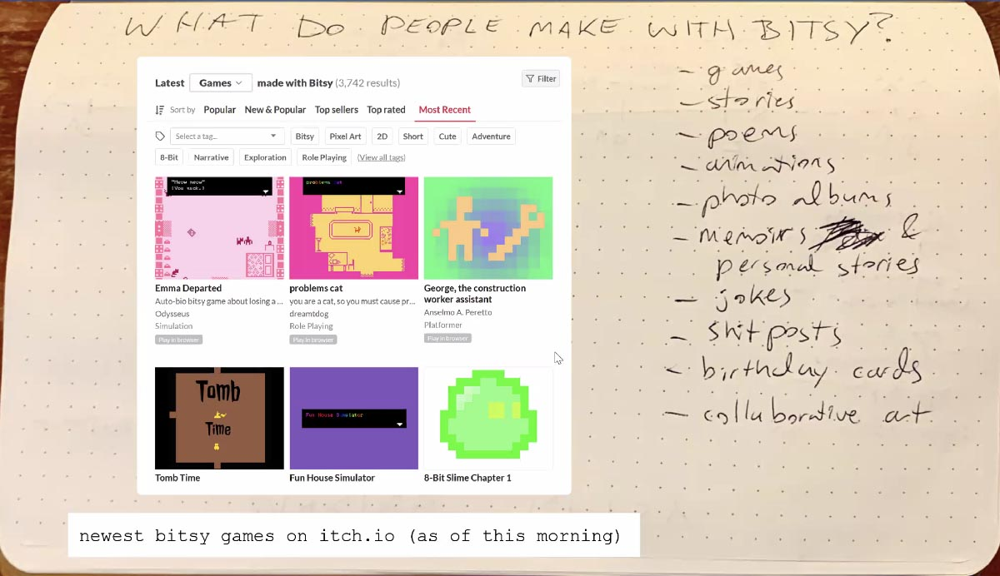

# Overview of the Bitsy Game Editor

* [Bitsy](https://ledoux.itch.io/bitsy) is a little editor for little games or worlds. 
* Bitsy games typically involve some kind of avatar moving through different rooms.
* Each room is made by repeatable tiles and can contain interactive objects and exits to other rooms.
* “Pushing against” interactive objects can make them disappear (collectables) or display text (dialogues, monologues, descriptions, narration).
* Bitsy's features are highly constrained (colors, resolution, animation), and it doesn’t require programming.

---

### Everest's Introduction

[Everest Pipkin presents Bitsy](https://www.youtube.com/watch?v=OTrarCW8fD8) (3m)

--- 

### Adam's Introduction

Bitsy was ~mostly made by one person, Adam LeDoux, with many later contributions from a much wider community. Here are some slides from a talk Adam gave at CMU a few years ago:

As Adam points out, Bitsy includes a map editor, sprite editor, palette tool, dialog tool, and easy export for the web. Adam also points out that programming is not required.

Adam points out that people make all sorts of things with Bitsy, including interactive games, animations, and stories. Adam was inspired to make Bitsy by toys like Polly Pocket, and other microworlds like dioramas, sketchbooks, Lego, and more. Adam was also inspired by older creativity software like KidPix, and newer software like Pico-8. Bitsy is ideal for making *personal games*. Bitsy is also a community with *values* (welcoming, inclusive, anti-bigotry, anti-capitalist, collaborative, supportive).

---

### FriendlyCosmonautDev's Case Study

[Case Study: Turning a Greek Myth into a Game with Bitsy](https://www.youtube.com/watch?v=UL68vKUZzJc&t=31s) (0:31—12:30 @1.2x)

---

### Next Up: Playtime!

We will take some time to explore how other people have used Bitsy creatively. Go through Prof. Pedercini's [list of recommendations on this page](some_bitsy_games.md).

