# Interactive Narrative: A Quick History

*A survey of interactive and nonlinear narrative experiments.<br />These lecture notes adapted from work by Prof. Paolo Pedercini.*

---

## Let's Look at Art

* Everest Pipkin, [*Shell Song*](https://shell-song.neocities.org/) (2020)
* Games by [Porpentine Charity Heartscape](http://slimedaughter.com/games/) (born 1987, active since 2012): [*Beautiful Frog*](http://slimedaughter.com/games/twine/frog/), [*Girl Waste*](http://slimedaughter.com/games/twine/girlwaste/), [*Pink Zone*](http://slimedaughter.com/games/2d/pinkzone/)

---
## Story Types

Here's a linear story:<br />


Here's a branching story:<br />
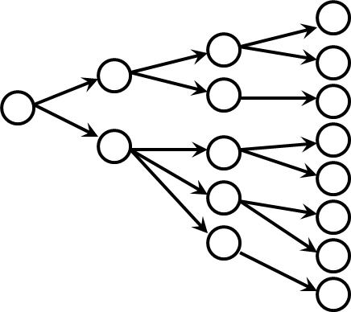

The problem with branching stories is infinitude...<br />
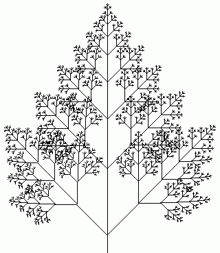

The most common solution: parallelism and convergence:<br />


The article [*Standard Patterns in Choice-Based Games*](https://heterogenoustasks.wordpress.com/2015/01/26/standard-patterns-in-choice-based-games/), by Sam Kabo Ashwell (2015), diagrams more of these possibilities.<br />
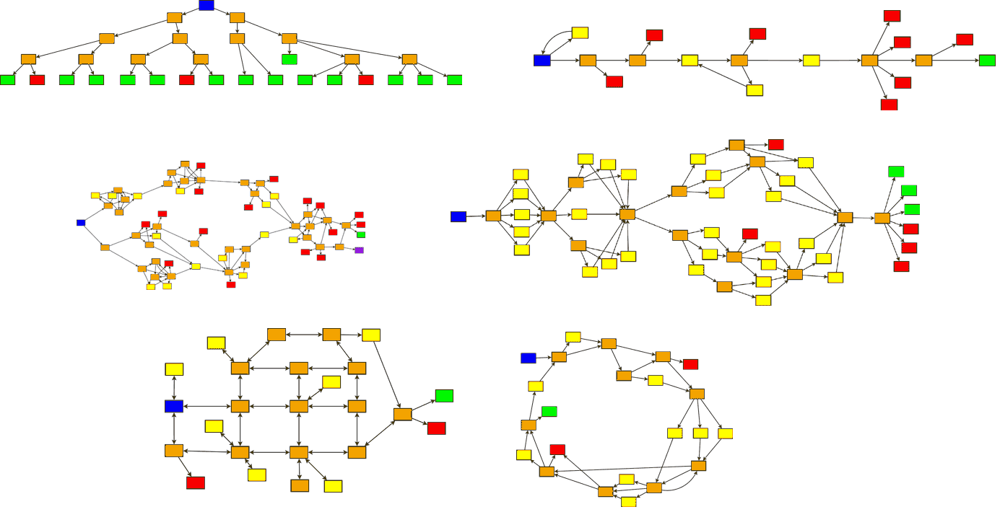

---

## In CYOA Novels

The most popular artifacts of this kind are "gamebooks" or "Choose Your Own Adventure" novels. These were very popular teenage literature in the 80s and 90s:<br />
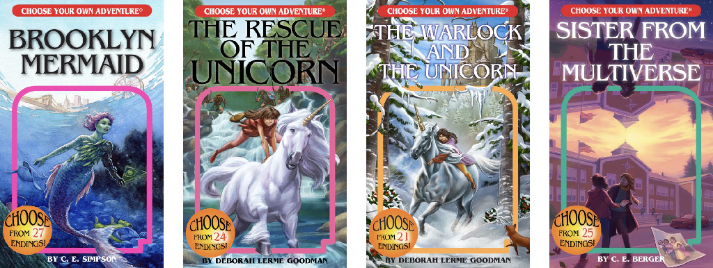

The earliest known gamebook is *Consider The Consequences!* (1930, by Doris Webster and Mary Alden Hopkins). It had 43 different endings:<br />
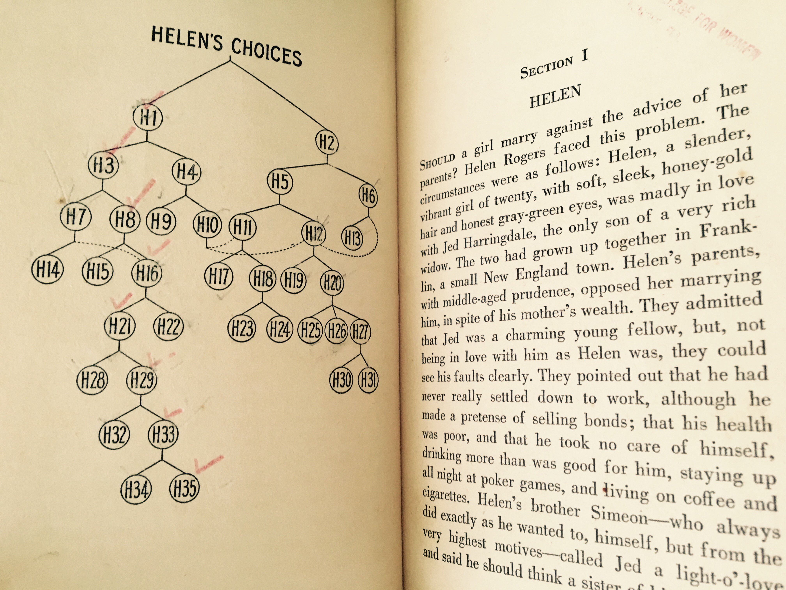<br />
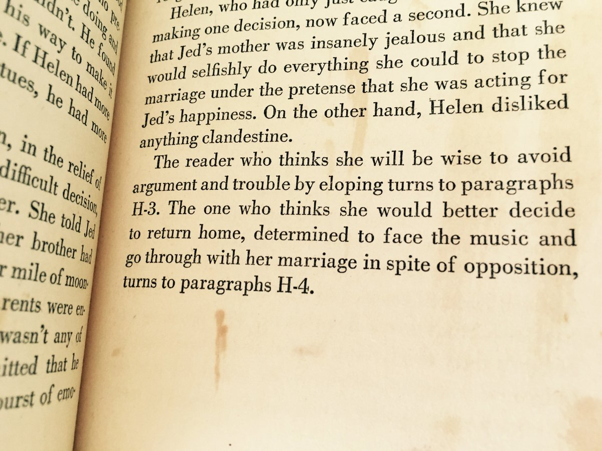<br />
The game has been ported to Twine (an interactive narrative authoring system similar to Bitsy) and is [now hosted on itch.io](https://geetheriot.itch.io/consider-the-consequences).

Here’s a diagram of a more recent book, [*Journey Under the Sea*](https://www.cyoa.com/products/journey-under-the-sea) (2006) by R. A. Montgomery. The diagram is by Michael Niggel:<br />
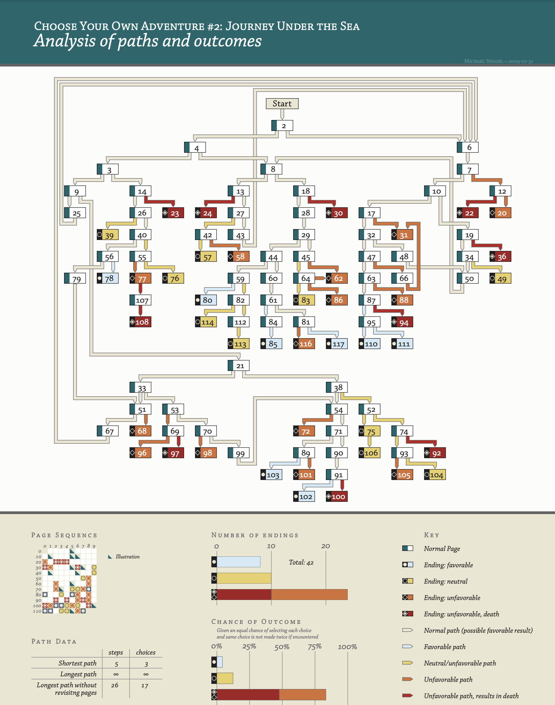

Or another solution...<br/>
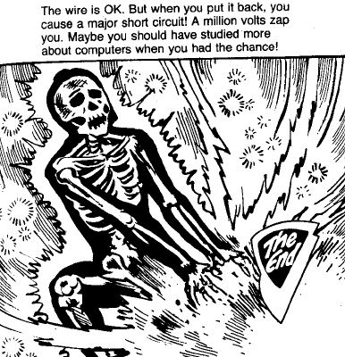<br />
(From [*YouChoseWrong*](https://youchosewrong.tumblr.com/), an archive of bad endings from choose-your-own-adventure books.)

---

## In 20th-C. Experimental Literature, Drama and Film

Unsurprisingly Lewis Carroll was an early person to devise procedural, non-linear cutup literature, as he described in his *Poeta Fit, Non Nascitur* (1883): 

```
For first you write a sentence,
And then you chop it small;
Then mix the bits, and sort them out
Just as they chance to fall:
The order of the phrases makes
No difference at all.
```

In the 1920s, the French DADA movement reinvented cut-up poetry:<br />
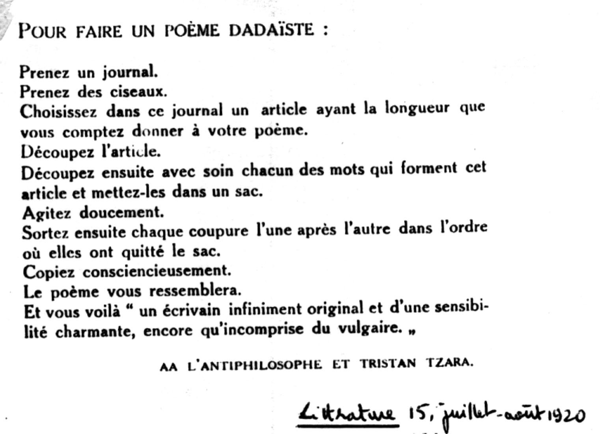

```
To make a Dadaist poem
Take a newspaper.
Take a pair of scissors.
Choose an article as long as you are planning to make your poem.
Cut out the article.
Then cut out each of the words that make up this article and put them in a bag.
Shake it gently.
Then take out the scraps one after the other in the order in which they left the bag.
Copy conscientiously.
The poem will be like you.
And here you are a writer, infinitely original and endowed with a sensibility 
that is charming though beyond the understanding of the vulgar.
– Tristan Tzara, 1920
```

Similarly, the *Oulipo* literary movement (France, early 1960s) – *OUvroir de LIttérature POtentielle* (workshop of potential literature) released the *Hundred Thousand Billion Poems* (1961):<br />


Inspired by William Burroughs (who also popularized the technique), [David Bowie explains](https://www.youtube.com/watch?v=m1InCrzGIPU) his cut-up method for songwriting (mid-1970s):<br />
[](https://www.youtube.com/watch?v=m1InCrzGIPU)

Augusto Boal’s *Forum Theatre* (1960):<br />
In this process, the actors or audience members could stop a performance, often a short scene in which a character was being oppressed in some way (for example, a chauvinist man mistreating a woman or a factory owner mistreating an employee). The audience could propose any solution, so long as they conveyed it on stage, working, acting, and directing not from the comfort of their seat.<br />
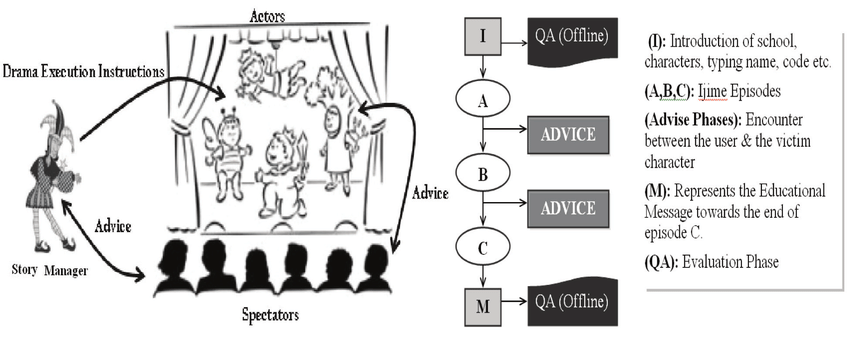

[*Kinoautomat*](https://www.youtube.com/watch?v=B1guIujgzAI) by Radúz Činčera (1967),  the “first interactive film”:<br />
“The film is a black comedy, opening with a flash-forward to a scene in which the protagonist’s apartment is in flames. No matter what choices are made, the end result is the burning building, making the film —as Činčera intended— a satire of democracy”<br />
[](https://www.youtube.com/watch?v=B1guIujgzAI)

---

## Interactive Narrative on the Computer

[*ELIZA*](https://en.wikipedia.org/wiki/ELIZA) (Joseph Weizenbaum, 1964-1966). [Try it out.](http://psych.fullerton.edu/mbirnbaum/psych101/Eliza.htm) From Wikipedia:<br />
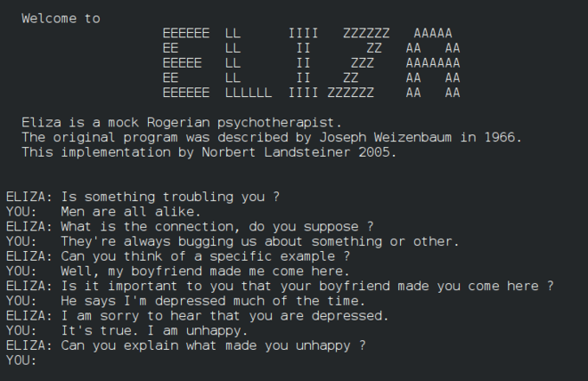

ELIZA is an early natural language processing computer program, developed by Joseph Weizenbaum, a researcher at MIT. Eliza simulated conversation by using a “pattern matching” and substitution methodology that gave users an illusion of understanding on the part of the program. The most famous script simulated a psychotherapist and used rules, dictated in the script, to respond with non-directional questions to user inputs. As such, ELIZA was one of the first chatbots and one of the first programs capable of attempting the Turing test (convincing a human that they're speaking to another person). Weizenbaum was surprised by the number of individuals who attributed human-like feelings to the computer program, including Weizenbaum’s secretary. Many early users were convinced of ELIZA’s intelligence and understanding, despite Weizenbaum’s insistence to the contrary.


[Colossal Cave Adventure](https://en.wikipedia.org/wiki/Colossal_Cave_Adventure) (1975-1977) was the first nonlinear text-based adventure game software. Try it out.<br />
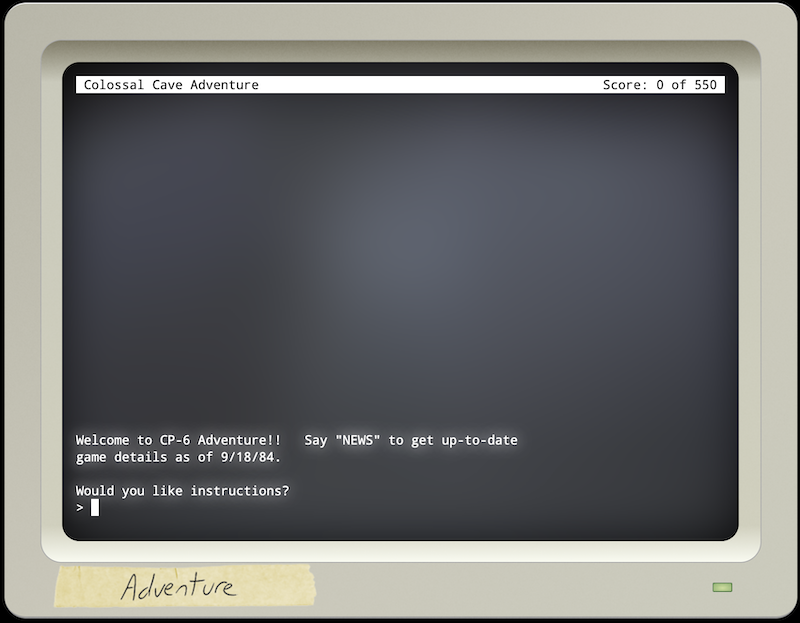

*ZORK* (1977-1979) [Try it out.](http://textadventures.co.uk/games/play/5zyoqrsugeopel3ffhz_vq)<br />
Zork is an interactive fiction computer game, released as a commercial game for personal computers.<br />
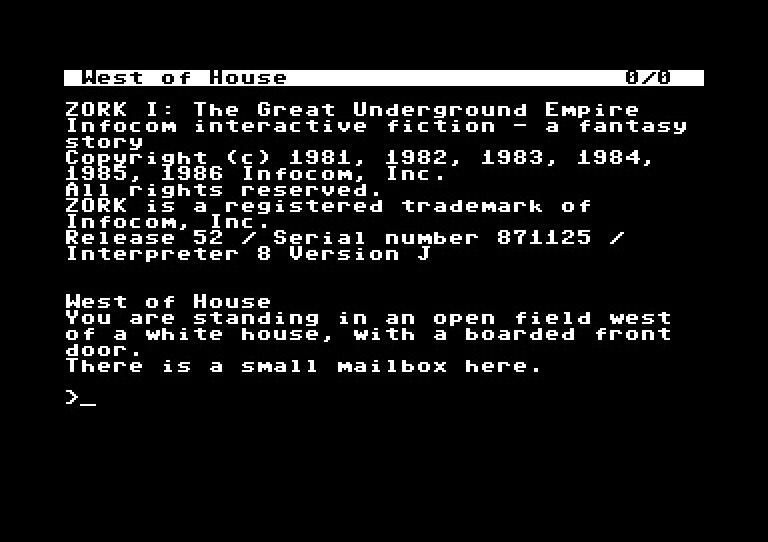


[*Galatea*](https://en.wikipedia.org/wiki/Galatea_(video_game)) (2000) by Emily Short.<br />
[Galatea](https://www.youtube.com/watch?v=f6AGNgPvmjY) is an interactive fiction video game by Emily Short featuring a modern rendition of the Greek myth of Galatea, the sculpture of a woman which gained life. The game displays an unusual rich approach to non-player character dialogue and diverts from the typical puzzle-solving in interactive fiction: the whole gameplay is based on the interaction with a single character in a single room.

[](https://www.youtube.com/watch?v=f6AGNgPvmjY)

*AI Dungeon* (2020). [Try it out.](https://play.aidungeon.com/)

---

## Beyond Text: Interactive Video

<br />
The **video laserdisc**, invented around 1980, was the first commercially available optical disc format capable of storing analog video. Its ability to instantly access any frame using *random access* (rather than linear tape playback) enabled the development of early interactive video systems, which allowed users to navigate through video content non-linearly. Developed for educational, training, and entertainment purposes, it soon found use by experimental new-media artists as well.

[*Aspen Movie Map*](https://www.youtube.com/watch?v=Hf6LkqgXPMU) by Andy Lippman, Michael Naimark et al. (1979-1981):<br />
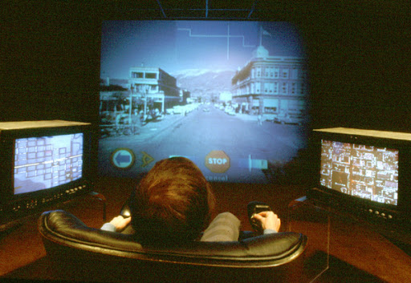

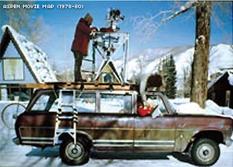

[](https://www.youtube.com/watch?v=2Ytd12d6qNw)


Lynn Hershman-Leeson, [*Lorna*](https://www.youtube.com/watch?v=rLAWYZoI51M&t=424s) (1981, jump to 7:04):<br />
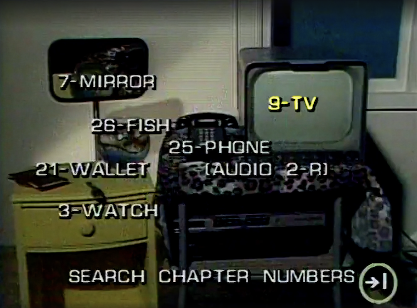

[](https://www.youtube.com/watch?v=rLAWYZoI51M&t=424s)


[*Façade*](https://www.youtube.com/watch?v=uQ7Ix8HXqc4), (2005) a natural language processing-based interactive narrative game created by Michael Mateas and Andrew Stern. It was the winner of the Grand Jury Prize at the 2006 Slamdance Independent Games Festival and has been called “the first true interactive storytelling software”. (Watch first 4 minutes)

[](https://www.youtube.com/watch?v=uQ7Ix8HXqc4)

---

EOF

<!--

* Olia Lialina, [*My Boyfriend Came Back From the War*](https://sites.rhizome.org/anthology/lialina.html) (1996). My Boyfriend Came Back From the War is an early example of Internet-based interactive hypertext storytelling. When clicking hyperlinks in the work, the frame splits into smaller frames and the user reveals a nonlinear story about a couple that is reunited after a nameless military conflict.
* Group Z, [*Love*](https://anthology.rhizome.org/love) (1995)

Recovered from [here](https://web.archive.org/web/20231128123714/https://golancourses.net/60120/daily-notes/unit-3-interactive-narrative/interactive-narrative-history/)
-->

