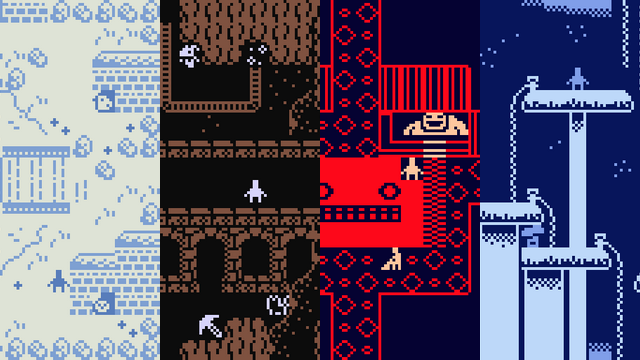

# Viewings: Some Bitsy Games

---

## Paolo's Pedercini's Recommendations

*Here's a short list of Bitsy games curated by CMU professor of game arts, Paolo Pedercini:*

* [7 things I mistake for my cats](https://w.itch.io/7-things) (a fun intro to bitsy)
* [What’s up in a Kharkiv bomb shelter](https://dahuanna.itch.io/whats-up-in-a-kharkiv-bomb-shelter) (documentary)
* [Junk Shop Telescope](https://cephalopodunk.itch.io/junk-shop-telescope) (playing with scale)
* [Spiral house](https://withering-systems.itch.io/spiral-house) (playing with abstraction by CMU alum Everest Pipkin)
* [A gallery visit](https://raulhaagensen.itch.io/a-gallery-visit) (not only top down)
* [Novena](https://haraiva.itch.io/novena) (playing with repetition)
* [Continental Drift](https://haraiva.itch.io/continental-drift) (autobiographical)
* [Moss as texture as space folding onto itself](https://polclarissou.itch.io/moss-as-texture-as-space-folding-onto-itself) (patterns and abstraction)
* [Roomba Quest](https://st33d.itch.io/roomba-quest) (puzzle)
* [Our Damned Machine](https://sophieh.itch.io/our-damned-machine) (environmental piece)
* [The last human touch](https://cephalopodunk.itch.io/silence-would-be-better) (time travel)
* [Cinerarium of solaris](https://sumaleth.itch.io/cinerarium) (magical realism)
* [A prison strike](https://molleindustria.itch.io/a-prison-strike) (by prof. Pedercini)
* [A holiday yarn](https://seansleblanc.itch.io/a-holiday-yarn) (visual hack)
* [Castle of the water monk](https://thatsmaik.itch.io/caste-of-the-water-monks) (made with [bitsy3D](https://bitsy3d.xyz/))

---

## Student Recommendations

*Here are some 60-120 students' favorite Bitsy games:*

* [Novena](https://haraiva.itch.io/novena)
* [Space Bubble Cat](https://emmadaues.itch.io/space-bubble-cat)
* [The Midnight Bakery](https://dreamingamaris.itch.io/the-midnight-bakery)
* [Vitreous](https://hyphinett.itch.io/vitreous)
* [A gallery visit](https://scumslug.itch.io/a-gallery-visit)
* [Our Damned Machine](https://sophieh.itch.io/our-damned-machine)
* [the last days of our castle](https://candle.itch.io/castle)
* [Commute](https://thisisstar.itch.io/commute)
* [The Museum of Mid 2000s forum signatures](https://niandra.itch.io/museum)
* [Minimalist](https://ruin.itch.io/minimalist)
* [I don't know how to have hotpot alone](https://nuttatulipa.itch.io/i-dont-know-how-to-have-hotpot-alone)
* [Under A Caustic Snow, I Danced](https://communistsister.itch.io/under-a-caustic-snow-i-danced)
* [I Hurt Myself](https://pastellexists.itch.io/i-hurt-myself-postjam) (CW)
* [Running Out of Emptiness](https://aloelazoe.itch.io/running-out-of-emptiness )
* [Welcome to the cursed bookshop](https://cephalopodunk.itch.io/cursed-bookshop)
* [In the pines, in the pines, where the sun never shines](https://laurahunt.itch.io/in-the-pines)
* [do you think ducks in the pond care about global finance](https://stanwixbuster.itch.io/do-you-think-ducks-in-the-pond-care-about-global-finance)
* [Zen Garden, Portland, The Day Before my Wedding](https://cephalopodunk.itch.io/zen-garden-portland)
* [Lonely Planet: a bedtime poem](https://illest-terminal.itch.io/lonely-planet)
* [the incredibly soft adventures of toothie](https://djaredona.itch.io/the-incredibly-soft-adventures-of-toothie)
* [Time for some Bullshit Fish Names](https://cephalopodunk.itch.io/bullshit-fish-names)
* [Lesbian Winter](https://digital-poppy.itch.io/lesbian-winter)
* [An autobiography](https://rhythmlynx.itch.io/wip) 
* [I Wonder](https://seansleblanc.itch.io/i-wonder)

---

## CMU Student Bitsy Projects

*Here are some Bitsy games by previous 60-120 students:*

* [Magpie](https://ajunglew.itch.io/magpie) by Ana
* [Not a Ghost Story](https://torfunky.itch.io/not-a-ghost-story) by Reiley
* [Train Station](https://solomon1000.itch.io/train-station) by Solomon
* [Lost and Found](https://emma-de.itch.io/lostandfound) by Emma
* [Morning Shift at Kang Lim](https://funkypanda12.itch.io/morning-shift-at-kang-lim) by Arin
* [This is my computer](https://dummydino.itch.io/this-is-my-computer) by Dino
* [Parasitic](https://middyvel.itch.io/parasitic) by Middy
* [Plenty of Fish](https://lvincent25.itch.io/plentyoffish) by Luke
* [Landlord, Be Kind](https://adeptusxi.itch.io/landlord-be-kind) by Xiao
* [2:48am](https://keittokettu.itch.io/248-am) by Santi
* [my parents' room](https://caprifoglio.itch.io/mama-and-papas-room) by Bayu
