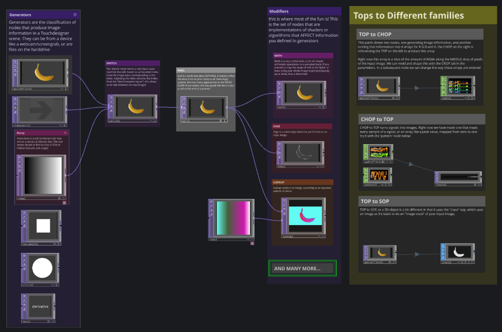
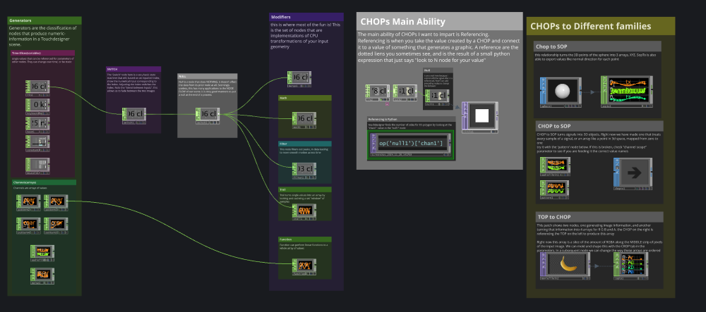

# TouchDesigner Lecture Notes I

**Lecture notes for Tuesday, April 15**

*By Em Lugo*

--- 

## Suggested Creators
Collecting these resources here as a list of channels you should look at for more TouchDesigner tutorials. It's good to borrow techniques, but not whole videos, and if you use something from a video please **__Site it__** 

These two channels are great and make very detailed content about the most popular TouchDesigner pipelines. They each have very popular intro tutorial series:

* [Bileam Tschepe-elekktronaut](https://www.youtube.com/@elekktronaut) — Bileam has a wide range of videos that are very easy to understand at every level in TouchDesigner learning. Bileam is one of the most popular channels and is where I started learning!
* [The Interactive and Immersive HQ](https://www.youtube.com/channel/UC-9DT8kpvykuBEQ2iVatWbA?app=desktop) — Truly one of my favorite channels. On one end they have approachable video tutorials of most basic operations, and on the other hand have very in-depth, long-form videos that take you through an advanced project froms scratch

Other Creators: 

* [Matthew Ragan](https://matthewragan.com/teaching-resources/touchdesigner/)
* [Noto the Talking ball](https://www.youtube.com/@NotoTheTalkingBall)
* [PPPANIk](https://www.youtube.com/channel/UCWBbakpo_cATqJy9Dzf9x4w) 
* [Digital Abstracts](https://www.youtube.com/@Digital.Abstracts) 
* [noones img](https://www.youtube.com/@noonesimg) 
* [threedashes](https://www.youtube.com/@threedashes___)

---

## 4/15 UI | TOPs | CHOPs

In class I have done a live walkthrough of interacting with the user interface, do some simple work with images, and some even more basic manipulation with signals. I have created interactive documentation of the [TOP](2025/lectures/touchdesigner/assets/assortment_of_TOPs.tox) and [CHOP](2025/lectures/touchdesigner/assets/assortment_of_CHOPs.tox) workflows at these respective links. These are `.tox` files, meaning you can open them individually in TouchDesigner or drag-and-drop them into an already running TouchDesigner instance. 

In the interactive demonstration I show how to convert data types, you can ignore them for now, but keep them in the back of your mind as we move forward.

> **_NOTE:_** You can ignore any warning about version differences for now. 
 

