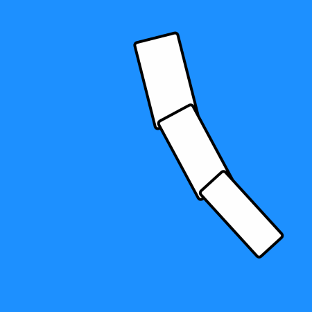
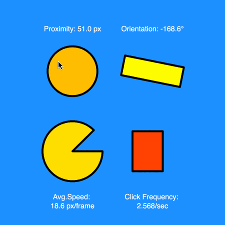
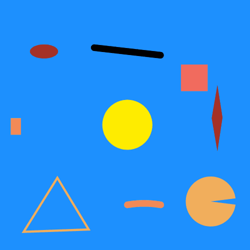
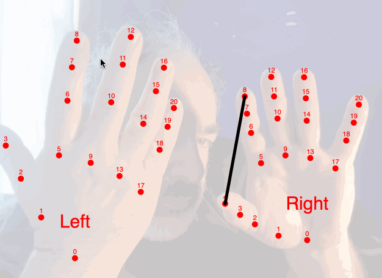
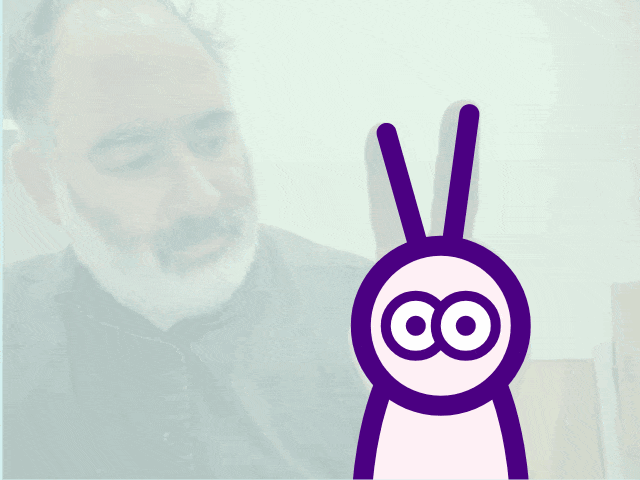
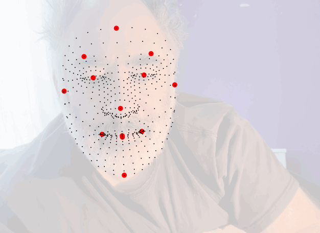
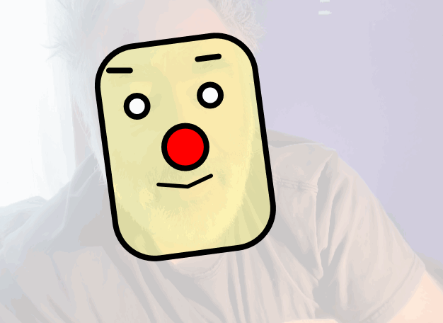
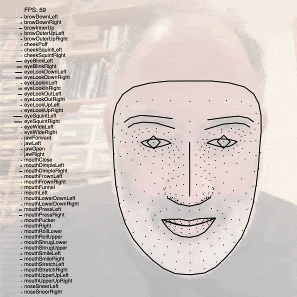
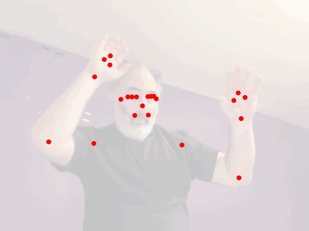
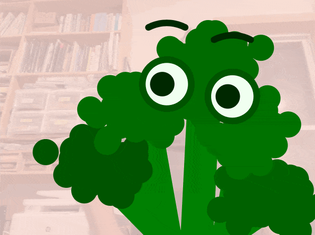

# Body Tracking & Gestural Interaction

---

**Templates for Gestural Input:** Code templates for mouse, microphone, and webcam (hands, face, body) input.

* [Hand tracking code](https://openprocessing.org/sketch/2547157) • [Hand puppet example](https://openprocessing.org/sketch/2187485)
* [Face tracking code](https://openprocessing.org/sketch/2186050) • [Face mask example](https://openprocessing.org/sketch/2187420)
* [Body tracking code](https://openprocessing.org/sketch/2187436) • [Body costume example](https://openprocessing.org/sketch/2187655)
* [Advanced face analysis code](https://openprocessing.org/sketch/2066195)
* Simple microphone [demo 1](https://openprocessing.org/sketch/2189445) • [demo 2](https://openprocessing.org/sketch/2191104)
* [Microphone input vocabularies](https://openprocessing.org/sketch/2189436)
* [Cursor interaction vocabularies](https://openprocessing.org/sketch/2189719)

---

## Preliminaries

* [Zeno’s Interpolation Demo](https://editor.p5js.org/golan/sketches/zsHOsu5DY) (Position)
* [Zeno’s Interpolation](https://editor.p5js.org/golan/sketches/7TgMUzo5j) (Color)
* [Arm](https://processing.org/examples/arm.html) 
* [Compound Rotations with Sinusoid](https://editor.p5js.org/golan/sketches/eemrPADyV)
* [Reach 1](https://processing.org/examples/reach1.html)
* [Follow 2](https://processing.org/examples/follow2.html)

---

### [Demonstration of mouse interaction techniques](https://openprocessing.org/sketch/2189719)

[**This project**](https://openprocessing.org/sketch/2189719) demonstrates how various aspects of mouse movement (such as speed, click frequency, proximity to a coordinate, or angle-with-respect-to a coordinate) can be used as elements of an interaction vocabulary:

---

### [Demonstration of microphone interaction techniques](https://openprocessing.org/sketch/2189436)

* Main microphone [demo](https://openprocessing.org/sketch/2189436)
* Simple microphone [demo 1](https://openprocessing.org/sketch/2189445) 
* Simple microphone [demo 2](https://openprocessing.org/sketch/2191104)

[**This project**](https://openprocessing.org/sketch/2189436) demonstrates how the microphone level can be used to control various visual properties of graphical elements, such as their size, color, rotation, strokeWeight, etc.:

---

### [Template p5.js code for hand pose tracking](https://openprocessing.org/sketch/2547157)

* [Hand tracking code](https://openprocessing.org/sketch/2547157) 
* [Hand puppet example](https://openprocessing.org/sketch/2187485)

[**This project**](https://openprocessing.org/sketch/2547157)  can track multiple hands in a webcam video. The tracker provides an array of hand objects, each of which contains an array of keypoints (x-y points) which indicate specific landmarks on the hand. The tracker is also able to distinguish left hands from right hands:

[**Simple Hand Puppet Example**](https://openprocessing.org/sketch/2187485) (2025). Graphics are affixed to the tracked hand points:

---

### [Template p5.js code for face tracking](https://openprocessing.org/sketch/2186050)

[**This project**](https://openprocessing.org/sketch/2186050) tracks a single face in webcam video. In addition to calculating an array of 468 keypoints, the project also provides 13 “named” landmarks (e.g. “nosePt”, “chinPt”, etc.):

[**Simple Mask Example**](](https://openprocessing.org/sketch/2187420)).
Demonstrates how to mount graphics on your face. Based on the face tracker above. 
The project is also sensitive to the microphone volume. 

[**This “Frog” demo**](https://openprocessing.org/sketch/1846001) illustrates how you can use math to position shapes in interesting ways. The size of the frog’s eyes are controlled by raising your eyebrows; the width of the face is controlled by smiling; and the eyes look at your index finger if it’s visible. Note that this demo uses an older tracking library which takes a very long time to load, and may be obsolete.

[**Advanced face analysis project**](https://openprocessing.org/sketch/2066195) calculates continuous metrics for various types of facial expressions, useful for puppeteering. 

---

### [Template p5.js Code for Body Tracking]()

[**This project**](https://openprocessing.org/sketch/2187436) tracks bodies in webcam video. It provides 33 landmarks (nose, right hip, left elbow, etc.):

[**Simple Body Costume Example (Broccoli)**](https://openprocessing.org/sketch/2187655) Demonstrates how to mount graphics on your tracked body landmarks:

---

EOF

